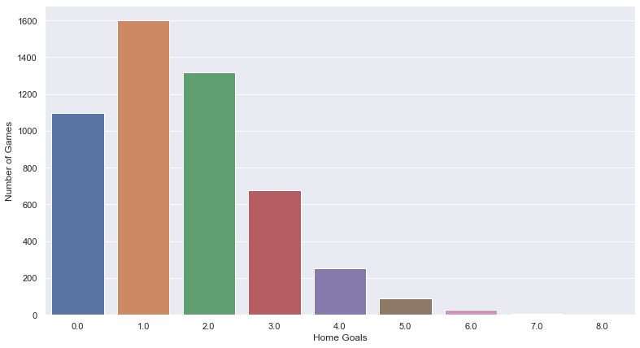
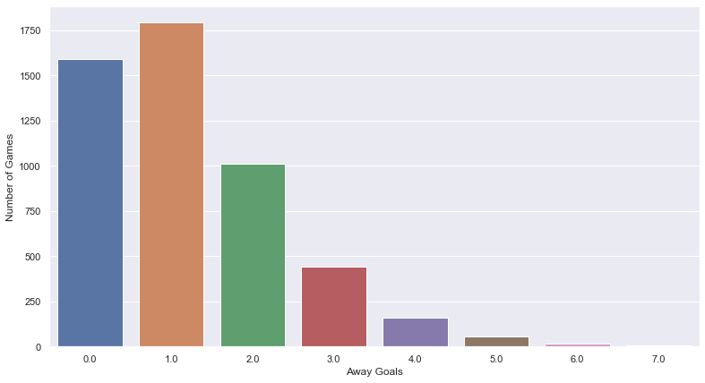
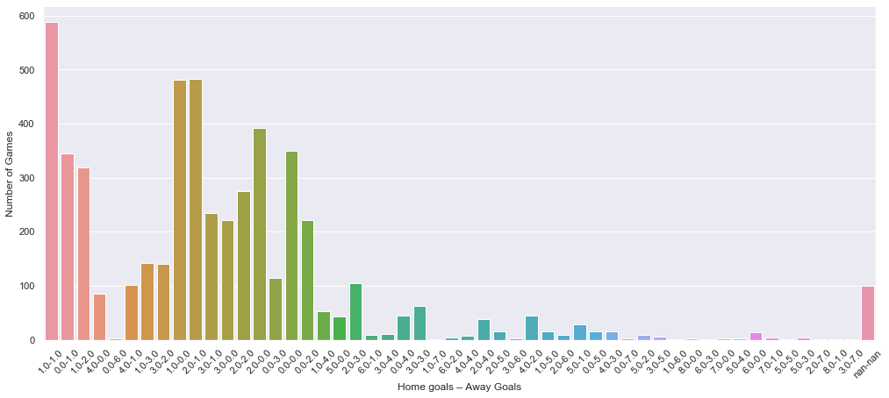

# Homework 1 


```python
import pandas as pd
import numpy as np
import matplotlib.pyplot as plt
import seaborn as sns
import math
```


```python
data = pd.read_csv("matches.csv")
data.fillna(0)
data.head()
home_goals  = list()
away_goals = list()
home_away_goals = list()
```


```python
home_goals = data["match_hometeam_score"].tolist()
away_goals = data["match_awayteam_score"].tolist()
```


```python
data["match_hometeam_score"].to_frame().info()
```

    <class 'pandas.core.frame.DataFrame'>
    RangeIndex: 5174 entries, 0 to 5173
    Data columns (total 1 columns):
    match_hometeam_score    5074 non-null float64
    dtypes: float64(1)
    memory usage: 40.5 KB
    


```python
for i in range(5174):
    home_away_goals.append(str(home_goals[i]) + "-" + str(away_goals[i]))
```


```python
sns.set(style="darkgrid")
plt.figure(figsize=(13,7))
ax = sns.countplot(x=home_goals)
ax.set(xlabel='Home Goals', ylabel='Number of Games')
plt.show()
```





```python
sns.set(style="darkgrid")
plt.figure(figsize=(13,7))
ax = sns.countplot(x=away_goals)
ax.set(xlabel='Away Goals', ylabel='Number of Games')
plt.show()
```





```python
plt.figure(figsize=(17,7))
ax = sns.countplot(x=home_away_goals)
ax.set(xlabel='Home goals – Away Goals', ylabel='Number of Games')
plt.xticks(rotation=45)
plt.show()
```





```python

```
