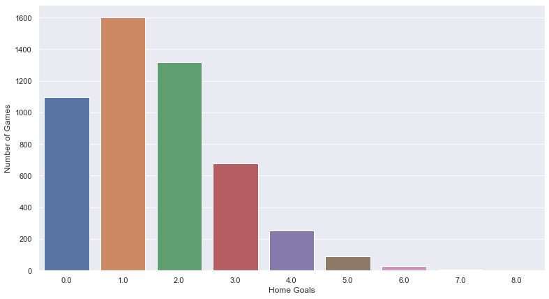
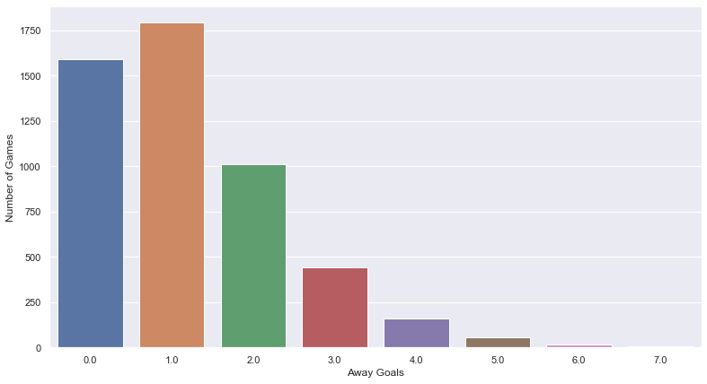
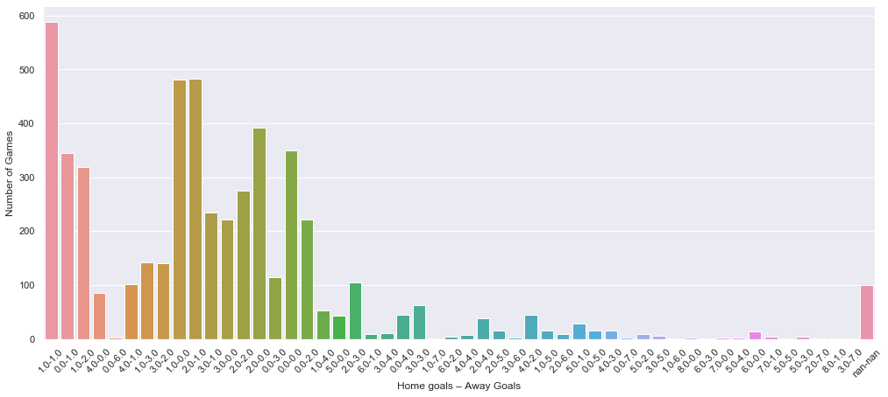
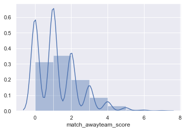
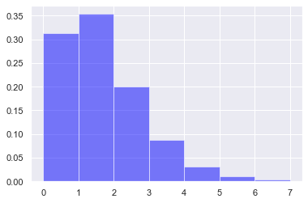

# Homework 1 

Importing necessary libraries.


```python
import pandas as pd
import numpy as np
import matplotlib.pyplot as plt
import seaborn as sns
import math
```

Reading the data from csv file:


```python
data = pd.read_csv("matches.csv")
data.fillna(0)
data.head()
home_goals  = list()
away_goals = list()
home_away_goals = list()
```

Assing home team goals and away team goals in seperate lists.


```python
home_goals = data["match_hometeam_score"].tolist()
away_goals = data["match_awayteam_score"].tolist()
```

Let's see how big our dataset.


```python
data["match_hometeam_score"].to_frame().info()
```

    <class 'pandas.core.frame.DataFrame'>
    RangeIndex: 5174 entries, 0 to 5173
    Data columns (total 1 columns):
    match_hometeam_score    5074 non-null float64
    dtypes: float64(1)
    memory usage: 40.5 KB
    

Let's create another list for results combining home and away goals.


```python
for i in range(5174):
    home_away_goals.append(str(home_goals[i]) + "-" + str(away_goals[i]))
```

Let's see the histogram of home team goals.


```python
sns.set(style="darkgrid")
plt.figure(figsize=(13,7))
ax = sns.countplot(x=home_goals)
ax.set(xlabel='Home Goals', ylabel='Number of Games')
plt.show()
```





And away goals:


```python
sns.set(style="darkgrid")
plt.figure(figsize=(13,7))
ax = sns.countplot(x=away_goals)
ax.set(xlabel='Away Goals', ylabel='Number of Games')
plt.show()
```





And which results are more likely to occur in matches:


```python
plt.figure(figsize=(17,7))
ax = sns.countplot(x=home_away_goals)
ax.set(xlabel='Home goals – Away Goals', ylabel='Number of Games')
plt.xticks(rotation=45)
plt.show()
```





It looks like distribution of away goals looks like poisson distribution.


```python
aways = data.match_awayteam_score.dropna().astype(int)
dats = list()
for i in aways:
    dats.append(int(i))
```


```python
from scipy import stats
from scipy.stats import norm
```

When we try to plot distribituon, an awkward graph meets us.. :


```python
sns.distplot(data.match_awayteam_score.dropna(), bins=7)
```


    <matplotlib.axes._subplots.AxesSubplot at 0x23448f59160>





Then we try another method to graph, but no success..:


```python
import matplotlib.mlab as mlab
sigma = 15
mu= 100
n, bins, patches = plt.hist(dats, 7, density=1, facecolor='blue', alpha=0.5)
y = ((1 / (np.sqrt(2 * np.pi) * sigma)) *
     np.exp(-0.5 * (1 / sigma * (bins - mu))**2))
ax.plot(bins, y, '--')

plt.show()
```





# Task 2


```python
books = pd.read_csv("booking.csv")
books.head()
```


<div>
<style scoped>
    .dataframe tbody tr th:only-of-type {
        vertical-align: middle;
    }

    .dataframe tbody tr th {
        vertical-align: top;
    }

    .dataframe thead th {
        text-align: right;
    }
</style>
<table border="1" class="dataframe">
  <thead>
    <tr style="text-align: right;">
      <th></th>
      <th>match_id</th>
      <th>time</th>
      <th>home_fault</th>
      <th>card</th>
      <th>away_fault</th>
    </tr>
  </thead>
  <tbody>
    <tr>
      <th>0</th>
      <td>13327</td>
      <td>90+3</td>
      <td>Can E.</td>
      <td>yellow card</td>
      <td>NaN</td>
    </tr>
    <tr>
      <th>1</th>
      <td>13329</td>
      <td>29</td>
      <td>Holebas J.</td>
      <td>yellow card</td>
      <td>NaN</td>
    </tr>
    <tr>
      <th>2</th>
      <td>13329</td>
      <td>40</td>
      <td>Doucoure A.</td>
      <td>yellow card</td>
      <td>NaN</td>
    </tr>
    <tr>
      <th>3</th>
      <td>13331</td>
      <td>33</td>
      <td>Cabaye Y.</td>
      <td>yellow card</td>
      <td>NaN</td>
    </tr>
    <tr>
      <th>4</th>
      <td>13331</td>
      <td>50</td>
      <td>Puncheon J.</td>
      <td>yellow card</td>
      <td>NaN</td>
    </tr>
  </tbody>
</table>
</div>


```python
bets = pd.read_csv("bets.csv")
bets.head()
```


<div>
<style scoped>
    .dataframe tbody tr th:only-of-type {
        vertical-align: middle;
    }

    .dataframe tbody tr th {
        vertical-align: top;
    }

    .dataframe thead th {
        text-align: right;
    }
</style>
<table border="1" class="dataframe">
  <thead>
    <tr style="text-align: right;">
      <th></th>
      <th>match_id</th>
      <th>odd_bookmakers</th>
      <th>odd_epoch</th>
      <th>variable</th>
      <th>value</th>
    </tr>
  </thead>
  <tbody>
    <tr>
      <th>0</th>
      <td>146845</td>
      <td>BetOlimp</td>
      <td>1486301854</td>
      <td>odd_1</td>
      <td>1.96</td>
    </tr>
    <tr>
      <th>1</th>
      <td>151780</td>
      <td>10Bet</td>
      <td>1486314920</td>
      <td>odd_1</td>
      <td>2.15</td>
    </tr>
    <tr>
      <th>2</th>
      <td>151780</td>
      <td>18bet</td>
      <td>1486314920</td>
      <td>odd_1</td>
      <td>2.17</td>
    </tr>
    <tr>
      <th>3</th>
      <td>151780</td>
      <td>1xBet</td>
      <td>1486314920</td>
      <td>odd_1</td>
      <td>2.20</td>
    </tr>
    <tr>
      <th>4</th>
      <td>151780</td>
      <td>5Dimes</td>
      <td>1486314920</td>
      <td>odd_1</td>
      <td>2.23</td>
    </tr>
  </tbody>
</table>
</div>


**odd_x : Draw**

**odd_1 : Home Wins**

**odd_2 : Away Wins**

Let's create another column which contains the probabilities that has been given by bookmakers using <br><br> $$\frac {1}{P(value)}$$


```python
prob = list()
for i in bets.value:
    try:
        temp = 1/i
        prob.append(temp)
    except:
        temp = 0
        prob.append(temp)

bets["possibility"] = prob
```


```python
bets["possibility"].head()
```


    0    0.510204
    1    0.465116
    2    0.460829
    3    0.454545
    4    0.448430
    Name: possibility, dtype: float64


### Lets create another column into our matches data to see if a match ended in a draw or no:


```python
data["results"] =  data["match_awayteam_score"] == data["match_hometeam_score"]
data.results.head()
```


    0     True
    1    False
    2    False
    3    False
    4    False
    Name: results, dtype: bool


```python
data.head()
```


<div>
<style scoped>
    .dataframe tbody tr th:only-of-type {
        vertical-align: middle;
    }

    .dataframe tbody tr th {
        vertical-align: top;
    }

    .dataframe thead th {
        text-align: right;
    }
</style>
<table border="1" class="dataframe">
  <thead>
    <tr style="text-align: right;">
      <th></th>
      <th>match_awayteam_id</th>
      <th>match_hometeam_id</th>
      <th>match_id</th>
      <th>epoch</th>
      <th>match_status</th>
      <th>match_live</th>
      <th>match_hometeam_name</th>
      <th>match_awayteam_name</th>
      <th>match_hometeam_score</th>
      <th>match_awayteam_score</th>
      <th>match_hometeam_halftime_score</th>
      <th>match_awayteam_halftime_score</th>
      <th>match_hometeam_extra_score</th>
      <th>match_awayteam_extra_score</th>
      <th>match_hometeam_penalty_score</th>
      <th>match_awayteam_penalty_score</th>
      <th>league_id</th>
      <th>results</th>
    </tr>
  </thead>
  <tbody>
    <tr>
      <th>0</th>
      <td>7109</td>
      <td>7097</td>
      <td>41196</td>
      <td>1505559600</td>
      <td>Finished</td>
      <td>0</td>
      <td>Levante</td>
      <td>Valencia</td>
      <td>1.0</td>
      <td>1.0</td>
      <td>1.0</td>
      <td>1.0</td>
      <td>1.0</td>
      <td>1.0</td>
      <td>NaN</td>
      <td>NaN</td>
      <td>468</td>
      <td>True</td>
    </tr>
    <tr>
      <th>1</th>
      <td>2614</td>
      <td>2619</td>
      <td>13331</td>
      <td>1505561400</td>
      <td>Finished</td>
      <td>0</td>
      <td>Crystal Palace</td>
      <td>Southampton</td>
      <td>0.0</td>
      <td>1.0</td>
      <td>0.0</td>
      <td>1.0</td>
      <td>0.0</td>
      <td>1.0</td>
      <td>NaN</td>
      <td>NaN</td>
      <td>148</td>
      <td>False</td>
    </tr>
    <tr>
      <th>2</th>
      <td>3224</td>
      <td>3238</td>
      <td>17683</td>
      <td>1505568600</td>
      <td>Finished</td>
      <td>0</td>
      <td>Eintracht Frankfurt</td>
      <td>FC Augsburg</td>
      <td>1.0</td>
      <td>2.0</td>
      <td>0.0</td>
      <td>1.0</td>
      <td>0.0</td>
      <td>1.0</td>
      <td>NaN</td>
      <td>NaN</td>
      <td>195</td>
      <td>False</td>
    </tr>
    <tr>
      <th>3</th>
      <td>3235</td>
      <td>3223</td>
      <td>17684</td>
      <td>1505568600</td>
      <td>Finished</td>
      <td>0</td>
      <td>SV Werder Bremen</td>
      <td>Schalke</td>
      <td>1.0</td>
      <td>2.0</td>
      <td>1.0</td>
      <td>1.0</td>
      <td>1.0</td>
      <td>1.0</td>
      <td>NaN</td>
      <td>NaN</td>
      <td>195</td>
      <td>False</td>
    </tr>
    <tr>
      <th>4</th>
      <td>3237</td>
      <td>3225</td>
      <td>17682</td>
      <td>1505568600</td>
      <td>Finished</td>
      <td>0</td>
      <td>Bayern Munich</td>
      <td>1. FSV Mainz 05</td>
      <td>4.0</td>
      <td>0.0</td>
      <td>2.0</td>
      <td>0.0</td>
      <td>2.0</td>
      <td>0.0</td>
      <td>NaN</td>
      <td>NaN</td>
      <td>195</td>
      <td>False</td>
    </tr>
  </tbody>
</table>
</div>


```python
bets.head()
```


<div>
<style scoped>
    .dataframe tbody tr th:only-of-type {
        vertical-align: middle;
    }

    .dataframe tbody tr th {
        vertical-align: top;
    }

    .dataframe thead th {
        text-align: right;
    }
</style>
<table border="1" class="dataframe">
  <thead>
    <tr style="text-align: right;">
      <th></th>
      <th>match_id</th>
      <th>odd_bookmakers</th>
      <th>odd_epoch</th>
      <th>variable</th>
      <th>value</th>
      <th>possibility</th>
    </tr>
  </thead>
  <tbody>
    <tr>
      <th>0</th>
      <td>146845</td>
      <td>BetOlimp</td>
      <td>1486301854</td>
      <td>odd_x</td>
      <td>1.96</td>
      <td>0.510204</td>
    </tr>
    <tr>
      <th>1</th>
      <td>151780</td>
      <td>10Bet</td>
      <td>1486314920</td>
      <td>odd_x</td>
      <td>2.15</td>
      <td>0.465116</td>
    </tr>
    <tr>
      <th>2</th>
      <td>151780</td>
      <td>18bet</td>
      <td>1486314920</td>
      <td>odd_x</td>
      <td>2.17</td>
      <td>0.460829</td>
    </tr>
    <tr>
      <th>3</th>
      <td>151780</td>
      <td>1xBet</td>
      <td>1486314920</td>
      <td>odd_x</td>
      <td>2.20</td>
      <td>0.454545</td>
    </tr>
    <tr>
      <th>4</th>
      <td>151780</td>
      <td>5Dimes</td>
      <td>1486314920</td>
      <td>odd_x</td>
      <td>2.23</td>
      <td>0.448430</td>
    </tr>
  </tbody>
</table>
</div>


We filter the Bets data to get only draw bets. And add a new column named **draw** to which contain a boolean data according to the match result, Draw or No. We make it all False for now.


```python
x = bets['variable'] == 'odd_x'
bets["draw"] = False
bets[x].head()
```


<div>
<style scoped>
    .dataframe tbody tr th:only-of-type {
        vertical-align: middle;
    }

    .dataframe tbody tr th {
        vertical-align: top;
    }

    .dataframe thead th {
        text-align: right;
    }
</style>
<table border="1" class="dataframe">
  <thead>
    <tr style="text-align: right;">
      <th></th>
      <th>match_id</th>
      <th>odd_bookmakers</th>
      <th>odd_epoch</th>
      <th>variable</th>
      <th>value</th>
      <th>possibility</th>
      <th>draw</th>
    </tr>
  </thead>
  <tbody>
    <tr>
      <th>35</th>
      <td>146845</td>
      <td>BetOlimp</td>
      <td>1486301854</td>
      <td>odd_x</td>
      <td>3.49</td>
      <td>0.286533</td>
      <td>False</td>
    </tr>
    <tr>
      <th>36</th>
      <td>151780</td>
      <td>10Bet</td>
      <td>1486314920</td>
      <td>odd_x</td>
      <td>3.15</td>
      <td>0.317460</td>
      <td>False</td>
    </tr>
    <tr>
      <th>37</th>
      <td>151780</td>
      <td>18bet</td>
      <td>1486314920</td>
      <td>odd_x</td>
      <td>3.12</td>
      <td>0.320513</td>
      <td>False</td>
    </tr>
    <tr>
      <th>38</th>
      <td>151780</td>
      <td>1xBet</td>
      <td>1486314920</td>
      <td>odd_x</td>
      <td>3.24</td>
      <td>0.308642</td>
      <td>False</td>
    </tr>
    <tr>
      <th>39</th>
      <td>151780</td>
      <td>5Dimes</td>
      <td>1486314920</td>
      <td>odd_x</td>
      <td>3.19</td>
      <td>0.313480</td>
      <td>False</td>
    </tr>
  </tbody>
</table>
</div>


```python
for index, row in bets[x].iterrows():
    id = row["match_id"]
    if data.query(f'match_id == {id}').results.values[0]:
        bets[x].query(f'match_id == {id}').draw = True
```

We put 4 different dataset of draw bets from 4 different Bookmakers into a python list named **makers**


```python
bookmakers = bets[x].odd_bookmakers.unique().tolist()
type(bookmakers)

makers = list()

for i in bookmakers[:4]:
    bookmaker = bets[x]['odd_bookmakers'] == i
    
    makers.append(bets[x][bookmaker])
```

Lets see the first element of the list makers to have a better understanding of what we done.

First element of makers list contains data of BetOlimp bookmakers draw data.


```python
makers[0].head(15)
```


<div>
<style scoped>
    .dataframe tbody tr th:only-of-type {
        vertical-align: middle;
    }

    .dataframe tbody tr th {
        vertical-align: top;
    }

    .dataframe thead th {
        text-align: right;
    }
</style>
<table border="1" class="dataframe">
  <thead>
    <tr style="text-align: right;">
      <th></th>
      <th>match_id</th>
      <th>odd_bookmakers</th>
      <th>odd_epoch</th>
      <th>variable</th>
      <th>value</th>
      <th>possibility</th>
      <th>draw</th>
    </tr>
  </thead>
  <tbody>
    <tr>
      <th>35</th>
      <td>146845</td>
      <td>BetOlimp</td>
      <td>1486301854</td>
      <td>odd_x</td>
      <td>3.49</td>
      <td>0.286533</td>
      <td>False</td>
    </tr>
    <tr>
      <th>42</th>
      <td>151780</td>
      <td>BetOlimp</td>
      <td>1486314920</td>
      <td>odd_x</td>
      <td>3.15</td>
      <td>0.317460</td>
      <td>False</td>
    </tr>
    <tr>
      <th>59</th>
      <td>151781</td>
      <td>BetOlimp</td>
      <td>1486314941</td>
      <td>odd_x</td>
      <td>3.28</td>
      <td>0.304878</td>
      <td>False</td>
    </tr>
    <tr>
      <th>166</th>
      <td>147990</td>
      <td>BetOlimp</td>
      <td>1486710451</td>
      <td>odd_x</td>
      <td>3.23</td>
      <td>0.309598</td>
      <td>False</td>
    </tr>
    <tr>
      <th>183</th>
      <td>148000</td>
      <td>BetOlimp</td>
      <td>1486710493</td>
      <td>odd_x</td>
      <td>2.99</td>
      <td>0.334448</td>
      <td>False</td>
    </tr>
    <tr>
      <th>200</th>
      <td>148001</td>
      <td>BetOlimp</td>
      <td>1486710502</td>
      <td>odd_x</td>
      <td>3.22</td>
      <td>0.310559</td>
      <td>False</td>
    </tr>
    <tr>
      <th>378</th>
      <td>147991</td>
      <td>BetOlimp</td>
      <td>1486797015</td>
      <td>odd_x</td>
      <td>3.51</td>
      <td>0.284900</td>
      <td>False</td>
    </tr>
    <tr>
      <th>395</th>
      <td>147992</td>
      <td>BetOlimp</td>
      <td>1486797022</td>
      <td>odd_x</td>
      <td>5.03</td>
      <td>0.198807</td>
      <td>False</td>
    </tr>
    <tr>
      <th>412</th>
      <td>147993</td>
      <td>BetOlimp</td>
      <td>1486797032</td>
      <td>odd_x</td>
      <td>4.59</td>
      <td>0.217865</td>
      <td>False</td>
    </tr>
    <tr>
      <th>429</th>
      <td>147995</td>
      <td>BetOlimp</td>
      <td>1486710471</td>
      <td>odd_x</td>
      <td>3.54</td>
      <td>0.282486</td>
      <td>False</td>
    </tr>
    <tr>
      <th>446</th>
      <td>147996</td>
      <td>BetOlimp</td>
      <td>1486797049</td>
      <td>odd_x</td>
      <td>3.60</td>
      <td>0.277778</td>
      <td>False</td>
    </tr>
    <tr>
      <th>612</th>
      <td>147997</td>
      <td>BetOlimp</td>
      <td>1486797054</td>
      <td>odd_x</td>
      <td>3.45</td>
      <td>0.289855</td>
      <td>False</td>
    </tr>
    <tr>
      <th>629</th>
      <td>147998</td>
      <td>BetOlimp</td>
      <td>1486929695</td>
      <td>odd_x</td>
      <td>3.21</td>
      <td>0.311526</td>
      <td>False</td>
    </tr>
    <tr>
      <th>646</th>
      <td>154303</td>
      <td>BetOlimp</td>
      <td>1486931765</td>
      <td>odd_x</td>
      <td>3.68</td>
      <td>0.271739</td>
      <td>False</td>
    </tr>
    <tr>
      <th>752</th>
      <td>150848</td>
      <td>BetOlimp</td>
      <td>1487365197</td>
      <td>odd_x</td>
      <td>3.16</td>
      <td>0.316456</td>
      <td>False</td>
    </tr>
  </tbody>
</table>
</div>


When we need to check if a match ended in a draw or no from its match_id it is more simple to have a dataset like below:


```python
match_results = data.iloc[:,[2,-1]]
match_results.head()
```


<div>
<style scoped>
    .dataframe tbody tr th:only-of-type {
        vertical-align: middle;
    }

    .dataframe tbody tr th {
        vertical-align: top;
    }

    .dataframe thead th {
        text-align: right;
    }
</style>
<table border="1" class="dataframe">
  <thead>
    <tr style="text-align: right;">
      <th></th>
      <th>match_id</th>
      <th>results</th>
    </tr>
  </thead>
  <tbody>
    <tr>
      <th>0</th>
      <td>41196</td>
      <td>True</td>
    </tr>
    <tr>
      <th>1</th>
      <td>13331</td>
      <td>False</td>
    </tr>
    <tr>
      <th>2</th>
      <td>17683</td>
      <td>False</td>
    </tr>
    <tr>
      <th>3</th>
      <td>17684</td>
      <td>False</td>
    </tr>
    <tr>
      <th>4</th>
      <td>17682</td>
      <td>False</td>
    </tr>
  </tbody>
</table>
</div>


### 4 Bookmakers that we are Going to Analyse their Draw Possiblities


```python
for i in makers:
    print(i.odd_bookmakers.unique())
    continue
```

    ['BetOlimp']
    ['10Bet']
    ['18bet']
    ['1xBet']
    

Now let's turn the "draw" column in each element of makers list which belongs to different bookamkers to True or False if correnponding match ended in draw.

To do that we need to check match ID's from the small dataset we created called match_results


```python
for index,rows in makers[0].iterrows():
    id = rows['match_id']
    if match_results.query(f'match_id == {id}').results.values[0]:
        makers[0].at[index,'draw'] = True
```


```python
for index,rows in makers[1].iterrows():
    id = rows['match_id']
    if match_results.query(f"match_id == {id}").results.values[0]:
        makers[1].at[index,'draw'] = True
```


```python
for index,rows in makers[2].iterrows():
    id = rows['match_id']
    if match_results.query(f"match_id == {id}").results.values[0]:
        makers[2].at[index,'draw'] = True
```


```python
for index,rows in makers[3].iterrows():
    id = rows['match_id']
    if match_results.query(f"match_id == {id}").results.values[0]:
        makers[3].at[index,'draw'] = True
```

### Splitting Probabilities into Bins for the Bookmaker BetOlimp

Now we split datasets into bins by their probability of draw.

### **Probabibility Range of Bins**

- ( 0.0 - 0.10 ]
- ( 0.10 - 0.20 ]
- ( 0.20 - 0.30 ]
- ( 0.30 - 0.40 ]


```python
bins_for_betolimp = list()
```


```python
x = makers[0][np.logical_and(makers[0]['possibility'] > 0.0 , makers[0]['possibility'] <= 0.10)]
x2 = makers[0][np.logical_and(makers[0]['possibility'] > 0.10 , makers[0]['possibility'] <= 0.20)]
x3 = makers[0][np.logical_and(makers[0]['possibility'] > 0.20 , makers[0]['possibility'] <= 0.30)]
x4 = makers[0][np.logical_and(makers[0]['possibility'] > 0.30 , makers[0]['possibility'] <= 0.40)]


x5 = makers[0][np.logical_and(makers[0]['possibility'] > 0.40 , makers[0]['possibility'] <= 0.50)]
x6 = makers[0][np.logical_and(makers[0]['possibility'] > 0.50 , makers[0]['possibility'] <= 0.60)]
x7 = makers[0][np.logical_and(makers[0]['possibility'] > 0.60 , makers[0]['possibility'] <= 0.70)]
x8 = makers[0][np.logical_and(makers[0]['possibility'] > 0.70 , makers[0]['possibility'] <= 0.80)]
```

Note that there are no probability of draw biger than 0.40 for some datasets.


```python
bins_for_betolimp = list()
bins_for_betolimp.append(x)
bins_for_betolimp.append(x2)
bins_for_betolimp.append(x3)
bins_for_betolimp.append(x4)
bins_for_betolimp.append(x5)
```


```python
x = makers[1][np.logical_and(makers[1]['possibility'] > 0.0 , makers[1]['possibility'] <= 0.10)]
x2 = makers[1][np.logical_and(makers[1]['possibility'] > 0.10 , makers[1]['possibility'] <= 0.20)]
x3 = makers[1][np.logical_and(makers[1]['possibility'] > 0.20 , makers[1]['possibility'] <= 0.30)]
x4 = makers[1][np.logical_and(makers[1]['possibility'] > 0.30 , makers[1]['possibility'] <= 0.40)]


x5 = makers[1][np.logical_and(makers[1]['possibility'] > 0.40 , makers[1]['possibility'] <= 0.50)]
x6 = makers[1][np.logical_and(makers[1]['possibility'] > 0.50 , makers[1]['possibility'] <= 0.60)]
x7 = makers[1][np.logical_and(makers[1]['possibility'] > 0.60 , makers[1]['possibility'] <= 0.70)]
x8 = makers[1][np.logical_and(makers[1]['possibility'] > 0.70 , makers[1]['possibility'] <= 0.80)]
```


```python
bins_for_10bet = list()

bins_for_10bet.append(x)
bins_for_10bet.append(x2)
bins_for_10bet.append(x3)
bins_for_10bet.append(x4)
bins_for_10bet.append(x5)
```


```python
x = makers[2][np.logical_and(makers[2]['possibility'] > 0.0 , makers[2]['possibility'] <= 0.10)]
x2 = makers[2][np.logical_and(makers[2]['possibility'] > 0.10 , makers[2]['possibility'] <= 0.20)]
x3 = makers[2][np.logical_and(makers[2]['possibility'] > 0.20 , makers[2]['possibility'] <= 0.30)]
x4 = makers[2][np.logical_and(makers[2]['possibility'] > 0.30 , makers[2]['possibility'] <= 0.40)]


x5 = makers[2][np.logical_and(makers[2]['possibility'] > 0.40 , makers[2]['possibility'] <= 0.50)]
x6 = makers[2][np.logical_and(makers[2]['possibility'] > 0.50 , makers[2]['possibility'] <= 0.60)]
x7 = makers[2][np.logical_and(makers[2]['possibility'] > 0.60 , makers[2]['possibility'] <= 0.70)]
x8 = makers[2][np.logical_and(makers[2]['possibility'] > 0.70 , makers[2]['possibility'] <= 0.80)]
```


```python
bins_for_18bet = list()

bins_for_18bet.append(x)
bins_for_18bet.append(x2)
bins_for_18bet.append(x3)
bins_for_18bet.append(x4)
bins_for_18bet.append(x5)
```


```python
x = makers[3][np.logical_and(makers[3]['possibility'] > 0.0 , makers[3]['possibility'] <= 0.10)]
x2 = makers[3][np.logical_and(makers[3]['possibility'] > 0.10 , makers[3]['possibility'] <= 0.20)]
x3 = makers[3][np.logical_and(makers[3]['possibility'] > 0.20 , makers[3]['possibility'] <= 0.30)]
x4 = makers[3][np.logical_and(makers[3]['possibility'] > 0.30 , makers[3]['possibility'] <= 0.40)]


x5 = makers[3][np.logical_and(makers[3]['possibility'] > 0.40 , makers[3]['possibility'] <= 0.50)]
x6 = makers[3][np.logical_and(makers[3]['possibility'] > 0.50 , makers[3]['possibility'] <= 0.60)]
x7 = makers[3][np.logical_and(makers[3]['possibility'] > 0.60 , makers[3]['possibility'] <= 0.70)]
x8 = makers[3][np.logical_and(makers[3]['possibility'] > 0.70 , makers[3]['possibility'] <= 0.80)]
```


```python
bins_for_1xbet = list()

bins_for_1xbet.append(x)
bins_for_1xbet.append(x2)
bins_for_1xbet.append(x3)
bins_for_1xbet.append(x4)
bins_for_1xbet.append(x5)
```

### Estimated Probability of Draws For BetOlimp

When we divide the number of matches ended in draw in the $Bin_i$ with the total number of matches in $Bin_i$: <br>

$$Estimated\space Probability\space of\space Draw = \frac{Number\space of\space Matches\space Ended\space In\space Draw\space in\space Bin_i}{Number\space of\space Matches\space In\space Bin_i}$$


```python
print("\nBetOlimp Estimated Probability of Draws\n\n")
print("Bookmakers Probability : Estimated Probability")
for i in bins_for_betolimp:
    k = i.draw == True
    try:
        print("(" + str(round(i.possibility.min(),2)) + " - " + str(round(i.possibility.max(),2)) +  "]        :        " + str(round(len(i[k])/len(i),2)))
    except:
        pass
    
```

    
    BetOlimp Estimated Probability of Draws
    
    
    Bookmakers Probability : Estimated Probability
    (0.07 - 0.1]        :        0.0
    (0.1 - 0.2]        :        0.19
    (0.2 - 0.3]        :        0.24
    (0.3 - 0.4]        :        0.27
    

### Estimated Probability of Draws For 10Bet


```python
print("\n10Bet Estimated Probability of Draws\n\n")
print("Bookmakers Probability : Estimated Probability")
for i in bins_for_10bet:
    k = i.draw == True
    try:
        print("(" + str(round(i.possibility.min(),2)) + " - " + str(round(i.possibility.max(),2)) +  "]        :         " + str(round(len(i[k])/len(i),2)))
    except:
        pass
```

    
    10Bet Estimated Probability of Draws
    
    
    Bookmakers Probability : Estimated Probability
    (0.07 - 0.1]        :         0.09
    (0.1 - 0.2]        :         0.12
    (0.2 - 0.3]        :         0.24
    (0.3 - 0.39]        :         0.28
    

### Estimated Probability of Draws For 18Bet


```python
print("\n18Bet Estimated Probability of Draws\n\n")
print("Bookmakers Probability : Estimated Probability")
for i in bins_for_18bet:
    k = i.draw == True
    try:
        print("(" + str(round(i.possibility.min(),2)) + " - " + str(round(i.possibility.max(),2)) +  "]        :         " + str(round(len(i[k])/len(i),2)))
    except:
        pass
```

    
    18Bet Estimated Probability of Draws
    
    
    Bookmakers Probability : Estimated Probability
    (0.07 - 0.1]        :         0.1
    (0.11 - 0.2]        :         0.13
    (0.2 - 0.3]        :         0.24
    (0.3 - 0.4]        :         0.29
    

### Estimated Probability of Draws For 1xBet


```python
print("\n1xBet Estimated Probability of Draws\n\n")
print("Bookmakers Probability : Estimated Probability")
for i in bins_for_1xbet:
    k = i.draw == True
    try:
        print("(" + str(round(i.possibility.min(),2)) + " - " + str(round(i.possibility.max(),2)) +  "]        :         " + str(round(len(i[k])/len(i),2)))
    except:
        pass
```

    
    1xBet Estimated Probability of Draws
    
    
    Bookmakers Probability : Estimated Probability
    (0.07 - 0.1]        :         0.04
    (0.1 - 0.2]        :         0.16
    (0.2 - 0.3]        :         0.24
    (0.3 - 0.39]        :         0.3
    (0.4 - 0.41]        :         0.0
    

### Diğer 3 Odd_Bookmaker liste elemanlarını da Draw ise True yapman lazım aynı üstteki gibi. Kolkay gelsin dostum.


```python
data.head()
```


<div>
<style scoped>
    .dataframe tbody tr th:only-of-type {
        vertical-align: middle;
    }

    .dataframe tbody tr th {
        vertical-align: top;
    }

    .dataframe thead th {
        text-align: right;
    }
</style>
<table border="1" class="dataframe">
  <thead>
    <tr style="text-align: right;">
      <th></th>
      <th>match_awayteam_id</th>
      <th>match_hometeam_id</th>
      <th>match_id</th>
      <th>epoch</th>
      <th>match_status</th>
      <th>match_live</th>
      <th>match_hometeam_name</th>
      <th>match_awayteam_name</th>
      <th>match_hometeam_score</th>
      <th>match_awayteam_score</th>
      <th>match_hometeam_halftime_score</th>
      <th>match_awayteam_halftime_score</th>
      <th>match_hometeam_extra_score</th>
      <th>match_awayteam_extra_score</th>
      <th>match_hometeam_penalty_score</th>
      <th>match_awayteam_penalty_score</th>
      <th>league_id</th>
      <th>results</th>
    </tr>
  </thead>
  <tbody>
    <tr>
      <th>0</th>
      <td>7109</td>
      <td>7097</td>
      <td>41196</td>
      <td>1505559600</td>
      <td>Finished</td>
      <td>0</td>
      <td>Levante</td>
      <td>Valencia</td>
      <td>1.0</td>
      <td>1.0</td>
      <td>1.0</td>
      <td>1.0</td>
      <td>1.0</td>
      <td>1.0</td>
      <td>NaN</td>
      <td>NaN</td>
      <td>468</td>
      <td>True</td>
    </tr>
    <tr>
      <th>1</th>
      <td>2614</td>
      <td>2619</td>
      <td>13331</td>
      <td>1505561400</td>
      <td>Finished</td>
      <td>0</td>
      <td>Crystal Palace</td>
      <td>Southampton</td>
      <td>0.0</td>
      <td>1.0</td>
      <td>0.0</td>
      <td>1.0</td>
      <td>0.0</td>
      <td>1.0</td>
      <td>NaN</td>
      <td>NaN</td>
      <td>148</td>
      <td>False</td>
    </tr>
    <tr>
      <th>2</th>
      <td>3224</td>
      <td>3238</td>
      <td>17683</td>
      <td>1505568600</td>
      <td>Finished</td>
      <td>0</td>
      <td>Eintracht Frankfurt</td>
      <td>FC Augsburg</td>
      <td>1.0</td>
      <td>2.0</td>
      <td>0.0</td>
      <td>1.0</td>
      <td>0.0</td>
      <td>1.0</td>
      <td>NaN</td>
      <td>NaN</td>
      <td>195</td>
      <td>False</td>
    </tr>
    <tr>
      <th>3</th>
      <td>3235</td>
      <td>3223</td>
      <td>17684</td>
      <td>1505568600</td>
      <td>Finished</td>
      <td>0</td>
      <td>SV Werder Bremen</td>
      <td>Schalke</td>
      <td>1.0</td>
      <td>2.0</td>
      <td>1.0</td>
      <td>1.0</td>
      <td>1.0</td>
      <td>1.0</td>
      <td>NaN</td>
      <td>NaN</td>
      <td>195</td>
      <td>False</td>
    </tr>
    <tr>
      <th>4</th>
      <td>3237</td>
      <td>3225</td>
      <td>17682</td>
      <td>1505568600</td>
      <td>Finished</td>
      <td>0</td>
      <td>Bayern Munich</td>
      <td>1. FSV Mainz 05</td>
      <td>4.0</td>
      <td>0.0</td>
      <td>2.0</td>
      <td>0.0</td>
      <td>2.0</td>
      <td>0.0</td>
      <td>NaN</td>
      <td>NaN</td>
      <td>195</td>
      <td>False</td>
    </tr>
  </tbody>
</table>
</div>


```python
len(bets[x].odd_bookmakers.unique().tolist())
```


    103


```python

```


```python

```


```python

```


```python
goals = pd.read_csv("goals.csv")
goals.head()
```


<div>
<style scoped>
    .dataframe tbody tr th:only-of-type {
        vertical-align: middle;
    }

    .dataframe tbody tr th {
        vertical-align: top;
    }

    .dataframe thead th {
        text-align: right;
    }
</style>
<table border="1" class="dataframe">
  <thead>
    <tr style="text-align: right;">
      <th></th>
      <th>match_id</th>
      <th>time</th>
      <th>home_scorer</th>
      <th>score</th>
      <th>away_scorer</th>
    </tr>
  </thead>
  <tbody>
    <tr>
      <th>0</th>
      <td>13327</td>
      <td>30</td>
      <td>Salah M.</td>
      <td>1 - 1</td>
      <td>NaN</td>
    </tr>
    <tr>
      <th>1</th>
      <td>13446</td>
      <td>35</td>
      <td>Colin M.</td>
      <td>1 - 0</td>
      <td>NaN</td>
    </tr>
    <tr>
      <th>2</th>
      <td>13446</td>
      <td>56</td>
      <td>NaN</td>
      <td>1 - 1</td>
      <td>Johnson D.</td>
    </tr>
    <tr>
      <th>3</th>
      <td>13446</td>
      <td>60</td>
      <td>NaN</td>
      <td>1 - 2</td>
      <td>Hugill J.</td>
    </tr>
    <tr>
      <th>4</th>
      <td>13446</td>
      <td>67</td>
      <td>NaN</td>
      <td>1 - 3</td>
      <td>Barkhuizen T.</td>
    </tr>
  </tbody>
</table>
</div>


