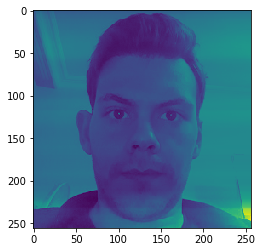
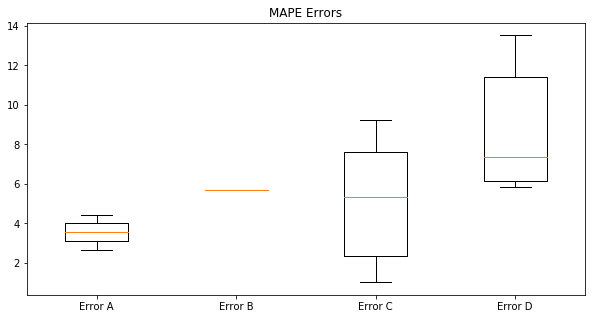

# Homework 1 and 2 and 3

Importing necessary libraries.


```python
import pandas as pd
import numpy as np
import matplotlib.pyplot as plt
import seaborn as sns
import math
```

Reading the data from csv file:


```python
data = pd.read_csv("matches.csv")
data.fillna(0)
data.head()
home_goals  = list()
away_goals = list()
home_away_goals = list()
```

Let's grab the data for only English Premier League which its ID is 148:


```python
x = data['league_id'] == 148
data = data[x]
```


```python
data.head()
```


<div>
<style scoped>
    .dataframe tbody tr th:only-of-type {
        vertical-align: middle;
    }

    .dataframe tbody tr th {
        vertical-align: top;
    }

    .dataframe thead th {
        text-align: right;
    }
</style>
<table border="1" class="dataframe">
  <thead>
    <tr style="text-align: right;">
      <th></th>
      <th>match_awayteam_id</th>
      <th>match_hometeam_id</th>
      <th>match_id</th>
      <th>epoch</th>
      <th>match_status</th>
      <th>match_live</th>
      <th>match_hometeam_name</th>
      <th>match_awayteam_name</th>
      <th>match_hometeam_score</th>
      <th>match_awayteam_score</th>
      <th>match_hometeam_halftime_score</th>
      <th>match_awayteam_halftime_score</th>
      <th>match_hometeam_extra_score</th>
      <th>match_awayteam_extra_score</th>
      <th>match_hometeam_penalty_score</th>
      <th>match_awayteam_penalty_score</th>
      <th>league_id</th>
    </tr>
  </thead>
  <tbody>
    <tr>
      <th>1</th>
      <td>2614</td>
      <td>2619</td>
      <td>13331</td>
      <td>1505561400</td>
      <td>Finished</td>
      <td>0</td>
      <td>Crystal Palace</td>
      <td>Southampton</td>
      <td>0.0</td>
      <td>1.0</td>
      <td>0.0</td>
      <td>1.0</td>
      <td>0.0</td>
      <td>1.0</td>
      <td>NaN</td>
      <td>NaN</td>
      <td>148</td>
    </tr>
    <tr>
      <th>5</th>
      <td>2626</td>
      <td>2623</td>
      <td>13329</td>
      <td>1505570400</td>
      <td>Finished</td>
      <td>0</td>
      <td>Watford</td>
      <td>Manchester City</td>
      <td>0.0</td>
      <td>6.0</td>
      <td>0.0</td>
      <td>3.0</td>
      <td>0.0</td>
      <td>3.0</td>
      <td>NaN</td>
      <td>NaN</td>
      <td>148</td>
    </tr>
    <tr>
      <th>6</th>
      <td>2629</td>
      <td>2621</td>
      <td>13327</td>
      <td>1505570400</td>
      <td>Finished</td>
      <td>0</td>
      <td>Liverpool</td>
      <td>Burnley</td>
      <td>1.0</td>
      <td>1.0</td>
      <td>1.0</td>
      <td>1.0</td>
      <td>1.0</td>
      <td>1.0</td>
      <td>NaN</td>
      <td>NaN</td>
      <td>148</td>
    </tr>
    <tr>
      <th>7</th>
      <td>2641</td>
      <td>2654</td>
      <td>13456</td>
      <td>1505570400</td>
      <td>Finished</td>
      <td>0</td>
      <td>Sheffield Utd</td>
      <td>Norwich</td>
      <td>0.0</td>
      <td>1.0</td>
      <td>0.0</td>
      <td>1.0</td>
      <td>0.0</td>
      <td>1.0</td>
      <td>NaN</td>
      <td>NaN</td>
      <td>148</td>
    </tr>
    <tr>
      <th>27</th>
      <td>2617</td>
      <td>2616</td>
      <td>13324</td>
      <td>1505651400</td>
      <td>Finished</td>
      <td>0</td>
      <td>Chelsea</td>
      <td>Arsenal</td>
      <td>0.0</td>
      <td>0.0</td>
      <td>0.0</td>
      <td>0.0</td>
      <td>0.0</td>
      <td>0.0</td>
      <td>NaN</td>
      <td>NaN</td>
      <td>148</td>
    </tr>
  </tbody>
</table>
</div>


Assing home team goals and away team goals in seperate lists.


```python
home_goals = data["match_hometeam_score"].tolist()
away_goals = data["match_awayteam_score"].tolist()
```

Let's see how big our dataset.


```python
data["match_hometeam_score"].to_frame().info()
```

    <class 'pandas.core.frame.DataFrame'>
    Int64Index: 628 entries, 1 to 5161
    Data columns (total 1 columns):
    match_hometeam_score    618 non-null float64
    dtypes: float64(1)
    memory usage: 9.8 KB
    

Let's create another list for results combining home and away goals.


```python
for i in range(618):
    home_away_goals.append(str(home_goals[i]) + "-" + str(away_goals[i]))
```

Let's see the histogram of home team goals.


```python
sns.set(style="darkgrid")
plt.figure(figsize=(13,7))
ax = sns.countplot(x=home_goals)
ax.set(xlabel='Home Goals', ylabel='Number of Games')
plt.show()
```


And away goals:


```python
sns.set(style="darkgrid")
plt.figure(figsize=(13,7))
ax = sns.countplot(x=away_goals)
ax.set(xlabel='Away Goals', ylabel='Number of Games')
plt.show()
```


And which results are more likely to occur in matches:


```python
plt.figure(figsize=(17,7))
ax = sns.countplot(x=home_away_goals)
ax.set(xlabel='Home goals – Away Goals', ylabel='Number of Games')
plt.xticks(rotation=45)
plt.show()
```


It looks like distribution of away goals looks like poisson distribution.


```python
aways = data.match_awayteam_score.dropna().astype(int)
dats = list()
for i in aways:
    dats.append(int(i))
```


```python
from scipy import stats
from scipy.stats import norm
```

When we try to plot distribituon :


```python
sns.distplot(data.match_awayteam_score.dropna(), bins=7)
```


    <matplotlib.axes._subplots.AxesSubplot at 0x234778f3160>


# Task 2


```python
books = pd.read_csv("booking.csv")
books.head()
```


<div>
<style scoped>
    .dataframe tbody tr th:only-of-type {
        vertical-align: middle;
    }

    .dataframe tbody tr th {
        vertical-align: top;
    }

    .dataframe thead th {
        text-align: right;
    }
</style>
<table border="1" class="dataframe">
  <thead>
    <tr style="text-align: right;">
      <th></th>
      <th>match_id</th>
      <th>time</th>
      <th>home_fault</th>
      <th>card</th>
      <th>away_fault</th>
    </tr>
  </thead>
  <tbody>
    <tr>
      <th>0</th>
      <td>13327</td>
      <td>90+3</td>
      <td>Can E.</td>
      <td>yellow card</td>
      <td>NaN</td>
    </tr>
    <tr>
      <th>1</th>
      <td>13329</td>
      <td>29</td>
      <td>Holebas J.</td>
      <td>yellow card</td>
      <td>NaN</td>
    </tr>
    <tr>
      <th>2</th>
      <td>13329</td>
      <td>40</td>
      <td>Doucoure A.</td>
      <td>yellow card</td>
      <td>NaN</td>
    </tr>
    <tr>
      <th>3</th>
      <td>13331</td>
      <td>33</td>
      <td>Cabaye Y.</td>
      <td>yellow card</td>
      <td>NaN</td>
    </tr>
    <tr>
      <th>4</th>
      <td>13331</td>
      <td>50</td>
      <td>Puncheon J.</td>
      <td>yellow card</td>
      <td>NaN</td>
    </tr>
  </tbody>
</table>
</div>


```python
bets = pd.read_csv("bets.csv")
bets.head()
```


<div>
<style scoped>
    .dataframe tbody tr th:only-of-type {
        vertical-align: middle;
    }

    .dataframe tbody tr th {
        vertical-align: top;
    }

    .dataframe thead th {
        text-align: right;
    }
</style>
<table border="1" class="dataframe">
  <thead>
    <tr style="text-align: right;">
      <th></th>
      <th>match_id</th>
      <th>odd_bookmakers</th>
      <th>odd_epoch</th>
      <th>variable</th>
      <th>value</th>
    </tr>
  </thead>
  <tbody>
    <tr>
      <th>0</th>
      <td>146845</td>
      <td>BetOlimp</td>
      <td>1486301854</td>
      <td>odd_1</td>
      <td>1.96</td>
    </tr>
    <tr>
      <th>1</th>
      <td>151780</td>
      <td>10Bet</td>
      <td>1486314920</td>
      <td>odd_1</td>
      <td>2.15</td>
    </tr>
    <tr>
      <th>2</th>
      <td>151780</td>
      <td>18bet</td>
      <td>1486314920</td>
      <td>odd_1</td>
      <td>2.17</td>
    </tr>
    <tr>
      <th>3</th>
      <td>151780</td>
      <td>1xBet</td>
      <td>1486314920</td>
      <td>odd_1</td>
      <td>2.20</td>
    </tr>
    <tr>
      <th>4</th>
      <td>151780</td>
      <td>5Dimes</td>
      <td>1486314920</td>
      <td>odd_1</td>
      <td>2.23</td>
    </tr>
  </tbody>
</table>
</div>


**odd_x : Draw**

**odd_1 : Home Wins**

**odd_2 : Away Wins**

Let's create another column which contains the probabilities that has been given by bookmakers using <br><br> $$\frac {1}{P(value)}$$


```python
prob = list()
for i in bets.value:
    try:
        temp = 1/i
        prob.append(temp)
    except:
        temp = 0
        prob.append(temp)

bets["possibility"] = prob
```


```python
bets["possibility"].head()
```


    0    0.510204
    1    0.465116
    2    0.460829
    3    0.454545
    4    0.448430
    Name: possibility, dtype: float64


### Lets create another column into our matches data to see if a match ended in a draw or no:


```python
data["results"] =  data["match_awayteam_score"] == data["match_hometeam_score"]
data.results.head()
```


    1     False
    5     False
    6      True
    7     False
    27     True
    Name: results, dtype: bool


```python
data.head()
```


<div>
<style scoped>
    .dataframe tbody tr th:only-of-type {
        vertical-align: middle;
    }

    .dataframe tbody tr th {
        vertical-align: top;
    }

    .dataframe thead th {
        text-align: right;
    }
</style>
<table border="1" class="dataframe">
  <thead>
    <tr style="text-align: right;">
      <th></th>
      <th>match_awayteam_id</th>
      <th>match_hometeam_id</th>
      <th>match_id</th>
      <th>epoch</th>
      <th>match_status</th>
      <th>match_live</th>
      <th>match_hometeam_name</th>
      <th>match_awayteam_name</th>
      <th>match_hometeam_score</th>
      <th>match_awayteam_score</th>
      <th>match_hometeam_halftime_score</th>
      <th>match_awayteam_halftime_score</th>
      <th>match_hometeam_extra_score</th>
      <th>match_awayteam_extra_score</th>
      <th>match_hometeam_penalty_score</th>
      <th>match_awayteam_penalty_score</th>
      <th>league_id</th>
      <th>results</th>
    </tr>
  </thead>
  <tbody>
    <tr>
      <th>1</th>
      <td>2614</td>
      <td>2619</td>
      <td>13331</td>
      <td>1505561400</td>
      <td>Finished</td>
      <td>0</td>
      <td>Crystal Palace</td>
      <td>Southampton</td>
      <td>0.0</td>
      <td>1.0</td>
      <td>0.0</td>
      <td>1.0</td>
      <td>0.0</td>
      <td>1.0</td>
      <td>NaN</td>
      <td>NaN</td>
      <td>148</td>
      <td>False</td>
    </tr>
    <tr>
      <th>5</th>
      <td>2626</td>
      <td>2623</td>
      <td>13329</td>
      <td>1505570400</td>
      <td>Finished</td>
      <td>0</td>
      <td>Watford</td>
      <td>Manchester City</td>
      <td>0.0</td>
      <td>6.0</td>
      <td>0.0</td>
      <td>3.0</td>
      <td>0.0</td>
      <td>3.0</td>
      <td>NaN</td>
      <td>NaN</td>
      <td>148</td>
      <td>False</td>
    </tr>
    <tr>
      <th>6</th>
      <td>2629</td>
      <td>2621</td>
      <td>13327</td>
      <td>1505570400</td>
      <td>Finished</td>
      <td>0</td>
      <td>Liverpool</td>
      <td>Burnley</td>
      <td>1.0</td>
      <td>1.0</td>
      <td>1.0</td>
      <td>1.0</td>
      <td>1.0</td>
      <td>1.0</td>
      <td>NaN</td>
      <td>NaN</td>
      <td>148</td>
      <td>True</td>
    </tr>
    <tr>
      <th>7</th>
      <td>2641</td>
      <td>2654</td>
      <td>13456</td>
      <td>1505570400</td>
      <td>Finished</td>
      <td>0</td>
      <td>Sheffield Utd</td>
      <td>Norwich</td>
      <td>0.0</td>
      <td>1.0</td>
      <td>0.0</td>
      <td>1.0</td>
      <td>0.0</td>
      <td>1.0</td>
      <td>NaN</td>
      <td>NaN</td>
      <td>148</td>
      <td>False</td>
    </tr>
    <tr>
      <th>27</th>
      <td>2617</td>
      <td>2616</td>
      <td>13324</td>
      <td>1505651400</td>
      <td>Finished</td>
      <td>0</td>
      <td>Chelsea</td>
      <td>Arsenal</td>
      <td>0.0</td>
      <td>0.0</td>
      <td>0.0</td>
      <td>0.0</td>
      <td>0.0</td>
      <td>0.0</td>
      <td>NaN</td>
      <td>NaN</td>
      <td>148</td>
      <td>True</td>
    </tr>
  </tbody>
</table>
</div>


```python
bets.head()
```


<div>
<style scoped>
    .dataframe tbody tr th:only-of-type {
        vertical-align: middle;
    }

    .dataframe tbody tr th {
        vertical-align: top;
    }

    .dataframe thead th {
        text-align: right;
    }
</style>
<table border="1" class="dataframe">
  <thead>
    <tr style="text-align: right;">
      <th></th>
      <th>match_id</th>
      <th>odd_bookmakers</th>
      <th>odd_epoch</th>
      <th>variable</th>
      <th>value</th>
      <th>possibility</th>
    </tr>
  </thead>
  <tbody>
    <tr>
      <th>0</th>
      <td>146845</td>
      <td>BetOlimp</td>
      <td>1486301854</td>
      <td>odd_1</td>
      <td>1.96</td>
      <td>0.510204</td>
    </tr>
    <tr>
      <th>1</th>
      <td>151780</td>
      <td>10Bet</td>
      <td>1486314920</td>
      <td>odd_1</td>
      <td>2.15</td>
      <td>0.465116</td>
    </tr>
    <tr>
      <th>2</th>
      <td>151780</td>
      <td>18bet</td>
      <td>1486314920</td>
      <td>odd_1</td>
      <td>2.17</td>
      <td>0.460829</td>
    </tr>
    <tr>
      <th>3</th>
      <td>151780</td>
      <td>1xBet</td>
      <td>1486314920</td>
      <td>odd_1</td>
      <td>2.20</td>
      <td>0.454545</td>
    </tr>
    <tr>
      <th>4</th>
      <td>151780</td>
      <td>5Dimes</td>
      <td>1486314920</td>
      <td>odd_1</td>
      <td>2.23</td>
      <td>0.448430</td>
    </tr>
  </tbody>
</table>
</div>


We filter the Bets data to get only draw bets. And add a new column named **draw** to which contain a boolean data according to the match result, Draw or No. We make it all False for now.


```python
x = bets['variable'] == 'odd_x'
bets["draw"] = False
bets_draw = bets[x]
```


```python
bets_draw.head()
```


<div>
<style scoped>
    .dataframe tbody tr th:only-of-type {
        vertical-align: middle;
    }

    .dataframe tbody tr th {
        vertical-align: top;
    }

    .dataframe thead th {
        text-align: right;
    }
</style>
<table border="1" class="dataframe">
  <thead>
    <tr style="text-align: right;">
      <th></th>
      <th>match_id</th>
      <th>odd_bookmakers</th>
      <th>odd_epoch</th>
      <th>variable</th>
      <th>value</th>
      <th>possibility</th>
      <th>draw</th>
    </tr>
  </thead>
  <tbody>
    <tr>
      <th>35</th>
      <td>146845</td>
      <td>BetOlimp</td>
      <td>1486301854</td>
      <td>odd_x</td>
      <td>3.49</td>
      <td>0.286533</td>
      <td>False</td>
    </tr>
    <tr>
      <th>36</th>
      <td>151780</td>
      <td>10Bet</td>
      <td>1486314920</td>
      <td>odd_x</td>
      <td>3.15</td>
      <td>0.317460</td>
      <td>False</td>
    </tr>
    <tr>
      <th>37</th>
      <td>151780</td>
      <td>18bet</td>
      <td>1486314920</td>
      <td>odd_x</td>
      <td>3.12</td>
      <td>0.320513</td>
      <td>False</td>
    </tr>
    <tr>
      <th>38</th>
      <td>151780</td>
      <td>1xBet</td>
      <td>1486314920</td>
      <td>odd_x</td>
      <td>3.24</td>
      <td>0.308642</td>
      <td>False</td>
    </tr>
    <tr>
      <th>39</th>
      <td>151780</td>
      <td>5Dimes</td>
      <td>1486314920</td>
      <td>odd_x</td>
      <td>3.19</td>
      <td>0.313480</td>
      <td>False</td>
    </tr>
  </tbody>
</table>
</div>


```python
data.results.value_counts()
```


    False    493
    True     135
    Name: results, dtype: int64


```python
count = int()
for index, row in bets_draw.iterrows():
    id = row["match_id"]
    match = data.query(f'match_id == {id}')
    if len(match) > 0:
        if match.results.values[0]:
            count+=1
            bets_draw.at[index,'draw'] = True
```


```python
count
```


    3783


```python
bets_draw.draw.value_counts()
```


    False    140999
    True       3783
    Name: draw, dtype: int64


```python
%%capture
from tqdm import tqdm_notebook as tqdm
tqdm().pandas()
```


```python
indexes = list()
with tqdm(total = len(bets_draw)) as pbar:
    for index,row in bets_draw.iterrows():
        id = row['match_id']
        match = data.query(f'match_id == {id}')
        if len(match) == 0:
            indexes.append(index)
        elif len(match) > 0:
            bets_draw.at[index,'draw'] = True
        pbar.update(1)

bets_draw = bets_draw.drop(indexes)
```


    HBox(children=(IntProgress(value=0, max=144782), HTML(value='')))


    
    


```python
bets_draw.draw.value_counts()
```


    True    19660
    Name: draw, dtype: int64


We put 4 different dataset of draw bets from 4 different Bookmakers into a python list named **makers**


```python
bookmakers = bets[x].odd_bookmakers.unique().tolist()  # Get a list of bookmakers.
#type(bookmakers)

makers = list()

for i in bookmakers[:4]:  #For the first 4 bookmakers in the list bookmakers. We get their data into makers list.
    bookmaker = bets[x]['odd_bookmakers'] == i
    
    makers.append(bets[x][bookmaker])
```

Lets see the first element of the list makers to have a better understanding of what we done.

First element of makers list contains data of BetOlimp bookmakers draw data.


```python
makers[0].head(15)
```


<div>
<style scoped>
    .dataframe tbody tr th:only-of-type {
        vertical-align: middle;
    }

    .dataframe tbody tr th {
        vertical-align: top;
    }

    .dataframe thead th {
        text-align: right;
    }
</style>
<table border="1" class="dataframe">
  <thead>
    <tr style="text-align: right;">
      <th></th>
      <th>match_id</th>
      <th>odd_bookmakers</th>
      <th>odd_epoch</th>
      <th>variable</th>
      <th>value</th>
      <th>possibility</th>
      <th>draw</th>
    </tr>
  </thead>
  <tbody>
    <tr>
      <th>35</th>
      <td>146845</td>
      <td>BetOlimp</td>
      <td>1486301854</td>
      <td>odd_x</td>
      <td>3.49</td>
      <td>0.286533</td>
      <td>False</td>
    </tr>
    <tr>
      <th>42</th>
      <td>151780</td>
      <td>BetOlimp</td>
      <td>1486314920</td>
      <td>odd_x</td>
      <td>3.15</td>
      <td>0.317460</td>
      <td>False</td>
    </tr>
    <tr>
      <th>59</th>
      <td>151781</td>
      <td>BetOlimp</td>
      <td>1486314941</td>
      <td>odd_x</td>
      <td>3.28</td>
      <td>0.304878</td>
      <td>False</td>
    </tr>
    <tr>
      <th>166</th>
      <td>147990</td>
      <td>BetOlimp</td>
      <td>1486710451</td>
      <td>odd_x</td>
      <td>3.23</td>
      <td>0.309598</td>
      <td>False</td>
    </tr>
    <tr>
      <th>183</th>
      <td>148000</td>
      <td>BetOlimp</td>
      <td>1486710493</td>
      <td>odd_x</td>
      <td>2.99</td>
      <td>0.334448</td>
      <td>False</td>
    </tr>
    <tr>
      <th>200</th>
      <td>148001</td>
      <td>BetOlimp</td>
      <td>1486710502</td>
      <td>odd_x</td>
      <td>3.22</td>
      <td>0.310559</td>
      <td>False</td>
    </tr>
    <tr>
      <th>378</th>
      <td>147991</td>
      <td>BetOlimp</td>
      <td>1486797015</td>
      <td>odd_x</td>
      <td>3.51</td>
      <td>0.284900</td>
      <td>False</td>
    </tr>
    <tr>
      <th>395</th>
      <td>147992</td>
      <td>BetOlimp</td>
      <td>1486797022</td>
      <td>odd_x</td>
      <td>5.03</td>
      <td>0.198807</td>
      <td>False</td>
    </tr>
    <tr>
      <th>412</th>
      <td>147993</td>
      <td>BetOlimp</td>
      <td>1486797032</td>
      <td>odd_x</td>
      <td>4.59</td>
      <td>0.217865</td>
      <td>False</td>
    </tr>
    <tr>
      <th>429</th>
      <td>147995</td>
      <td>BetOlimp</td>
      <td>1486710471</td>
      <td>odd_x</td>
      <td>3.54</td>
      <td>0.282486</td>
      <td>False</td>
    </tr>
    <tr>
      <th>446</th>
      <td>147996</td>
      <td>BetOlimp</td>
      <td>1486797049</td>
      <td>odd_x</td>
      <td>3.60</td>
      <td>0.277778</td>
      <td>False</td>
    </tr>
    <tr>
      <th>612</th>
      <td>147997</td>
      <td>BetOlimp</td>
      <td>1486797054</td>
      <td>odd_x</td>
      <td>3.45</td>
      <td>0.289855</td>
      <td>False</td>
    </tr>
    <tr>
      <th>629</th>
      <td>147998</td>
      <td>BetOlimp</td>
      <td>1486929695</td>
      <td>odd_x</td>
      <td>3.21</td>
      <td>0.311526</td>
      <td>False</td>
    </tr>
    <tr>
      <th>646</th>
      <td>154303</td>
      <td>BetOlimp</td>
      <td>1486931765</td>
      <td>odd_x</td>
      <td>3.68</td>
      <td>0.271739</td>
      <td>False</td>
    </tr>
    <tr>
      <th>752</th>
      <td>150848</td>
      <td>BetOlimp</td>
      <td>1487365197</td>
      <td>odd_x</td>
      <td>3.16</td>
      <td>0.316456</td>
      <td>False</td>
    </tr>
  </tbody>
</table>
</div>


When we need to check if a match ended in a draw or no from its match_id it is more simple to have a dataset like below:


```python
match_results = data.iloc[:,[2,-1]]
match_results.head()
```


<div>
<style scoped>
    .dataframe tbody tr th:only-of-type {
        vertical-align: middle;
    }

    .dataframe tbody tr th {
        vertical-align: top;
    }

    .dataframe thead th {
        text-align: right;
    }
</style>
<table border="1" class="dataframe">
  <thead>
    <tr style="text-align: right;">
      <th></th>
      <th>match_id</th>
      <th>results</th>
    </tr>
  </thead>
  <tbody>
    <tr>
      <th>0</th>
      <td>41196</td>
      <td>True</td>
    </tr>
    <tr>
      <th>1</th>
      <td>13331</td>
      <td>False</td>
    </tr>
    <tr>
      <th>2</th>
      <td>17683</td>
      <td>False</td>
    </tr>
    <tr>
      <th>3</th>
      <td>17684</td>
      <td>False</td>
    </tr>
    <tr>
      <th>4</th>
      <td>17682</td>
      <td>False</td>
    </tr>
  </tbody>
</table>
</div>


### 4 Bookmakers that we are Going to Analyse their Draw Possiblities


```python
for i in makers:
    print(i.odd_bookmakers.unique())
    continue
```

    ['BetOlimp']
    ['10Bet']
    ['18bet']
    ['1xBet']
    

Now let's turn the "draw" column in each element of makers list which belongs to different bookamkers to True or False if correnponding match ended in draw.

To do that we need to check match ID's from the small dataset we created called match_results


```python
for index,rows in makers[0].iterrows():
    id = rows['match_id']
    if match_results.query(f'match_id == {id}').results.values[0]:
        makers[0].at[index,'draw'] = True
```


```python
for index,rows in makers[1].iterrows():
    id = rows['match_id']
    if match_results.query(f"match_id == {id}").results.values[0]:
        makers[1].at[index,'draw'] = True
```


```python
for index,rows in makers[2].iterrows():
    id = rows['match_id']
    if match_results.query(f"match_id == {id}").results.values[0]:
        makers[2].at[index,'draw'] = True
```


```python
for index,rows in makers[3].iterrows():
    id = rows['match_id']
    if match_results.query(f"match_id == {id}").results.values[0]:
        makers[3].at[index,'draw'] = True
```

### Splitting Probabilities into Bins for the Bookmaker BetOlimp

Now we split datasets into bins by their probability of draw.

### **Probabibility Range of Bins**

- ( 0.0 - 0.10 ]
- ( 0.10 - 0.20 ]
- ( 0.20 - 0.30 ]
- ( 0.30 - 0.40 ]


```python
bins_for_betolimp = list()
```


```python
x = makers[0][np.logical_and(makers[0]['possibility'] > 0.0 , makers[0]['possibility'] <= 0.10)]
x2 = makers[0][np.logical_and(makers[0]['possibility'] > 0.10 , makers[0]['possibility'] <= 0.20)]
x3 = makers[0][np.logical_and(makers[0]['possibility'] > 0.20 , makers[0]['possibility'] <= 0.30)]
x4 = makers[0][np.logical_and(makers[0]['possibility'] > 0.30 , makers[0]['possibility'] <= 0.40)]


x5 = makers[0][np.logical_and(makers[0]['possibility'] > 0.40 , makers[0]['possibility'] <= 0.50)]
x6 = makers[0][np.logical_and(makers[0]['possibility'] > 0.50 , makers[0]['possibility'] <= 0.60)]
x7 = makers[0][np.logical_and(makers[0]['possibility'] > 0.60 , makers[0]['possibility'] <= 0.70)]
x8 = makers[0][np.logical_and(makers[0]['possibility'] > 0.70 , makers[0]['possibility'] <= 0.80)]
```

Note that there are no probability of draw biger than 0.40 for some datasets.


```python
bins_for_betolimp = list()
bins_for_betolimp.append(x)
bins_for_betolimp.append(x2)
bins_for_betolimp.append(x3)
bins_for_betolimp.append(x4)
bins_for_betolimp.append(x5)
```


```python
x = makers[1][np.logical_and(makers[1]['possibility'] > 0.0 , makers[1]['possibility'] <= 0.10)]
x2 = makers[1][np.logical_and(makers[1]['possibility'] > 0.10 , makers[1]['possibility'] <= 0.20)]
x3 = makers[1][np.logical_and(makers[1]['possibility'] > 0.20 , makers[1]['possibility'] <= 0.30)]
x4 = makers[1][np.logical_and(makers[1]['possibility'] > 0.30 , makers[1]['possibility'] <= 0.40)]


x5 = makers[1][np.logical_and(makers[1]['possibility'] > 0.40 , makers[1]['possibility'] <= 0.50)]
x6 = makers[1][np.logical_and(makers[1]['possibility'] > 0.50 , makers[1]['possibility'] <= 0.60)]
x7 = makers[1][np.logical_and(makers[1]['possibility'] > 0.60 , makers[1]['possibility'] <= 0.70)]
x8 = makers[1][np.logical_and(makers[1]['possibility'] > 0.70 , makers[1]['possibility'] <= 0.80)]
```


```python
bins_for_10bet = list()

bins_for_10bet.append(x)
bins_for_10bet.append(x2)
bins_for_10bet.append(x3)
bins_for_10bet.append(x4)
bins_for_10bet.append(x5)
```


```python
x = makers[2][np.logical_and(makers[2]['possibility'] > 0.0 , makers[2]['possibility'] <= 0.10)]
x2 = makers[2][np.logical_and(makers[2]['possibility'] > 0.10 , makers[2]['possibility'] <= 0.20)]
x3 = makers[2][np.logical_and(makers[2]['possibility'] > 0.20 , makers[2]['possibility'] <= 0.30)]
x4 = makers[2][np.logical_and(makers[2]['possibility'] > 0.30 , makers[2]['possibility'] <= 0.40)]


x5 = makers[2][np.logical_and(makers[2]['possibility'] > 0.40 , makers[2]['possibility'] <= 0.50)]
x6 = makers[2][np.logical_and(makers[2]['possibility'] > 0.50 , makers[2]['possibility'] <= 0.60)]
x7 = makers[2][np.logical_and(makers[2]['possibility'] > 0.60 , makers[2]['possibility'] <= 0.70)]
x8 = makers[2][np.logical_and(makers[2]['possibility'] > 0.70 , makers[2]['possibility'] <= 0.80)]
```


```python
bins_for_18bet = list()

bins_for_18bet.append(x)
bins_for_18bet.append(x2)
bins_for_18bet.append(x3)
bins_for_18bet.append(x4)
bins_for_18bet.append(x5)
```


```python
x = makers[3][np.logical_and(makers[3]['possibility'] > 0.0 , makers[3]['possibility'] <= 0.10)]
x2 = makers[3][np.logical_and(makers[3]['possibility'] > 0.10 , makers[3]['possibility'] <= 0.20)]
x3 = makers[3][np.logical_and(makers[3]['possibility'] > 0.20 , makers[3]['possibility'] <= 0.30)]
x4 = makers[3][np.logical_and(makers[3]['possibility'] > 0.30 , makers[3]['possibility'] <= 0.40)]


x5 = makers[3][np.logical_and(makers[3]['possibility'] > 0.40 , makers[3]['possibility'] <= 0.50)]
x6 = makers[3][np.logical_and(makers[3]['possibility'] > 0.50 , makers[3]['possibility'] <= 0.60)]
x7 = makers[3][np.logical_and(makers[3]['possibility'] > 0.60 , makers[3]['possibility'] <= 0.70)]
x8 = makers[3][np.logical_and(makers[3]['possibility'] > 0.70 , makers[3]['possibility'] <= 0.80)]
```


```python
bins_for_1xbet = list()

bins_for_1xbet.append(x)
bins_for_1xbet.append(x2)
bins_for_1xbet.append(x3)
bins_for_1xbet.append(x4)
bins_for_1xbet.append(x5)
```

### Estimated Probability of Draws For BetOlimp

When we divide the number of matches ended in draw in the $Bin_i$ with the total number of matches in $Bin_i$: <br>

$$Estimated\space Probability\space of\space Draw = \frac{Number\space of\space Matches\space Ended\space In\space Draw\space in\space Bin_i}{Number\space of\space Matches\space In\space Bin_i}$$


```python
print("\nBetOlimp Estimated Probability of Draws\n\n")
print("Bookmakers Probability : Estimated Probability")
for i in bins_for_betolimp:
    k = i.draw == True
    try:
        print("(" + str(round(i.possibility.min(),2)) + " - " + str(round(i.possibility.max(),2)) +  "]        :        " + str(round(len(i[k])/len(i),2)))
    except:
        pass
    
```

    
    BetOlimp Estimated Probability of Draws
    
    
    Bookmakers Probability : Estimated Probability
    (0.07 - 0.1]        :        0.0
    (0.1 - 0.2]        :        0.19
    (0.2 - 0.3]        :        0.24
    (0.3 - 0.4]        :        0.27
    

### Estimated Probability of Draws For 10Bet


```python
print("\n10Bet Estimated Probability of Draws\n\n")
print("Bookmakers Probability : Estimated Probability")
for i in bins_for_10bet:
    k = i.draw == True
    try:
        print("(" + str(round(i.possibility.min(),2)) + " - " + str(round(i.possibility.max(),2)) +  "]        :         " + str(round(len(i[k])/len(i),2)))
    except:
        pass
```

    
    10Bet Estimated Probability of Draws
    
    
    Bookmakers Probability : Estimated Probability
    (0.07 - 0.1]        :         0.09
    (0.1 - 0.2]        :         0.12
    (0.2 - 0.3]        :         0.24
    (0.3 - 0.39]        :         0.28
    

### Estimated Probability of Draws For 18Bet


```python
print("\n18Bet Estimated Probability of Draws\n\n")
print("Bookmakers Probability : Estimated Probability")
for i in bins_for_18bet:
    k = i.draw == True
    try:
        print("(" + str(round(i.possibility.min(),2)) + " - " + str(round(i.possibility.max(),2)) +  "]        :         " + str(round(len(i[k])/len(i),2)))
    except:
        pass
```

    
    18Bet Estimated Probability of Draws
    
    
    Bookmakers Probability : Estimated Probability
    (0.07 - 0.1]        :         0.1
    (0.11 - 0.2]        :         0.13
    (0.2 - 0.3]        :         0.24
    (0.3 - 0.4]        :         0.29
    

### Estimated Probability of Draws For 1xBet


```python
print("\n1xBet Estimated Probability of Draws\n\n")
print("Bookmakers Probability : Estimated Probability")
for i in bins_for_1xbet:
    k = i.draw == True
    try:
        print("(" + str(round(i.possibility.min(),2)) + " - " + str(round(i.possibility.max(),2)) +  "]        :         " + str(round(len(i[k])/len(i),2)))
    except:
        pass
```

    
    1xBet Estimated Probability of Draws
    
    
    Bookmakers Probability : Estimated Probability
    (0.07 - 0.1]        :         0.04
    (0.1 - 0.2]        :         0.16
    (0.2 - 0.3]        :         0.24
    (0.3 - 0.39]        :         0.3
    (0.4 - 0.41]        :         0.0
    

Since we are done with the draw boolen column, we can dop it:


```python
bets = bets.drop(['draw'], axis=1)
```

Now let's take a look at the home win bets:


```python
#bets = bets.drop(['away_win'], axis=1)
x = bets['variable'] == 'odd_1'
bets["home_win"] = False
bets[x].head(10)
```


<div>
<style scoped>
    .dataframe tbody tr th:only-of-type {
        vertical-align: middle;
    }

    .dataframe tbody tr th {
        vertical-align: top;
    }

    .dataframe thead th {
        text-align: right;
    }
</style>
<table border="1" class="dataframe">
  <thead>
    <tr style="text-align: right;">
      <th></th>
      <th>match_id</th>
      <th>odd_bookmakers</th>
      <th>odd_epoch</th>
      <th>variable</th>
      <th>value</th>
      <th>possibility</th>
      <th>home_win</th>
    </tr>
  </thead>
  <tbody>
    <tr>
      <th>0</th>
      <td>146845</td>
      <td>BetOlimp</td>
      <td>1486301854</td>
      <td>odd_1</td>
      <td>1.96</td>
      <td>0.510204</td>
      <td>False</td>
    </tr>
    <tr>
      <th>1</th>
      <td>151780</td>
      <td>10Bet</td>
      <td>1486314920</td>
      <td>odd_1</td>
      <td>2.15</td>
      <td>0.465116</td>
      <td>False</td>
    </tr>
    <tr>
      <th>2</th>
      <td>151780</td>
      <td>18bet</td>
      <td>1486314920</td>
      <td>odd_1</td>
      <td>2.17</td>
      <td>0.460829</td>
      <td>False</td>
    </tr>
    <tr>
      <th>3</th>
      <td>151780</td>
      <td>1xBet</td>
      <td>1486314920</td>
      <td>odd_1</td>
      <td>2.20</td>
      <td>0.454545</td>
      <td>False</td>
    </tr>
    <tr>
      <th>4</th>
      <td>151780</td>
      <td>5Dimes</td>
      <td>1486314920</td>
      <td>odd_1</td>
      <td>2.23</td>
      <td>0.448430</td>
      <td>False</td>
    </tr>
    <tr>
      <th>5</th>
      <td>151780</td>
      <td>bet-at-home</td>
      <td>1486314920</td>
      <td>odd_1</td>
      <td>2.12</td>
      <td>0.471698</td>
      <td>False</td>
    </tr>
    <tr>
      <th>6</th>
      <td>151780</td>
      <td>bet365</td>
      <td>1486314920</td>
      <td>odd_1</td>
      <td>2.20</td>
      <td>0.454545</td>
      <td>False</td>
    </tr>
    <tr>
      <th>7</th>
      <td>151780</td>
      <td>BetOlimp</td>
      <td>1486314920</td>
      <td>odd_1</td>
      <td>2.19</td>
      <td>0.456621</td>
      <td>False</td>
    </tr>
    <tr>
      <th>8</th>
      <td>151780</td>
      <td>Betrally</td>
      <td>1486314920</td>
      <td>odd_1</td>
      <td>2.15</td>
      <td>0.465116</td>
      <td>False</td>
    </tr>
    <tr>
      <th>9</th>
      <td>151780</td>
      <td>BetVictor</td>
      <td>1486314920</td>
      <td>odd_1</td>
      <td>2.20</td>
      <td>0.454545</td>
      <td>False</td>
    </tr>
  </tbody>
</table>
</div>


```python
bookmakers = bets[x].odd_bookmakers.unique().tolist()
type(bookmakers)

makers_1 = list()

for i in bookmakers[:4]:
    bookmaker = bets[x]['odd_bookmakers'] == i
    
    makers_1.append(bets[x][bookmaker])
```


```python
bets.query(f'match_id == 146845')
```


<div>
<style scoped>
    .dataframe tbody tr th:only-of-type {
        vertical-align: middle;
    }

    .dataframe tbody tr th {
        vertical-align: top;
    }

    .dataframe thead th {
        text-align: right;
    }
</style>
<table border="1" class="dataframe">
  <thead>
    <tr style="text-align: right;">
      <th></th>
      <th>match_id</th>
      <th>odd_bookmakers</th>
      <th>odd_epoch</th>
      <th>variable</th>
      <th>value</th>
      <th>possibility</th>
      <th>home_win</th>
    </tr>
  </thead>
  <tbody>
    <tr>
      <th>0</th>
      <td>146845</td>
      <td>BetOlimp</td>
      <td>1486301854</td>
      <td>odd_1</td>
      <td>1.96</td>
      <td>0.510204</td>
      <td>False</td>
    </tr>
    <tr>
      <th>35</th>
      <td>146845</td>
      <td>BetOlimp</td>
      <td>1486301854</td>
      <td>odd_x</td>
      <td>3.49</td>
      <td>0.286533</td>
      <td>False</td>
    </tr>
    <tr>
      <th>70</th>
      <td>146845</td>
      <td>BetOlimp</td>
      <td>1486301854</td>
      <td>odd_2</td>
      <td>3.65</td>
      <td>0.273973</td>
      <td>False</td>
    </tr>
  </tbody>
</table>
</div>


```python
makers_1[0].head()
```


<div>
<style scoped>
    .dataframe tbody tr th:only-of-type {
        vertical-align: middle;
    }

    .dataframe tbody tr th {
        vertical-align: top;
    }

    .dataframe thead th {
        text-align: right;
    }
</style>
<table border="1" class="dataframe">
  <thead>
    <tr style="text-align: right;">
      <th></th>
      <th>match_id</th>
      <th>odd_bookmakers</th>
      <th>odd_epoch</th>
      <th>variable</th>
      <th>value</th>
      <th>possibility</th>
      <th>home_win</th>
    </tr>
  </thead>
  <tbody>
    <tr>
      <th>0</th>
      <td>146845</td>
      <td>BetOlimp</td>
      <td>1486301854</td>
      <td>odd_1</td>
      <td>1.96</td>
      <td>0.510204</td>
      <td>False</td>
    </tr>
    <tr>
      <th>7</th>
      <td>151780</td>
      <td>BetOlimp</td>
      <td>1486314920</td>
      <td>odd_1</td>
      <td>2.19</td>
      <td>0.456621</td>
      <td>False</td>
    </tr>
    <tr>
      <th>24</th>
      <td>151781</td>
      <td>BetOlimp</td>
      <td>1486314941</td>
      <td>odd_1</td>
      <td>2.95</td>
      <td>0.338983</td>
      <td>False</td>
    </tr>
    <tr>
      <th>111</th>
      <td>147990</td>
      <td>BetOlimp</td>
      <td>1486710451</td>
      <td>odd_1</td>
      <td>2.14</td>
      <td>0.467290</td>
      <td>False</td>
    </tr>
    <tr>
      <th>128</th>
      <td>148000</td>
      <td>BetOlimp</td>
      <td>1486710493</td>
      <td>odd_1</td>
      <td>2.50</td>
      <td>0.400000</td>
      <td>False</td>
    </tr>
  </tbody>
</table>
</div>


```python
data.head()
```


<div>
<style scoped>
    .dataframe tbody tr th:only-of-type {
        vertical-align: middle;
    }

    .dataframe tbody tr th {
        vertical-align: top;
    }

    .dataframe thead th {
        text-align: right;
    }
</style>
<table border="1" class="dataframe">
  <thead>
    <tr style="text-align: right;">
      <th></th>
      <th>match_awayteam_id</th>
      <th>match_hometeam_id</th>
      <th>match_id</th>
      <th>epoch</th>
      <th>match_status</th>
      <th>match_live</th>
      <th>match_hometeam_name</th>
      <th>match_awayteam_name</th>
      <th>match_hometeam_score</th>
      <th>match_awayteam_score</th>
      <th>match_hometeam_halftime_score</th>
      <th>match_awayteam_halftime_score</th>
      <th>match_hometeam_extra_score</th>
      <th>match_awayteam_extra_score</th>
      <th>match_hometeam_penalty_score</th>
      <th>match_awayteam_penalty_score</th>
      <th>league_id</th>
      <th>results</th>
    </tr>
  </thead>
  <tbody>
    <tr>
      <th>0</th>
      <td>7109</td>
      <td>7097</td>
      <td>41196</td>
      <td>1505559600</td>
      <td>Finished</td>
      <td>0</td>
      <td>Levante</td>
      <td>Valencia</td>
      <td>1.0</td>
      <td>1.0</td>
      <td>1.0</td>
      <td>1.0</td>
      <td>1.0</td>
      <td>1.0</td>
      <td>NaN</td>
      <td>NaN</td>
      <td>468</td>
      <td>True</td>
    </tr>
    <tr>
      <th>1</th>
      <td>2614</td>
      <td>2619</td>
      <td>13331</td>
      <td>1505561400</td>
      <td>Finished</td>
      <td>0</td>
      <td>Crystal Palace</td>
      <td>Southampton</td>
      <td>0.0</td>
      <td>1.0</td>
      <td>0.0</td>
      <td>1.0</td>
      <td>0.0</td>
      <td>1.0</td>
      <td>NaN</td>
      <td>NaN</td>
      <td>148</td>
      <td>False</td>
    </tr>
    <tr>
      <th>2</th>
      <td>3224</td>
      <td>3238</td>
      <td>17683</td>
      <td>1505568600</td>
      <td>Finished</td>
      <td>0</td>
      <td>Eintracht Frankfurt</td>
      <td>FC Augsburg</td>
      <td>1.0</td>
      <td>2.0</td>
      <td>0.0</td>
      <td>1.0</td>
      <td>0.0</td>
      <td>1.0</td>
      <td>NaN</td>
      <td>NaN</td>
      <td>195</td>
      <td>False</td>
    </tr>
    <tr>
      <th>3</th>
      <td>3235</td>
      <td>3223</td>
      <td>17684</td>
      <td>1505568600</td>
      <td>Finished</td>
      <td>0</td>
      <td>SV Werder Bremen</td>
      <td>Schalke</td>
      <td>1.0</td>
      <td>2.0</td>
      <td>1.0</td>
      <td>1.0</td>
      <td>1.0</td>
      <td>1.0</td>
      <td>NaN</td>
      <td>NaN</td>
      <td>195</td>
      <td>False</td>
    </tr>
    <tr>
      <th>4</th>
      <td>3237</td>
      <td>3225</td>
      <td>17682</td>
      <td>1505568600</td>
      <td>Finished</td>
      <td>0</td>
      <td>Bayern Munich</td>
      <td>1. FSV Mainz 05</td>
      <td>4.0</td>
      <td>0.0</td>
      <td>2.0</td>
      <td>0.0</td>
      <td>2.0</td>
      <td>0.0</td>
      <td>NaN</td>
      <td>NaN</td>
      <td>195</td>
      <td>False</td>
    </tr>
  </tbody>
</table>
</div>


We extract the part of the data which has home team wins. Since we dont have a column that tells us the result, we compare goals of home teams and away teams and add the matches with bigger home team goals to the new dataset called **home_wins**


```python
home_wins = data[data['match_hometeam_score'] > data['match_awayteam_score']]
home_wins.head()
```


<div>
<style scoped>
    .dataframe tbody tr th:only-of-type {
        vertical-align: middle;
    }

    .dataframe tbody tr th {
        vertical-align: top;
    }

    .dataframe thead th {
        text-align: right;
    }
</style>
<table border="1" class="dataframe">
  <thead>
    <tr style="text-align: right;">
      <th></th>
      <th>match_awayteam_id</th>
      <th>match_hometeam_id</th>
      <th>match_id</th>
      <th>epoch</th>
      <th>match_status</th>
      <th>match_live</th>
      <th>match_hometeam_name</th>
      <th>match_awayteam_name</th>
      <th>match_hometeam_score</th>
      <th>match_awayteam_score</th>
      <th>match_hometeam_halftime_score</th>
      <th>match_awayteam_halftime_score</th>
      <th>match_hometeam_extra_score</th>
      <th>match_awayteam_extra_score</th>
      <th>match_hometeam_penalty_score</th>
      <th>match_awayteam_penalty_score</th>
      <th>league_id</th>
      <th>results</th>
    </tr>
  </thead>
  <tbody>
    <tr>
      <th>4</th>
      <td>3237</td>
      <td>3225</td>
      <td>17682</td>
      <td>1505568600</td>
      <td>Finished</td>
      <td>0</td>
      <td>Bayern Munich</td>
      <td>1. FSV Mainz 05</td>
      <td>4.0</td>
      <td>0.0</td>
      <td>2.0</td>
      <td>0.0</td>
      <td>2.0</td>
      <td>0.0</td>
      <td>NaN</td>
      <td>NaN</td>
      <td>195</td>
      <td>False</td>
    </tr>
    <tr>
      <th>8</th>
      <td>2642</td>
      <td>2650</td>
      <td>13448</td>
      <td>1505570400</td>
      <td>Finished</td>
      <td>0</td>
      <td>Bristol City</td>
      <td>Derby</td>
      <td>4.0</td>
      <td>1.0</td>
      <td>0.0</td>
      <td>1.0</td>
      <td>0.0</td>
      <td>1.0</td>
      <td>NaN</td>
      <td>NaN</td>
      <td>149</td>
      <td>False</td>
    </tr>
    <tr>
      <th>10</th>
      <td>2645</td>
      <td>2648</td>
      <td>13453</td>
      <td>1505570400</td>
      <td>Finished</td>
      <td>0</td>
      <td>Middlesbrough</td>
      <td>QPR</td>
      <td>3.0</td>
      <td>2.0</td>
      <td>1.0</td>
      <td>1.0</td>
      <td>1.0</td>
      <td>1.0</td>
      <td>NaN</td>
      <td>NaN</td>
      <td>149</td>
      <td>False</td>
    </tr>
    <tr>
      <th>13</th>
      <td>2653</td>
      <td>2638</td>
      <td>13454</td>
      <td>1505570400</td>
      <td>Finished</td>
      <td>0</td>
      <td>Millwall</td>
      <td>Leeds</td>
      <td>1.0</td>
      <td>0.0</td>
      <td>0.0</td>
      <td>0.0</td>
      <td>0.0</td>
      <td>0.0</td>
      <td>NaN</td>
      <td>NaN</td>
      <td>149</td>
      <td>False</td>
    </tr>
    <tr>
      <th>14</th>
      <td>7110</td>
      <td>7115</td>
      <td>41313</td>
      <td>1505570400</td>
      <td>Finished</td>
      <td>0</td>
      <td>Valladolid</td>
      <td>Granada CF</td>
      <td>2.0</td>
      <td>1.0</td>
      <td>1.0</td>
      <td>0.0</td>
      <td>1.0</td>
      <td>0.0</td>
      <td>NaN</td>
      <td>NaN</td>
      <td>468</td>
      <td>False</td>
    </tr>
  </tbody>
</table>
</div>


```python
for i in makers_1:
    for index,rows in i.iterrows():
        id = rows['match_id']
        if len(home_wins.query(f'match_id == {id}')) > 0:
            i.at[index,'home_win'] = True
```


```python
bins_for_10bet_1 = list()
bins_for_18bet_1 = list()
bins_for_betolimp_1 = list()
bins_for_1xbet_1 = list()

for i in makers_1:
    poss = 0.0
    if i['odd_bookmakers'].unique().tolist()[0] == 'BetOlimp':
        while poss <= 0.90:
            bins_for_betolimp_1.append(i[np.logical_and(i['possibility'] > poss , i['possibility'] <= (poss + 0.10))])
            poss += 0.10
    poss = 0.0
    if i['odd_bookmakers'].unique().tolist()[0] == '10Bet':
        while poss <= 0.90:
            bins_for_10bet_1.append(i[np.logical_and(i['possibility'] > poss , i['possibility'] <= (poss + 0.10))])
            poss += 0.10
    poss = 0.0
    if i['odd_bookmakers'].unique().tolist()[0] == '18Bet':
        while poss <= 0.90:
            bins_for_18bet_1.append(i[np.logical_and(i['possibility'] > poss , i['possibility'] <= (poss + 0.10))])
            poss += 0.10
    poss = 0.0
    if i['odd_bookmakers'].unique().tolist()[0] == '1xBet':
        while poss <= 0.90:
            bins_for_10bet_1.append(i[np.logical_and(i['possibility'] > poss , i['possibility'] <= (poss + 0.10))])
            poss += 0.10
    poss = 0.0
```


```python
for i in makers_1:
    print(i['odd_bookmakers'].unique().tolist())
    
```

    ['BetOlimp']
    ['10Bet']
    ['18bet']
    ['1xBet']
    


```python
#bets = bets.drop(['home_win'], axis = 1)
x = bets['variable'] == 'odd_2'
bets["away_win"] = False
bets[x].head()
```


<div>
<style scoped>
    .dataframe tbody tr th:only-of-type {
        vertical-align: middle;
    }

    .dataframe tbody tr th {
        vertical-align: top;
    }

    .dataframe thead th {
        text-align: right;
    }
</style>
<table border="1" class="dataframe">
  <thead>
    <tr style="text-align: right;">
      <th></th>
      <th>match_id</th>
      <th>odd_bookmakers</th>
      <th>odd_epoch</th>
      <th>variable</th>
      <th>value</th>
      <th>possibility</th>
      <th>away_win</th>
    </tr>
  </thead>
  <tbody>
    <tr>
      <th>70</th>
      <td>146845</td>
      <td>BetOlimp</td>
      <td>1486301854</td>
      <td>odd_2</td>
      <td>3.65</td>
      <td>0.273973</td>
      <td>False</td>
    </tr>
    <tr>
      <th>71</th>
      <td>151780</td>
      <td>10Bet</td>
      <td>1486314920</td>
      <td>odd_2</td>
      <td>3.70</td>
      <td>0.270270</td>
      <td>False</td>
    </tr>
    <tr>
      <th>72</th>
      <td>151780</td>
      <td>18bet</td>
      <td>1486314920</td>
      <td>odd_2</td>
      <td>3.32</td>
      <td>0.301205</td>
      <td>False</td>
    </tr>
    <tr>
      <th>73</th>
      <td>151780</td>
      <td>1xBet</td>
      <td>1486314920</td>
      <td>odd_2</td>
      <td>3.88</td>
      <td>0.257732</td>
      <td>False</td>
    </tr>
    <tr>
      <th>74</th>
      <td>151780</td>
      <td>5Dimes</td>
      <td>1486314920</td>
      <td>odd_2</td>
      <td>3.82</td>
      <td>0.261780</td>
      <td>False</td>
    </tr>
  </tbody>
</table>
</div>


```python
bookmakers = bets[x].odd_bookmakers.unique().tolist()
type(bookmakers)

makers_2 = list()

for i in bookmakers[:4]:
    bookmaker = bets[x]['odd_bookmakers'] == i
    
    makers_2.append(bets[x][bookmaker])
```


```python
away_wins = data[data['match_hometeam_score'] < data['match_awayteam_score']]
away_wins.head()
```


<div>
<style scoped>
    .dataframe tbody tr th:only-of-type {
        vertical-align: middle;
    }

    .dataframe tbody tr th {
        vertical-align: top;
    }

    .dataframe thead th {
        text-align: right;
    }
</style>
<table border="1" class="dataframe">
  <thead>
    <tr style="text-align: right;">
      <th></th>
      <th>match_awayteam_id</th>
      <th>match_hometeam_id</th>
      <th>match_id</th>
      <th>epoch</th>
      <th>match_status</th>
      <th>match_live</th>
      <th>match_hometeam_name</th>
      <th>match_awayteam_name</th>
      <th>match_hometeam_score</th>
      <th>match_awayteam_score</th>
      <th>match_hometeam_halftime_score</th>
      <th>match_awayteam_halftime_score</th>
      <th>match_hometeam_extra_score</th>
      <th>match_awayteam_extra_score</th>
      <th>match_hometeam_penalty_score</th>
      <th>match_awayteam_penalty_score</th>
      <th>league_id</th>
      <th>results</th>
    </tr>
  </thead>
  <tbody>
    <tr>
      <th>1</th>
      <td>2614</td>
      <td>2619</td>
      <td>13331</td>
      <td>1505561400</td>
      <td>Finished</td>
      <td>0</td>
      <td>Crystal Palace</td>
      <td>Southampton</td>
      <td>0.0</td>
      <td>1.0</td>
      <td>0.0</td>
      <td>1.0</td>
      <td>0.0</td>
      <td>1.0</td>
      <td>NaN</td>
      <td>NaN</td>
      <td>148</td>
      <td>False</td>
    </tr>
    <tr>
      <th>2</th>
      <td>3224</td>
      <td>3238</td>
      <td>17683</td>
      <td>1505568600</td>
      <td>Finished</td>
      <td>0</td>
      <td>Eintracht Frankfurt</td>
      <td>FC Augsburg</td>
      <td>1.0</td>
      <td>2.0</td>
      <td>0.0</td>
      <td>1.0</td>
      <td>0.0</td>
      <td>1.0</td>
      <td>NaN</td>
      <td>NaN</td>
      <td>195</td>
      <td>False</td>
    </tr>
    <tr>
      <th>3</th>
      <td>3235</td>
      <td>3223</td>
      <td>17684</td>
      <td>1505568600</td>
      <td>Finished</td>
      <td>0</td>
      <td>SV Werder Bremen</td>
      <td>Schalke</td>
      <td>1.0</td>
      <td>2.0</td>
      <td>1.0</td>
      <td>1.0</td>
      <td>1.0</td>
      <td>1.0</td>
      <td>NaN</td>
      <td>NaN</td>
      <td>195</td>
      <td>False</td>
    </tr>
    <tr>
      <th>5</th>
      <td>2626</td>
      <td>2623</td>
      <td>13329</td>
      <td>1505570400</td>
      <td>Finished</td>
      <td>0</td>
      <td>Watford</td>
      <td>Manchester City</td>
      <td>0.0</td>
      <td>6.0</td>
      <td>0.0</td>
      <td>3.0</td>
      <td>0.0</td>
      <td>3.0</td>
      <td>NaN</td>
      <td>NaN</td>
      <td>148</td>
      <td>False</td>
    </tr>
    <tr>
      <th>7</th>
      <td>2641</td>
      <td>2654</td>
      <td>13456</td>
      <td>1505570400</td>
      <td>Finished</td>
      <td>0</td>
      <td>Sheffield Utd</td>
      <td>Norwich</td>
      <td>0.0</td>
      <td>1.0</td>
      <td>0.0</td>
      <td>1.0</td>
      <td>0.0</td>
      <td>1.0</td>
      <td>NaN</td>
      <td>NaN</td>
      <td>148</td>
      <td>False</td>
    </tr>
  </tbody>
</table>
</div>


```python
for i in makers_2:
    for index,rows in i.iterrows():
        id = rows['match_id']
        if len(away_wins.query(f'match_id == {id}')) > 0:
            i.at[index,'away_win'] = True
```


```python
bins_for_10bet_2 = list()
bins_for_18bet_2 = list()
bins_for_betolimp_2 = list()
bins_for_1xbet_2 = list()

for i in makers_2:
    poss = 0.0
    if i['odd_bookmakers'].unique().tolist()[0] == 'BetOlimp':
        while poss <= 0.90:
            bins_for_betolimp_2.append(i[np.logical_and(i['possibility'] > poss , i['possibility'] <= (poss + 0.10))])
            poss += 0.10
    poss = 0.0
    if i['odd_bookmakers'].unique().tolist()[0] == '10Bet':
        while poss <= 0.90:
            bins_for_10bet_2.append(i[np.logical_and(i['possibility'] > poss , i['possibility'] <= (poss + 0.10))])
            poss += 0.10
    poss = 0.0
    if i['odd_bookmakers'].unique().tolist()[0] == '18Bet':
        while poss <= 0.90:
            bins_for_18bet_2.append(i[np.logical_and(i['possibility'] > poss , i['possibility'] <= (poss + 0.10))])
            poss += 0.10
    poss = 0.0
    if i['odd_bookmakers'].unique().tolist()[0] == '1xBet':
        while poss <= 0.90:
            bins_for_10bet_2.append(i[np.logical_and(i['possibility'] > poss , i['possibility'] <= (poss + 0.10))])
            poss += 0.10
    poss = 0.0
```


```python
makers_1[0].head()
#makers[0].head()
```


<div>
<style scoped>
    .dataframe tbody tr th:only-of-type {
        vertical-align: middle;
    }

    .dataframe tbody tr th {
        vertical-align: top;
    }

    .dataframe thead th {
        text-align: right;
    }
</style>
<table border="1" class="dataframe">
  <thead>
    <tr style="text-align: right;">
      <th></th>
      <th>match_id</th>
      <th>odd_bookmakers</th>
      <th>odd_epoch</th>
      <th>variable</th>
      <th>value</th>
      <th>possibility</th>
      <th>home_win</th>
    </tr>
  </thead>
  <tbody>
    <tr>
      <th>0</th>
      <td>146845</td>
      <td>BetOlimp</td>
      <td>1486301854</td>
      <td>odd_1</td>
      <td>1.96</td>
      <td>0.510204</td>
      <td>True</td>
    </tr>
    <tr>
      <th>7</th>
      <td>151780</td>
      <td>BetOlimp</td>
      <td>1486314920</td>
      <td>odd_1</td>
      <td>2.19</td>
      <td>0.456621</td>
      <td>True</td>
    </tr>
    <tr>
      <th>24</th>
      <td>151781</td>
      <td>BetOlimp</td>
      <td>1486314941</td>
      <td>odd_1</td>
      <td>2.95</td>
      <td>0.338983</td>
      <td>True</td>
    </tr>
    <tr>
      <th>111</th>
      <td>147990</td>
      <td>BetOlimp</td>
      <td>1486710451</td>
      <td>odd_1</td>
      <td>2.14</td>
      <td>0.467290</td>
      <td>False</td>
    </tr>
    <tr>
      <th>128</th>
      <td>148000</td>
      <td>BetOlimp</td>
      <td>1486710493</td>
      <td>odd_1</td>
      <td>2.50</td>
      <td>0.400000</td>
      <td>False</td>
    </tr>
  </tbody>
</table>
</div>


```python
home_away = pd.concat([(-makers_2[0]["possibility"]), makers_1[0]["possibility"]])
home_away.head()
                
```


    70    -0.273973
    77    -0.275482
    94    -0.406504
    221   -0.263852
    238   -0.335570
    Name: possibility, dtype: float64


```python


plt.figure(figsize= (16,7))

plt.subplot(1,2,1)
plt.title("BetOlimp")
plt.scatter(makers_1[0]["possibility"], makers[0]["possibility"], alpha = 0.05)
plt.xlabel("Home-Win Possibilities")
plt.ylabel("Draw Possibilities")
plt.subplot(1,2,2)
plt.title("10Bet")
plt.scatter(makers_1[1]["possibility"], makers[1]["possibility"], alpha = 0.05)
plt.xlabel("Home-Win Possibilities")
plt.ylabel("Draw Possibilities")
plt.show()
```


# Homework 2


```python
import pandas as pd
import matplotlib.pyplot as plt
import numpy as np
import cv2
```

## Task 1

Column 1 --> Bag Class

Column 2 --> Bag ID


```python
data = pd.read_csv('Musk1.csv', header = None)
data.head()
```


<div>
<style scoped>
    .dataframe tbody tr th:only-of-type {
        vertical-align: middle;
    }

    .dataframe tbody tr th {
        vertical-align: top;
    }

    .dataframe thead th {
        text-align: right;
    }
</style>
<table border="1" class="dataframe">
  <thead>
    <tr style="text-align: right;">
      <th></th>
      <th>0</th>
      <th>1</th>
      <th>2</th>
      <th>3</th>
      <th>4</th>
      <th>5</th>
      <th>6</th>
      <th>7</th>
      <th>8</th>
      <th>9</th>
      <th>...</th>
      <th>158</th>
      <th>159</th>
      <th>160</th>
      <th>161</th>
      <th>162</th>
      <th>163</th>
      <th>164</th>
      <th>165</th>
      <th>166</th>
      <th>167</th>
    </tr>
  </thead>
  <tbody>
    <tr>
      <th>0</th>
      <td>1</td>
      <td>1</td>
      <td>42</td>
      <td>-198</td>
      <td>-109</td>
      <td>-75</td>
      <td>-117</td>
      <td>11</td>
      <td>23</td>
      <td>-88</td>
      <td>...</td>
      <td>-238</td>
      <td>-74</td>
      <td>-129</td>
      <td>-120</td>
      <td>-38</td>
      <td>30</td>
      <td>48</td>
      <td>-37</td>
      <td>6</td>
      <td>30</td>
    </tr>
    <tr>
      <th>1</th>
      <td>1</td>
      <td>1</td>
      <td>42</td>
      <td>-191</td>
      <td>-142</td>
      <td>-65</td>
      <td>-117</td>
      <td>55</td>
      <td>49</td>
      <td>-170</td>
      <td>...</td>
      <td>-238</td>
      <td>-302</td>
      <td>60</td>
      <td>-120</td>
      <td>-39</td>
      <td>31</td>
      <td>48</td>
      <td>-37</td>
      <td>5</td>
      <td>30</td>
    </tr>
    <tr>
      <th>2</th>
      <td>1</td>
      <td>1</td>
      <td>42</td>
      <td>-191</td>
      <td>-142</td>
      <td>-75</td>
      <td>-117</td>
      <td>11</td>
      <td>49</td>
      <td>-161</td>
      <td>...</td>
      <td>-238</td>
      <td>-73</td>
      <td>-127</td>
      <td>-120</td>
      <td>-38</td>
      <td>30</td>
      <td>48</td>
      <td>-37</td>
      <td>5</td>
      <td>31</td>
    </tr>
    <tr>
      <th>3</th>
      <td>1</td>
      <td>1</td>
      <td>42</td>
      <td>-198</td>
      <td>-110</td>
      <td>-65</td>
      <td>-117</td>
      <td>55</td>
      <td>23</td>
      <td>-95</td>
      <td>...</td>
      <td>-238</td>
      <td>-302</td>
      <td>60</td>
      <td>-120</td>
      <td>-39</td>
      <td>30</td>
      <td>48</td>
      <td>-37</td>
      <td>6</td>
      <td>30</td>
    </tr>
    <tr>
      <th>4</th>
      <td>1</td>
      <td>2</td>
      <td>42</td>
      <td>-198</td>
      <td>-102</td>
      <td>-75</td>
      <td>-117</td>
      <td>10</td>
      <td>24</td>
      <td>-87</td>
      <td>...</td>
      <td>-238</td>
      <td>-73</td>
      <td>-127</td>
      <td>51</td>
      <td>128</td>
      <td>144</td>
      <td>43</td>
      <td>-30</td>
      <td>14</td>
      <td>26</td>
    </tr>
  </tbody>
</table>
<p>5 rows × 168 columns</p>
</div>


```python
from sklearn.preprocessing import StandardScaler
x = data.loc[:,2:167]
y = data.loc[:,0]
```

### Let's separate the independent features and dependent class column:


```python
x.head()
```


<div>
<style scoped>
    .dataframe tbody tr th:only-of-type {
        vertical-align: middle;
    }

    .dataframe tbody tr th {
        vertical-align: top;
    }

    .dataframe thead th {
        text-align: right;
    }
</style>
<table border="1" class="dataframe">
  <thead>
    <tr style="text-align: right;">
      <th></th>
      <th>2</th>
      <th>3</th>
      <th>4</th>
      <th>5</th>
      <th>6</th>
      <th>7</th>
      <th>8</th>
      <th>9</th>
      <th>10</th>
      <th>11</th>
      <th>...</th>
      <th>158</th>
      <th>159</th>
      <th>160</th>
      <th>161</th>
      <th>162</th>
      <th>163</th>
      <th>164</th>
      <th>165</th>
      <th>166</th>
      <th>167</th>
    </tr>
  </thead>
  <tbody>
    <tr>
      <th>0</th>
      <td>42</td>
      <td>-198</td>
      <td>-109</td>
      <td>-75</td>
      <td>-117</td>
      <td>11</td>
      <td>23</td>
      <td>-88</td>
      <td>-28</td>
      <td>-27</td>
      <td>...</td>
      <td>-238</td>
      <td>-74</td>
      <td>-129</td>
      <td>-120</td>
      <td>-38</td>
      <td>30</td>
      <td>48</td>
      <td>-37</td>
      <td>6</td>
      <td>30</td>
    </tr>
    <tr>
      <th>1</th>
      <td>42</td>
      <td>-191</td>
      <td>-142</td>
      <td>-65</td>
      <td>-117</td>
      <td>55</td>
      <td>49</td>
      <td>-170</td>
      <td>-45</td>
      <td>5</td>
      <td>...</td>
      <td>-238</td>
      <td>-302</td>
      <td>60</td>
      <td>-120</td>
      <td>-39</td>
      <td>31</td>
      <td>48</td>
      <td>-37</td>
      <td>5</td>
      <td>30</td>
    </tr>
    <tr>
      <th>2</th>
      <td>42</td>
      <td>-191</td>
      <td>-142</td>
      <td>-75</td>
      <td>-117</td>
      <td>11</td>
      <td>49</td>
      <td>-161</td>
      <td>-45</td>
      <td>-28</td>
      <td>...</td>
      <td>-238</td>
      <td>-73</td>
      <td>-127</td>
      <td>-120</td>
      <td>-38</td>
      <td>30</td>
      <td>48</td>
      <td>-37</td>
      <td>5</td>
      <td>31</td>
    </tr>
    <tr>
      <th>3</th>
      <td>42</td>
      <td>-198</td>
      <td>-110</td>
      <td>-65</td>
      <td>-117</td>
      <td>55</td>
      <td>23</td>
      <td>-95</td>
      <td>-28</td>
      <td>5</td>
      <td>...</td>
      <td>-238</td>
      <td>-302</td>
      <td>60</td>
      <td>-120</td>
      <td>-39</td>
      <td>30</td>
      <td>48</td>
      <td>-37</td>
      <td>6</td>
      <td>30</td>
    </tr>
    <tr>
      <th>4</th>
      <td>42</td>
      <td>-198</td>
      <td>-102</td>
      <td>-75</td>
      <td>-117</td>
      <td>10</td>
      <td>24</td>
      <td>-87</td>
      <td>-28</td>
      <td>-28</td>
      <td>...</td>
      <td>-238</td>
      <td>-73</td>
      <td>-127</td>
      <td>51</td>
      <td>128</td>
      <td>144</td>
      <td>43</td>
      <td>-30</td>
      <td>14</td>
      <td>26</td>
    </tr>
  </tbody>
</table>
<p>5 rows × 166 columns</p>
</div>


```python
y.head()
```


    0    1
    1    1
    2    1
    3    1
    4    1
    Name: 0, dtype: int64


#### Than we need to standardize these independent features' values:


```python
x = StandardScaler().fit_transform(x)
```


```python
x
```


    array([[ 0.1809131 , -0.88252743, -0.43062779, ..., -0.17946317,
             0.55638614, -0.06861517],
           [ 0.1809131 , -0.80318093, -0.90819777, ..., -0.17946317,
             0.53912936, -0.06861517],
           [ 0.1809131 , -0.80318093, -0.90819777, ..., -0.17946317,
             0.53912936, -0.05014186],
           ...,
           [ 0.2362567 ,  0.20565318,  0.85736399, ..., -0.17946317,
             0.12496664, -1.28785397],
           [ 0.01488231,  0.70440263,  1.53753942, ...,  0.38295103,
             0.5046158 ,  0.74421069],
           [ 0.73434907, -0.0097159 ,  0.79947672, ...,  1.25781757,
             0.65992682,  1.15062363]])


#### Than we import PCA library for python, we choose n = 2 as we want to reduce the number of components to 2:


```python
from sklearn.decomposition import PCA
pca = PCA(n_components=2)
```


```python
principalComponents = pca.fit_transform(x)
```


```python
columns = data[1].unique()
```


```python
principalDf = pd.DataFrame(data = principalComponents
             , columns = ["principal_component_1", "principal_component_2"])
```


```python
finalDf = pd.concat([principalDf, data[0]], axis = 1)
```


```python
finalDf.tail()
```


<div>
<style scoped>
    .dataframe tbody tr th:only-of-type {
        vertical-align: middle;
    }

    .dataframe tbody tr th {
        vertical-align: top;
    }

    .dataframe thead th {
        text-align: right;
    }
</style>
<table border="1" class="dataframe">
  <thead>
    <tr style="text-align: right;">
      <th></th>
      <th>principal_component_1</th>
      <th>principal_component_2</th>
      <th>0</th>
    </tr>
  </thead>
  <tbody>
    <tr>
      <th>471</th>
      <td>-5.253664</td>
      <td>-1.294476</td>
      <td>0</td>
    </tr>
    <tr>
      <th>472</th>
      <td>-6.833537</td>
      <td>-0.135816</td>
      <td>0</td>
    </tr>
    <tr>
      <th>473</th>
      <td>10.587193</td>
      <td>-2.892693</td>
      <td>0</td>
    </tr>
    <tr>
      <th>474</th>
      <td>-4.003161</td>
      <td>-0.307099</td>
      <td>0</td>
    </tr>
    <tr>
      <th>475</th>
      <td>10.507496</td>
      <td>-2.668611</td>
      <td>0</td>
    </tr>
  </tbody>
</table>
</div>


```python
fig = plt.figure(figsize = (8,8))
ax = fig.add_subplot(1,1,1) 
ax.set_xlabel('Principal Component 1', fontsize = 15)
ax.set_ylabel('Principal Component 2', fontsize = 15)
ax.set_title('2 component PCA', fontsize = 20)
targets = [0, 1]
colors = ['r', 'g']
for target, color in zip(targets,colors):
    indicesToKeep = finalDf[0] == target
    ax.scatter(finalDf.loc[indicesToKeep, 'principal_component_1']
               , finalDf.loc[indicesToKeep, 'principal_component_2']
               , c = color
               , s = 50)
ax.legend(targets)
ax.grid()
```


This seem like, it is not a good transformation approach for classifying bags.

## Task 2

### Let's display our 256x256 photo


```python
image = cv2.imread('selfie.jpg',1)
#gray = cv2.cvtColor(image, cv2.COLOR_BGR2GRAY)
image = cv2.cvtColor(image, cv2.COLOR_BGR2RGB)
plt.figure(figsize = (6,6))
plt.imshow(image)
```


    <matplotlib.image.AxesImage at 0x22e69eafe10>


```python
r,g,b = cv2.split(image)
```


```python
noise_R = np.random.uniform(r.min(),r.max()*0.1, r.size)
noise_G = np.random.uniform(g.min(),g.max()*0.1, g.size)
noise_B = np.random.uniform(b.min(),b.max()*0.1, b.size)
```


```python
noise_R = noise_R.reshape(256,256)
noise_G = noise_G.reshape(256,256)
noise_B = noise_B.reshape(256,256)
```


```python
r = r + noise_R
g = g + noise_G
b = b + noise_B
```

Some pixel values could get bigger than 255, to avoid that, we use clip fuction to limit max of a pixel value: 


```python
r = np.clip(r, a_min = 0, a_max = 255)
g = np.clip(g, a_min = 0, a_max = 255)
b = np.clip(b, a_min = 0, a_max = 255)
```


```python
img = cv2.merge((r, g, b))
```

### Noisy Image


```python
plt.figure(figsize = (7, 7))
img = img.astype(np.uint8)
plt.imshow(img)
```


    <matplotlib.image.AxesImage at 0x22e6b2446a0>


### Each channel of the Noisy Image


```python
fig, (ax1, ax2, ax3) = plt.subplots(1, 3, figsize=(15,10))
#fig.suptitle('Channels')
ax1.imshow(r)
ax2.imshow(g)
ax3.imshow(b)
```


    <matplotlib.image.AxesImage at 0x22e69ccdb00>


### Now lets transform our noisy image to grayscale format:


```python
gray = cv2.cvtColor(img, cv2.COLOR_BGR2GRAY)
plt.imshow(gray)
```


    <matplotlib.image.AxesImage at 0x22e69cf1cc0>


```python
gray
```


    array([[201, 205, 224, ..., 252, 252, 252],
           [198, 205, 217, ..., 251, 252, 252],
           [193, 205, 208, ..., 252, 252, 253],
           ...,
           [ 80,  78,  79, ..., 158, 156, 158],
           [ 80,  80,  77, ..., 157, 156, 167],
           [ 80,  78,  76, ..., 168, 162, 158]], dtype=uint8)


### Import necessary libraries to implement PCA:


```python
from sklearn.decomposition import PCA
from sklearn.preprocessing import normalize
import scipy.io as sio
import matplotlib.image as image
import pandas as pd
import matplotlib.pyplot as plt
```


```python
gray = normalize(gray)
```


```python
plt.imshow(gray)
```


    <matplotlib.image.AxesImage at 0x22e6a031048>





```python
pca = PCA(.25)
lower_dimension_data = pca.fit_transform(gray)
```


```python
lower_dimension_data.shape
```


    (256, 1)


```python
approximation = pca.inverse_transform(lower_dimension_data)
approximation.shape
```


    (256, 256)


```python
approximation = approximation.reshape(1,256,256)
gray = gray.reshape(1,256,256)
```


```python
gray.shape
```


    (1, 256, 256)


```python
for i in range(0,gray.shape[0]):
    gray[i,] = gray[i,].T
    approximation[i,] = approximation[i,].T
    
fig4, axarr = plt.subplots(2,2,figsize=(8,8))
axarr[0,0].imshow(gray[0,],cmap='gray')
axarr[0,0].set_title('Original Image')
axarr[0,0].axis('off')
axarr[0,1].imshow(approximation[0,],cmap='gray')
axarr[0,1].set_title('25% Variation')
axarr[0,1].axis('off')
plt.show()
```


## Homework 3


```python
import pandas as pd
import numpy as np
```


```python
data = pd.read_csv("consumption.csv")
data.head()
```


<div>
<style scoped>
    .dataframe tbody tr th:only-of-type {
        vertical-align: middle;
    }

    .dataframe tbody tr th {
        vertical-align: top;
    }

    .dataframe thead th {
        text-align: right;
    }
</style>
<table border="1" class="dataframe">
  <thead>
    <tr style="text-align: right;">
      <th></th>
      <th>Tarih</th>
      <th>Saat</th>
      <th>Tuketim Miktari (MWh)</th>
    </tr>
  </thead>
  <tbody>
    <tr>
      <th>0</th>
      <td>01.01.2016</td>
      <td>00:00</td>
      <td>26.277,24</td>
    </tr>
    <tr>
      <th>1</th>
      <td>01.01.2016</td>
      <td>01:00</td>
      <td>24.991,82</td>
    </tr>
    <tr>
      <th>2</th>
      <td>01.01.2016</td>
      <td>02:00</td>
      <td>23.532,61</td>
    </tr>
    <tr>
      <th>3</th>
      <td>01.01.2016</td>
      <td>03:00</td>
      <td>22.464,78</td>
    </tr>
    <tr>
      <th>4</th>
      <td>01.01.2016</td>
      <td>04:00</td>
      <td>22.002,91</td>
    </tr>
  </tbody>
</table>
</div>


In order to see data better, we make date and hour index.


```python
data.set_index(["Tarih","Saat"], inplace = True)
```


```python
data.head(10)
```


<div>
<style scoped>
    .dataframe tbody tr th:only-of-type {
        vertical-align: middle;
    }

    .dataframe tbody tr th {
        vertical-align: top;
    }

    .dataframe thead th {
        text-align: right;
    }
</style>
<table border="1" class="dataframe">
  <thead>
    <tr style="text-align: right;">
      <th></th>
      <th></th>
      <th>Tuketim Miktari (MWh)</th>
    </tr>
    <tr>
      <th>Tarih</th>
      <th>Saat</th>
      <th></th>
    </tr>
  </thead>
  <tbody>
    <tr>
      <th rowspan="10" valign="top">01.01.2016</th>
      <th>00:00</th>
      <td>26.277,24</td>
    </tr>
    <tr>
      <th>01:00</th>
      <td>24.991,82</td>
    </tr>
    <tr>
      <th>02:00</th>
      <td>23.532,61</td>
    </tr>
    <tr>
      <th>03:00</th>
      <td>22.464,78</td>
    </tr>
    <tr>
      <th>04:00</th>
      <td>22.002,91</td>
    </tr>
    <tr>
      <th>05:00</th>
      <td>21.957,08</td>
    </tr>
    <tr>
      <th>06:00</th>
      <td>22.203,54</td>
    </tr>
    <tr>
      <th>07:00</th>
      <td>21.844,16</td>
    </tr>
    <tr>
      <th>08:00</th>
      <td>23.094,73</td>
    </tr>
    <tr>
      <th>09:00</th>
      <td>25.202,27</td>
    </tr>
  </tbody>
</table>
</div>


We change the column name of the consumption in order to get the data easier


```python
data.rename(columns={'Tuketim Miktari (MWh)':'tuketim'},inplace=True)
data.head()
```


<div>
<style scoped>
    .dataframe tbody tr th:only-of-type {
        vertical-align: middle;
    }

    .dataframe tbody tr th {
        vertical-align: top;
    }

    .dataframe thead th {
        text-align: right;
    }
</style>
<table border="1" class="dataframe">
  <thead>
    <tr style="text-align: right;">
      <th></th>
      <th></th>
      <th>tuketim</th>
    </tr>
    <tr>
      <th>Tarih</th>
      <th>Saat</th>
      <th></th>
    </tr>
  </thead>
  <tbody>
    <tr>
      <th rowspan="5" valign="top">01.01.2016</th>
      <th>00:00</th>
      <td>26.277,24</td>
    </tr>
    <tr>
      <th>01:00</th>
      <td>24.991,82</td>
    </tr>
    <tr>
      <th>02:00</th>
      <td>23.532,61</td>
    </tr>
    <tr>
      <th>03:00</th>
      <td>22.464,78</td>
    </tr>
    <tr>
      <th>04:00</th>
      <td>22.002,91</td>
    </tr>
  </tbody>
</table>
</div>


We turn column 'tuketim' into float values.


```python
data['tuketim']  = [float(i.replace(".","").replace(",",".")) for i in data["tuketim"]]
```


```python
type(data['tuketim'][0])
```


    numpy.float64


## PART a)


```python
# Last weeks fridays consumption lag168 data
lag168 = data[-192:-168]
lag168.head()
```


<div>
<style scoped>
    .dataframe tbody tr th:only-of-type {
        vertical-align: middle;
    }

    .dataframe tbody tr th {
        vertical-align: top;
    }

    .dataframe thead th {
        text-align: right;
    }
</style>
<table border="1" class="dataframe">
  <thead>
    <tr style="text-align: right;">
      <th></th>
      <th></th>
      <th>tuketim</th>
    </tr>
    <tr>
      <th>Tarih</th>
      <th>Saat</th>
      <th></th>
    </tr>
  </thead>
  <tbody>
    <tr>
      <th rowspan="5" valign="top">25.10.2019</th>
      <th>00:00</th>
      <td>29563.43</td>
    </tr>
    <tr>
      <th>01:00</th>
      <td>28242.90</td>
    </tr>
    <tr>
      <th>02:00</th>
      <td>27258.74</td>
    </tr>
    <tr>
      <th>03:00</th>
      <td>26739.84</td>
    </tr>
    <tr>
      <th>04:00</th>
      <td>26555.35</td>
    </tr>
  </tbody>
</table>
</div>


```python
# Consumption of lag48
lag48 = data[-72:-48]
lag48.head()
```


<div>
<style scoped>
    .dataframe tbody tr th:only-of-type {
        vertical-align: middle;
    }

    .dataframe tbody tr th {
        vertical-align: top;
    }

    .dataframe thead th {
        text-align: right;
    }
</style>
<table border="1" class="dataframe">
  <thead>
    <tr style="text-align: right;">
      <th></th>
      <th></th>
      <th>tuketim</th>
    </tr>
    <tr>
      <th>Tarih</th>
      <th>Saat</th>
      <th></th>
    </tr>
  </thead>
  <tbody>
    <tr>
      <th rowspan="5" valign="top">30.10.2019</th>
      <th>00:00</th>
      <td>27154.21</td>
    </tr>
    <tr>
      <th>01:00</th>
      <td>26157.42</td>
    </tr>
    <tr>
      <th>02:00</th>
      <td>25373.88</td>
    </tr>
    <tr>
      <th>03:00</th>
      <td>24911.43</td>
    </tr>
    <tr>
      <th>04:00</th>
      <td>24836.11</td>
    </tr>
  </tbody>
</table>
</div>


```python
# The data we are going to test: (1th November 2019)
test = data[-24:]
test.head()
```


<div>
<style scoped>
    .dataframe tbody tr th:only-of-type {
        vertical-align: middle;
    }

    .dataframe tbody tr th {
        vertical-align: top;
    }

    .dataframe thead th {
        text-align: right;
    }
</style>
<table border="1" class="dataframe">
  <thead>
    <tr style="text-align: right;">
      <th></th>
      <th></th>
      <th>tuketim</th>
    </tr>
    <tr>
      <th>Tarih</th>
      <th>Saat</th>
      <th></th>
    </tr>
  </thead>
  <tbody>
    <tr>
      <th rowspan="5" valign="top">01.11.2019</th>
      <th>00:00</th>
      <td>29417.56</td>
    </tr>
    <tr>
      <th>01:00</th>
      <td>28133.75</td>
    </tr>
    <tr>
      <th>02:00</th>
      <td>27358.60</td>
    </tr>
    <tr>
      <th>03:00</th>
      <td>26780.09</td>
    </tr>
    <tr>
      <th>04:00</th>
      <td>26511.54</td>
    </tr>
  </tbody>
</table>
</div>


**MAPE for lag168**


```python
toplam = float(0)
print("Actual Values || Forecast Values\n")

for i in range(len(lag168['tuketim'])):
    print(test['tuketim'][i] , '||' , lag168['tuketim'][i])
    toplam += abs(test['tuketim'][i] - lag168['tuketim'][i]) / test['tuketim'][i]


print("\n"+ "Sum:     " + str(toplam))
print("MAPE Error for lag168:   " + str(toplam/len(lag168['tuketim'])))
```

    Actual Values || Forecast Values
    
    29417.56 || 29563.43
    28133.75 || 28242.9
    27358.6 || 27258.74
    26780.09 || 26739.84
    26511.54 || 26555.35
    27002.74 || 26857.36
    27945.43 || 27783.77
    29120.27 || 28969.45
    32815.46 || 32153.21
    34569.09 || 33615.22
    35091.43 || 33398.5
    35416.33 || 33542.88
    33184.81 || 30839.72
    33549.94 || 30920.91
    35732.88 || 33019.99
    35859.75 || 33476.62
    36268.51 || 34304.06
    37011.89 || 35973.89
    37199.91 || 36302.11
    36056.96 || 35698.7
    35130.19 || 34820.93
    33947.64 || 33659.48
    32877.69 || 32696.81
    31590.75 || 30942.64
    
    Sum:     0.631903428588055
    MAPE Error for lag168:   0.026329309524502294
    


```python
toplam = float(0)
print("Actual Values || Forecast Values\n")

for i in range(len(lag48['tuketim'])):
    print(test['tuketim'][i] , '||' , lag48['tuketim'][i])
    toplam += abs(test['tuketim'][i] - lag48['tuketim'][i]) / test['tuketim'][i]


print("\n"+ "Sum:     " + str(toplam))
print("MAPE Error for lag48:   " + str(toplam/len(lag48['tuketim'])))
```

    Actual Values || Forecast Values
    
    29417.56 || 27154.21
    28133.75 || 26157.42
    27358.6 || 25373.88
    26780.09 || 24911.43
    26511.54 || 24836.11
    27002.74 || 25233.76
    27945.43 || 26296.0
    29120.27 || 27575.6
    32815.46 || 31667.27
    34569.09 || 33138.17
    35091.43 || 32926.25
    35416.33 || 33122.35
    33184.81 || 31518.65
    33549.94 || 31895.21
    35732.88 || 33050.83
    35859.75 || 33464.69
    36268.51 || 34612.24
    37011.89 || 36082.1
    37199.91 || 36936.24
    36056.96 || 36219.71
    35130.19 || 35136.55
    33947.64 || 34155.15
    32877.69 || 32878.23
    31590.75 || 31456.46
    
    Sum:     1.0674682056215312
    MAPE Error for lag48:   0.04447784190089713
    

## Part b)

We already have the test dataset as follows:


```python
test
```


<div>
<style scoped>
    .dataframe tbody tr th:only-of-type {
        vertical-align: middle;
    }

    .dataframe tbody tr th {
        vertical-align: top;
    }

    .dataframe thead th {
        text-align: right;
    }
</style>
<table border="1" class="dataframe">
  <thead>
    <tr style="text-align: right;">
      <th></th>
      <th></th>
      <th>tuketim</th>
    </tr>
    <tr>
      <th>Tarih</th>
      <th>Saat</th>
      <th></th>
    </tr>
  </thead>
  <tbody>
    <tr>
      <th rowspan="24" valign="top">01.11.2019</th>
      <th>00:00</th>
      <td>29417.56</td>
    </tr>
    <tr>
      <th>01:00</th>
      <td>28133.75</td>
    </tr>
    <tr>
      <th>02:00</th>
      <td>27358.60</td>
    </tr>
    <tr>
      <th>03:00</th>
      <td>26780.09</td>
    </tr>
    <tr>
      <th>04:00</th>
      <td>26511.54</td>
    </tr>
    <tr>
      <th>05:00</th>
      <td>27002.74</td>
    </tr>
    <tr>
      <th>06:00</th>
      <td>27945.43</td>
    </tr>
    <tr>
      <th>07:00</th>
      <td>29120.27</td>
    </tr>
    <tr>
      <th>08:00</th>
      <td>32815.46</td>
    </tr>
    <tr>
      <th>09:00</th>
      <td>34569.09</td>
    </tr>
    <tr>
      <th>10:00</th>
      <td>35091.43</td>
    </tr>
    <tr>
      <th>11:00</th>
      <td>35416.33</td>
    </tr>
    <tr>
      <th>12:00</th>
      <td>33184.81</td>
    </tr>
    <tr>
      <th>13:00</th>
      <td>33549.94</td>
    </tr>
    <tr>
      <th>14:00</th>
      <td>35732.88</td>
    </tr>
    <tr>
      <th>15:00</th>
      <td>35859.75</td>
    </tr>
    <tr>
      <th>16:00</th>
      <td>36268.51</td>
    </tr>
    <tr>
      <th>17:00</th>
      <td>37011.89</td>
    </tr>
    <tr>
      <th>18:00</th>
      <td>37199.91</td>
    </tr>
    <tr>
      <th>19:00</th>
      <td>36056.96</td>
    </tr>
    <tr>
      <th>20:00</th>
      <td>35130.19</td>
    </tr>
    <tr>
      <th>21:00</th>
      <td>33947.64</td>
    </tr>
    <tr>
      <th>22:00</th>
      <td>32877.69</td>
    </tr>
    <tr>
      <th>23:00</th>
      <td>31590.75</td>
    </tr>
  </tbody>
</table>
</div>


**Let's start over to reset indexing:**


```python
cons = pd.read_csv('consumption.csv')
cons.head()
```


<div>
<style scoped>
    .dataframe tbody tr th:only-of-type {
        vertical-align: middle;
    }

    .dataframe tbody tr th {
        vertical-align: top;
    }

    .dataframe thead th {
        text-align: right;
    }
</style>
<table border="1" class="dataframe">
  <thead>
    <tr style="text-align: right;">
      <th></th>
      <th>Tarih</th>
      <th>Saat</th>
      <th>Tuketim Miktari (MWh)</th>
    </tr>
  </thead>
  <tbody>
    <tr>
      <th>0</th>
      <td>01.01.2016</td>
      <td>00:00</td>
      <td>26.277,24</td>
    </tr>
    <tr>
      <th>1</th>
      <td>01.01.2016</td>
      <td>01:00</td>
      <td>24.991,82</td>
    </tr>
    <tr>
      <th>2</th>
      <td>01.01.2016</td>
      <td>02:00</td>
      <td>23.532,61</td>
    </tr>
    <tr>
      <th>3</th>
      <td>01.01.2016</td>
      <td>03:00</td>
      <td>22.464,78</td>
    </tr>
    <tr>
      <th>4</th>
      <td>01.01.2016</td>
      <td>04:00</td>
      <td>22.002,91</td>
    </tr>
  </tbody>
</table>
</div>


### Year - Month - Day

Let's change date column to datetime format properly, so that we can filter columns by date without any problem:


```python
cons.rename(columns={'Tuketim Miktari (MWh)':'tuketim'},inplace=True)
cons.rename(columns={'Tarih':'tarih'},inplace=True)
cons['tarih'] = pd.to_datetime(cons['tarih'], format='%d.%m.%Y')
cons['tuketim']  = [float(i.replace(".","").replace(",",".")) for i in cons["tuketim"]]
```

Since our dataset starts from the date **2016-01-01**, we wont be able to find lag168 for the first week, so I would like to shift the start of our training data for 1 week, such that it starts from **2016-01-09:**


```python
train = cons[cons['tarih'] > '2016-01-08']
```


```python
train.head()
```


<div>
<style scoped>
    .dataframe tbody tr th:only-of-type {
        vertical-align: middle;
    }

    .dataframe tbody tr th {
        vertical-align: top;
    }

    .dataframe thead th {
        text-align: right;
    }
</style>
<table border="1" class="dataframe">
  <thead>
    <tr style="text-align: right;">
      <th></th>
      <th>tarih</th>
      <th>Saat</th>
      <th>tuketim</th>
    </tr>
  </thead>
  <tbody>
    <tr>
      <th>192</th>
      <td>2016-01-09</td>
      <td>00:00</td>
      <td>29906.93</td>
    </tr>
    <tr>
      <th>193</th>
      <td>2016-01-09</td>
      <td>01:00</td>
      <td>28061.98</td>
    </tr>
    <tr>
      <th>194</th>
      <td>2016-01-09</td>
      <td>02:00</td>
      <td>26808.78</td>
    </tr>
    <tr>
      <th>195</th>
      <td>2016-01-09</td>
      <td>03:00</td>
      <td>25798.80</td>
    </tr>
    <tr>
      <th>196</th>
      <td>2016-01-09</td>
      <td>04:00</td>
      <td>25820.46</td>
    </tr>
  </tbody>
</table>
</div>


```python
cons.head()
```


<div>
<style scoped>
    .dataframe tbody tr th:only-of-type {
        vertical-align: middle;
    }

    .dataframe tbody tr th {
        vertical-align: top;
    }

    .dataframe thead th {
        text-align: right;
    }
</style>
<table border="1" class="dataframe">
  <thead>
    <tr style="text-align: right;">
      <th></th>
      <th>tarih</th>
      <th>Saat</th>
      <th>tuketim</th>
    </tr>
  </thead>
  <tbody>
    <tr>
      <th>0</th>
      <td>2016-01-01</td>
      <td>00:00</td>
      <td>26277.24</td>
    </tr>
    <tr>
      <th>1</th>
      <td>2016-01-01</td>
      <td>01:00</td>
      <td>24991.82</td>
    </tr>
    <tr>
      <th>2</th>
      <td>2016-01-01</td>
      <td>02:00</td>
      <td>23532.61</td>
    </tr>
    <tr>
      <th>3</th>
      <td>2016-01-01</td>
      <td>03:00</td>
      <td>22464.78</td>
    </tr>
    <tr>
      <th>4</th>
      <td>2016-01-01</td>
      <td>04:00</td>
      <td>22002.91</td>
    </tr>
  </tbody>
</table>
</div>


```python
from datetime import datetime, timedelta
```

We add another column to indicate the lag dates: lag48 dates first, it will be obviously 2 days earlier than the main date.


```python
lag48_dates = train['tarih'] - timedelta(days=2)
```


```python
train['lag48_dates'] = lag48_dates
```

    c:\users\gunay.eser\python\python36\lib\site-packages\ipykernel_launcher.py:1: SettingWithCopyWarning: 
    A value is trying to be set on a copy of a slice from a DataFrame.
    Try using .loc[row_indexer,col_indexer] = value instead
    
    See the caveats in the documentation: http://pandas.pydata.org/pandas-docs/stable/user_guide/indexing.html#returning-a-view-versus-a-copy
      """Entry point for launching an IPython kernel.
    


```python
train.head()
```


<div>
<style scoped>
    .dataframe tbody tr th:only-of-type {
        vertical-align: middle;
    }

    .dataframe tbody tr th {
        vertical-align: top;
    }

    .dataframe thead th {
        text-align: right;
    }
</style>
<table border="1" class="dataframe">
  <thead>
    <tr style="text-align: right;">
      <th></th>
      <th>tarih</th>
      <th>Saat</th>
      <th>tuketim</th>
      <th>lag48_dates</th>
    </tr>
  </thead>
  <tbody>
    <tr>
      <th>192</th>
      <td>2016-01-09</td>
      <td>00:00</td>
      <td>29906.93</td>
      <td>2016-01-07</td>
    </tr>
    <tr>
      <th>193</th>
      <td>2016-01-09</td>
      <td>01:00</td>
      <td>28061.98</td>
      <td>2016-01-07</td>
    </tr>
    <tr>
      <th>194</th>
      <td>2016-01-09</td>
      <td>02:00</td>
      <td>26808.78</td>
      <td>2016-01-07</td>
    </tr>
    <tr>
      <th>195</th>
      <td>2016-01-09</td>
      <td>03:00</td>
      <td>25798.80</td>
      <td>2016-01-07</td>
    </tr>
    <tr>
      <th>196</th>
      <td>2016-01-09</td>
      <td>04:00</td>
      <td>25820.46</td>
      <td>2016-01-07</td>
    </tr>
  </tbody>
</table>
</div>


**Refresh the index:**

Refreshing index is very important to avoid any problems when creating new columns or concating, merging etc.


```python
train = train.reset_index(drop=True)
```

**Get lage48_dates into a python list:**

So that, looping into that list, we will extract the consumption of those dates, and add that data as another columns.


```python
dates = list()
for i in train.lag48_dates.unique():
    dates.append(str(i).split('T')[0])
```

Here we extract the data with the matching date:


```python
lcons = pd.DataFrame()
for i in dates:
    lcons = pd.concat([lcons, cons[cons['tarih'] == i ]])
```

Rename the columns and reseting index:


```python
lcons.rename({'tarih': 'lag48_dates', 'tuketim': 'lag48'}, axis=1, inplace=True)
```


```python
lcons = lcons.reset_index(drop=True) 
```

And add as a column to or training dataset:


```python
train['lag48'] = pd.Series(lcons['lag48'])
```

**Looks like we added the lag48 values as a column to our train dataset:**


```python
train.head()
```


<div>
<style scoped>
    .dataframe tbody tr th:only-of-type {
        vertical-align: middle;
    }

    .dataframe tbody tr th {
        vertical-align: top;
    }

    .dataframe thead th {
        text-align: right;
    }
</style>
<table border="1" class="dataframe">
  <thead>
    <tr style="text-align: right;">
      <th></th>
      <th>tarih</th>
      <th>Saat</th>
      <th>tuketim</th>
      <th>lag48_dates</th>
      <th>lag48</th>
    </tr>
  </thead>
  <tbody>
    <tr>
      <th>0</th>
      <td>2016-01-09</td>
      <td>00:00</td>
      <td>29906.93</td>
      <td>2016-01-07</td>
      <td>28763.95</td>
    </tr>
    <tr>
      <th>1</th>
      <td>2016-01-09</td>
      <td>01:00</td>
      <td>28061.98</td>
      <td>2016-01-07</td>
      <td>27284.84</td>
    </tr>
    <tr>
      <th>2</th>
      <td>2016-01-09</td>
      <td>02:00</td>
      <td>26808.78</td>
      <td>2016-01-07</td>
      <td>26321.95</td>
    </tr>
    <tr>
      <th>3</th>
      <td>2016-01-09</td>
      <td>03:00</td>
      <td>25798.80</td>
      <td>2016-01-07</td>
      <td>25748.49</td>
    </tr>
    <tr>
      <th>4</th>
      <td>2016-01-09</td>
      <td>04:00</td>
      <td>25820.46</td>
      <td>2016-01-07</td>
      <td>25636.58</td>
    </tr>
  </tbody>
</table>
</div>


```python
train.tail()
```


<div>
<style scoped>
    .dataframe tbody tr th:only-of-type {
        vertical-align: middle;
    }

    .dataframe tbody tr th {
        vertical-align: top;
    }

    .dataframe thead th {
        text-align: right;
    }
</style>
<table border="1" class="dataframe">
  <thead>
    <tr style="text-align: right;">
      <th></th>
      <th>tarih</th>
      <th>Saat</th>
      <th>tuketim</th>
      <th>lag48_dates</th>
      <th>lag48</th>
    </tr>
  </thead>
  <tbody>
    <tr>
      <th>33403</th>
      <td>2019-11-01</td>
      <td>19:00</td>
      <td>36056.96</td>
      <td>2019-10-30</td>
      <td>NaN</td>
    </tr>
    <tr>
      <th>33404</th>
      <td>2019-11-01</td>
      <td>20:00</td>
      <td>35130.19</td>
      <td>2019-10-30</td>
      <td>NaN</td>
    </tr>
    <tr>
      <th>33405</th>
      <td>2019-11-01</td>
      <td>21:00</td>
      <td>33947.64</td>
      <td>2019-10-30</td>
      <td>NaN</td>
    </tr>
    <tr>
      <th>33406</th>
      <td>2019-11-01</td>
      <td>22:00</td>
      <td>32877.69</td>
      <td>2019-10-30</td>
      <td>NaN</td>
    </tr>
    <tr>
      <th>33407</th>
      <td>2019-11-01</td>
      <td>23:00</td>
      <td>31590.75</td>
      <td>2019-10-30</td>
      <td>NaN</td>
    </tr>
  </tbody>
</table>
</div>


**Now, let's add lag168 data to the train dataset:**

Same procedure as we did in lag48:


```python
lag168_dates = train['tarih'] - timedelta(days=7)
```


```python
train['lag168_dates'] = lag168_dates
```


```python
dates = list()
for i in train.lag168_dates.unique():
    dates.append(str(i).split('T')[0])
```


```python
lcons2 = pd.DataFrame()
for i in dates:
    lcons2 = pd.concat([lcons2, cons[cons['tarih'] == i ]])
```


```python
lcons2.rename({'tarih': 'lag168_dates', 'tuketim': 'lag168'}, axis=1, inplace=True)
```


```python
lcons2 = lcons2.reset_index(drop=True) 
```


```python
lcons2.head()
```


<div>
<style scoped>
    .dataframe tbody tr th:only-of-type {
        vertical-align: middle;
    }

    .dataframe tbody tr th {
        vertical-align: top;
    }

    .dataframe thead th {
        text-align: right;
    }
</style>
<table border="1" class="dataframe">
  <thead>
    <tr style="text-align: right;">
      <th></th>
      <th>lag168_dates</th>
      <th>Saat</th>
      <th>lag168</th>
    </tr>
  </thead>
  <tbody>
    <tr>
      <th>0</th>
      <td>2016-01-02</td>
      <td>00:00</td>
      <td>26224.60</td>
    </tr>
    <tr>
      <th>1</th>
      <td>2016-01-02</td>
      <td>01:00</td>
      <td>24708.58</td>
    </tr>
    <tr>
      <th>2</th>
      <td>2016-01-02</td>
      <td>02:00</td>
      <td>23771.58</td>
    </tr>
    <tr>
      <th>3</th>
      <td>2016-01-02</td>
      <td>03:00</td>
      <td>22921.29</td>
    </tr>
    <tr>
      <th>4</th>
      <td>2016-01-02</td>
      <td>04:00</td>
      <td>22870.89</td>
    </tr>
  </tbody>
</table>
</div>


```python
train['lag168'] = pd.Series(lcons2['lag168'])
```

### Know we have our long format of the training dataset with both lag48 and lag168 datas in it:


```python
train
```


<div>
<style scoped>
    .dataframe tbody tr th:only-of-type {
        vertical-align: middle;
    }

    .dataframe tbody tr th {
        vertical-align: top;
    }

    .dataframe thead th {
        text-align: right;
    }
</style>
<table border="1" class="dataframe">
  <thead>
    <tr style="text-align: right;">
      <th></th>
      <th>tarih</th>
      <th>Saat</th>
      <th>tuketim</th>
      <th>lag48_dates</th>
      <th>lag48</th>
      <th>lag168_dates</th>
      <th>lag168</th>
    </tr>
  </thead>
  <tbody>
    <tr>
      <th>0</th>
      <td>2016-01-09</td>
      <td>00:00</td>
      <td>29906.93</td>
      <td>2016-01-07</td>
      <td>28763.95</td>
      <td>2016-01-02</td>
      <td>26224.60</td>
    </tr>
    <tr>
      <th>1</th>
      <td>2016-01-09</td>
      <td>01:00</td>
      <td>28061.98</td>
      <td>2016-01-07</td>
      <td>27284.84</td>
      <td>2016-01-02</td>
      <td>24708.58</td>
    </tr>
    <tr>
      <th>2</th>
      <td>2016-01-09</td>
      <td>02:00</td>
      <td>26808.78</td>
      <td>2016-01-07</td>
      <td>26321.95</td>
      <td>2016-01-02</td>
      <td>23771.58</td>
    </tr>
    <tr>
      <th>3</th>
      <td>2016-01-09</td>
      <td>03:00</td>
      <td>25798.80</td>
      <td>2016-01-07</td>
      <td>25748.49</td>
      <td>2016-01-02</td>
      <td>22921.29</td>
    </tr>
    <tr>
      <th>4</th>
      <td>2016-01-09</td>
      <td>04:00</td>
      <td>25820.46</td>
      <td>2016-01-07</td>
      <td>25636.58</td>
      <td>2016-01-02</td>
      <td>22870.89</td>
    </tr>
    <tr>
      <th>5</th>
      <td>2016-01-09</td>
      <td>05:00</td>
      <td>26035.77</td>
      <td>2016-01-07</td>
      <td>25932.52</td>
      <td>2016-01-02</td>
      <td>23325.63</td>
    </tr>
    <tr>
      <th>6</th>
      <td>2016-01-09</td>
      <td>06:00</td>
      <td>26451.24</td>
      <td>2016-01-07</td>
      <td>26963.74</td>
      <td>2016-01-02</td>
      <td>23604.98</td>
    </tr>
    <tr>
      <th>7</th>
      <td>2016-01-09</td>
      <td>07:00</td>
      <td>26853.42</td>
      <td>2016-01-07</td>
      <td>28444.83</td>
      <td>2016-01-02</td>
      <td>24022.70</td>
    </tr>
    <tr>
      <th>8</th>
      <td>2016-01-09</td>
      <td>08:00</td>
      <td>30627.32</td>
      <td>2016-01-07</td>
      <td>32804.27</td>
      <td>2016-01-02</td>
      <td>26930.48</td>
    </tr>
    <tr>
      <th>9</th>
      <td>2016-01-09</td>
      <td>09:00</td>
      <td>33468.25</td>
      <td>2016-01-07</td>
      <td>35608.30</td>
      <td>2016-01-02</td>
      <td>30043.60</td>
    </tr>
    <tr>
      <th>10</th>
      <td>2016-01-09</td>
      <td>10:00</td>
      <td>34792.84</td>
      <td>2016-01-07</td>
      <td>36500.83</td>
      <td>2016-01-02</td>
      <td>32102.38</td>
    </tr>
    <tr>
      <th>11</th>
      <td>2016-01-09</td>
      <td>11:00</td>
      <td>35382.85</td>
      <td>2016-01-07</td>
      <td>37350.92</td>
      <td>2016-01-02</td>
      <td>33431.89</td>
    </tr>
    <tr>
      <th>12</th>
      <td>2016-01-09</td>
      <td>12:00</td>
      <td>34131.49</td>
      <td>2016-01-07</td>
      <td>35900.99</td>
      <td>2016-01-02</td>
      <td>32910.61</td>
    </tr>
    <tr>
      <th>13</th>
      <td>2016-01-09</td>
      <td>13:00</td>
      <td>33827.99</td>
      <td>2016-01-07</td>
      <td>36800.39</td>
      <td>2016-01-02</td>
      <td>32887.61</td>
    </tr>
    <tr>
      <th>14</th>
      <td>2016-01-09</td>
      <td>14:00</td>
      <td>33524.80</td>
      <td>2016-01-07</td>
      <td>37376.83</td>
      <td>2016-01-02</td>
      <td>32796.18</td>
    </tr>
    <tr>
      <th>15</th>
      <td>2016-01-09</td>
      <td>15:00</td>
      <td>32951.39</td>
      <td>2016-01-07</td>
      <td>37100.43</td>
      <td>2016-01-02</td>
      <td>32594.55</td>
    </tr>
    <tr>
      <th>16</th>
      <td>2016-01-09</td>
      <td>16:00</td>
      <td>33655.89</td>
      <td>2016-01-07</td>
      <td>37668.65</td>
      <td>2016-01-02</td>
      <td>33358.47</td>
    </tr>
    <tr>
      <th>17</th>
      <td>2016-01-09</td>
      <td>17:00</td>
      <td>35045.14</td>
      <td>2016-01-07</td>
      <td>37906.99</td>
      <td>2016-01-02</td>
      <td>34387.95</td>
    </tr>
    <tr>
      <th>18</th>
      <td>2016-01-09</td>
      <td>18:00</td>
      <td>34407.27</td>
      <td>2016-01-07</td>
      <td>35841.62</td>
      <td>2016-01-02</td>
      <td>33591.26</td>
    </tr>
    <tr>
      <th>19</th>
      <td>2016-01-09</td>
      <td>19:00</td>
      <td>33494.32</td>
      <td>2016-01-07</td>
      <td>34621.65</td>
      <td>2016-01-02</td>
      <td>32648.83</td>
    </tr>
    <tr>
      <th>20</th>
      <td>2016-01-09</td>
      <td>20:00</td>
      <td>32624.31</td>
      <td>2016-01-07</td>
      <td>33784.72</td>
      <td>2016-01-02</td>
      <td>31897.73</td>
    </tr>
    <tr>
      <th>21</th>
      <td>2016-01-09</td>
      <td>21:00</td>
      <td>32097.79</td>
      <td>2016-01-07</td>
      <td>32638.14</td>
      <td>2016-01-02</td>
      <td>31049.20</td>
    </tr>
    <tr>
      <th>22</th>
      <td>2016-01-09</td>
      <td>22:00</td>
      <td>32176.63</td>
      <td>2016-01-07</td>
      <td>32739.98</td>
      <td>2016-01-02</td>
      <td>30906.43</td>
    </tr>
    <tr>
      <th>23</th>
      <td>2016-01-09</td>
      <td>23:00</td>
      <td>30760.17</td>
      <td>2016-01-07</td>
      <td>31092.87</td>
      <td>2016-01-02</td>
      <td>29621.09</td>
    </tr>
    <tr>
      <th>24</th>
      <td>2016-01-10</td>
      <td>00:00</td>
      <td>28890.37</td>
      <td>2016-01-08</td>
      <td>28602.02</td>
      <td>2016-01-03</td>
      <td>27613.96</td>
    </tr>
    <tr>
      <th>25</th>
      <td>2016-01-10</td>
      <td>01:00</td>
      <td>27133.75</td>
      <td>2016-01-08</td>
      <td>27112.37</td>
      <td>2016-01-03</td>
      <td>25779.28</td>
    </tr>
    <tr>
      <th>26</th>
      <td>2016-01-10</td>
      <td>02:00</td>
      <td>25656.13</td>
      <td>2016-01-08</td>
      <td>25975.34</td>
      <td>2016-01-03</td>
      <td>24566.31</td>
    </tr>
    <tr>
      <th>27</th>
      <td>2016-01-10</td>
      <td>03:00</td>
      <td>24937.87</td>
      <td>2016-01-08</td>
      <td>25315.55</td>
      <td>2016-01-03</td>
      <td>23878.42</td>
    </tr>
    <tr>
      <th>28</th>
      <td>2016-01-10</td>
      <td>04:00</td>
      <td>24538.16</td>
      <td>2016-01-08</td>
      <td>25128.15</td>
      <td>2016-01-03</td>
      <td>23511.38</td>
    </tr>
    <tr>
      <th>29</th>
      <td>2016-01-10</td>
      <td>05:00</td>
      <td>24616.05</td>
      <td>2016-01-08</td>
      <td>25356.22</td>
      <td>2016-01-03</td>
      <td>23672.32</td>
    </tr>
    <tr>
      <th>...</th>
      <td>...</td>
      <td>...</td>
      <td>...</td>
      <td>...</td>
      <td>...</td>
      <td>...</td>
      <td>...</td>
    </tr>
    <tr>
      <th>33378</th>
      <td>2019-10-31</td>
      <td>18:00</td>
      <td>37199.82</td>
      <td>2019-10-29</td>
      <td>36936.24</td>
      <td>2019-10-24</td>
      <td>36302.11</td>
    </tr>
    <tr>
      <th>33379</th>
      <td>2019-10-31</td>
      <td>19:00</td>
      <td>36104.42</td>
      <td>2019-10-29</td>
      <td>36219.71</td>
      <td>2019-10-24</td>
      <td>35698.70</td>
    </tr>
    <tr>
      <th>33380</th>
      <td>2019-10-31</td>
      <td>20:00</td>
      <td>35263.31</td>
      <td>2019-10-29</td>
      <td>35136.55</td>
      <td>2019-10-24</td>
      <td>34820.93</td>
    </tr>
    <tr>
      <th>33381</th>
      <td>2019-10-31</td>
      <td>21:00</td>
      <td>34133.64</td>
      <td>2019-10-29</td>
      <td>34155.15</td>
      <td>2019-10-24</td>
      <td>33659.48</td>
    </tr>
    <tr>
      <th>33382</th>
      <td>2019-10-31</td>
      <td>22:00</td>
      <td>32865.22</td>
      <td>2019-10-29</td>
      <td>32878.23</td>
      <td>2019-10-24</td>
      <td>32696.81</td>
    </tr>
    <tr>
      <th>33383</th>
      <td>2019-10-31</td>
      <td>23:00</td>
      <td>31399.91</td>
      <td>2019-10-29</td>
      <td>31456.46</td>
      <td>2019-10-24</td>
      <td>30942.64</td>
    </tr>
    <tr>
      <th>33384</th>
      <td>2019-11-01</td>
      <td>00:00</td>
      <td>29417.56</td>
      <td>2019-10-30</td>
      <td>NaN</td>
      <td>2019-10-25</td>
      <td>NaN</td>
    </tr>
    <tr>
      <th>33385</th>
      <td>2019-11-01</td>
      <td>01:00</td>
      <td>28133.75</td>
      <td>2019-10-30</td>
      <td>NaN</td>
      <td>2019-10-25</td>
      <td>NaN</td>
    </tr>
    <tr>
      <th>33386</th>
      <td>2019-11-01</td>
      <td>02:00</td>
      <td>27358.60</td>
      <td>2019-10-30</td>
      <td>NaN</td>
      <td>2019-10-25</td>
      <td>NaN</td>
    </tr>
    <tr>
      <th>33387</th>
      <td>2019-11-01</td>
      <td>03:00</td>
      <td>26780.09</td>
      <td>2019-10-30</td>
      <td>NaN</td>
      <td>2019-10-25</td>
      <td>NaN</td>
    </tr>
    <tr>
      <th>33388</th>
      <td>2019-11-01</td>
      <td>04:00</td>
      <td>26511.54</td>
      <td>2019-10-30</td>
      <td>NaN</td>
      <td>2019-10-25</td>
      <td>NaN</td>
    </tr>
    <tr>
      <th>33389</th>
      <td>2019-11-01</td>
      <td>05:00</td>
      <td>27002.74</td>
      <td>2019-10-30</td>
      <td>NaN</td>
      <td>2019-10-25</td>
      <td>NaN</td>
    </tr>
    <tr>
      <th>33390</th>
      <td>2019-11-01</td>
      <td>06:00</td>
      <td>27945.43</td>
      <td>2019-10-30</td>
      <td>NaN</td>
      <td>2019-10-25</td>
      <td>NaN</td>
    </tr>
    <tr>
      <th>33391</th>
      <td>2019-11-01</td>
      <td>07:00</td>
      <td>29120.27</td>
      <td>2019-10-30</td>
      <td>NaN</td>
      <td>2019-10-25</td>
      <td>NaN</td>
    </tr>
    <tr>
      <th>33392</th>
      <td>2019-11-01</td>
      <td>08:00</td>
      <td>32815.46</td>
      <td>2019-10-30</td>
      <td>NaN</td>
      <td>2019-10-25</td>
      <td>NaN</td>
    </tr>
    <tr>
      <th>33393</th>
      <td>2019-11-01</td>
      <td>09:00</td>
      <td>34569.09</td>
      <td>2019-10-30</td>
      <td>NaN</td>
      <td>2019-10-25</td>
      <td>NaN</td>
    </tr>
    <tr>
      <th>33394</th>
      <td>2019-11-01</td>
      <td>10:00</td>
      <td>35091.43</td>
      <td>2019-10-30</td>
      <td>NaN</td>
      <td>2019-10-25</td>
      <td>NaN</td>
    </tr>
    <tr>
      <th>33395</th>
      <td>2019-11-01</td>
      <td>11:00</td>
      <td>35416.33</td>
      <td>2019-10-30</td>
      <td>NaN</td>
      <td>2019-10-25</td>
      <td>NaN</td>
    </tr>
    <tr>
      <th>33396</th>
      <td>2019-11-01</td>
      <td>12:00</td>
      <td>33184.81</td>
      <td>2019-10-30</td>
      <td>NaN</td>
      <td>2019-10-25</td>
      <td>NaN</td>
    </tr>
    <tr>
      <th>33397</th>
      <td>2019-11-01</td>
      <td>13:00</td>
      <td>33549.94</td>
      <td>2019-10-30</td>
      <td>NaN</td>
      <td>2019-10-25</td>
      <td>NaN</td>
    </tr>
    <tr>
      <th>33398</th>
      <td>2019-11-01</td>
      <td>14:00</td>
      <td>35732.88</td>
      <td>2019-10-30</td>
      <td>NaN</td>
      <td>2019-10-25</td>
      <td>NaN</td>
    </tr>
    <tr>
      <th>33399</th>
      <td>2019-11-01</td>
      <td>15:00</td>
      <td>35859.75</td>
      <td>2019-10-30</td>
      <td>NaN</td>
      <td>2019-10-25</td>
      <td>NaN</td>
    </tr>
    <tr>
      <th>33400</th>
      <td>2019-11-01</td>
      <td>16:00</td>
      <td>36268.51</td>
      <td>2019-10-30</td>
      <td>NaN</td>
      <td>2019-10-25</td>
      <td>NaN</td>
    </tr>
    <tr>
      <th>33401</th>
      <td>2019-11-01</td>
      <td>17:00</td>
      <td>37011.89</td>
      <td>2019-10-30</td>
      <td>NaN</td>
      <td>2019-10-25</td>
      <td>NaN</td>
    </tr>
    <tr>
      <th>33402</th>
      <td>2019-11-01</td>
      <td>18:00</td>
      <td>37199.91</td>
      <td>2019-10-30</td>
      <td>NaN</td>
      <td>2019-10-25</td>
      <td>NaN</td>
    </tr>
    <tr>
      <th>33403</th>
      <td>2019-11-01</td>
      <td>19:00</td>
      <td>36056.96</td>
      <td>2019-10-30</td>
      <td>NaN</td>
      <td>2019-10-25</td>
      <td>NaN</td>
    </tr>
    <tr>
      <th>33404</th>
      <td>2019-11-01</td>
      <td>20:00</td>
      <td>35130.19</td>
      <td>2019-10-30</td>
      <td>NaN</td>
      <td>2019-10-25</td>
      <td>NaN</td>
    </tr>
    <tr>
      <th>33405</th>
      <td>2019-11-01</td>
      <td>21:00</td>
      <td>33947.64</td>
      <td>2019-10-30</td>
      <td>NaN</td>
      <td>2019-10-25</td>
      <td>NaN</td>
    </tr>
    <tr>
      <th>33406</th>
      <td>2019-11-01</td>
      <td>22:00</td>
      <td>32877.69</td>
      <td>2019-10-30</td>
      <td>NaN</td>
      <td>2019-10-25</td>
      <td>NaN</td>
    </tr>
    <tr>
      <th>33407</th>
      <td>2019-11-01</td>
      <td>23:00</td>
      <td>31590.75</td>
      <td>2019-10-30</td>
      <td>NaN</td>
      <td>2019-10-25</td>
      <td>NaN</td>
    </tr>
  </tbody>
</table>
<p>33408 rows × 7 columns</p>
</div>


**As we can see, last 24 rows of the train data is going to be our test dataset:**

So we assign it into a new dataframe named test:


```python
test = train[-24:].copy()
```


```python
test.head()
```


<div>
<style scoped>
    .dataframe tbody tr th:only-of-type {
        vertical-align: middle;
    }

    .dataframe tbody tr th {
        vertical-align: top;
    }

    .dataframe thead th {
        text-align: right;
    }
</style>
<table border="1" class="dataframe">
  <thead>
    <tr style="text-align: right;">
      <th></th>
      <th>tarih</th>
      <th>Saat</th>
      <th>tuketim</th>
      <th>lag48_dates</th>
      <th>lag48</th>
      <th>lag168_dates</th>
      <th>lag168</th>
    </tr>
  </thead>
  <tbody>
    <tr>
      <th>33384</th>
      <td>2019-11-01</td>
      <td>00:00</td>
      <td>29417.56</td>
      <td>2019-10-30</td>
      <td>NaN</td>
      <td>2019-10-25</td>
      <td>NaN</td>
    </tr>
    <tr>
      <th>33385</th>
      <td>2019-11-01</td>
      <td>01:00</td>
      <td>28133.75</td>
      <td>2019-10-30</td>
      <td>NaN</td>
      <td>2019-10-25</td>
      <td>NaN</td>
    </tr>
    <tr>
      <th>33386</th>
      <td>2019-11-01</td>
      <td>02:00</td>
      <td>27358.60</td>
      <td>2019-10-30</td>
      <td>NaN</td>
      <td>2019-10-25</td>
      <td>NaN</td>
    </tr>
    <tr>
      <th>33387</th>
      <td>2019-11-01</td>
      <td>03:00</td>
      <td>26780.09</td>
      <td>2019-10-30</td>
      <td>NaN</td>
      <td>2019-10-25</td>
      <td>NaN</td>
    </tr>
    <tr>
      <th>33388</th>
      <td>2019-11-01</td>
      <td>04:00</td>
      <td>26511.54</td>
      <td>2019-10-30</td>
      <td>NaN</td>
      <td>2019-10-25</td>
      <td>NaN</td>
    </tr>
  </tbody>
</table>
</div>


Reset indexes again:


```python
test = test.reset_index(drop=True)
test.head()
```


<div>
<style scoped>
    .dataframe tbody tr th:only-of-type {
        vertical-align: middle;
    }

    .dataframe tbody tr th {
        vertical-align: top;
    }

    .dataframe thead th {
        text-align: right;
    }
</style>
<table border="1" class="dataframe">
  <thead>
    <tr style="text-align: right;">
      <th></th>
      <th>tarih</th>
      <th>Saat</th>
      <th>tuketim</th>
      <th>lag48_dates</th>
      <th>lag48</th>
      <th>lag168_dates</th>
      <th>lag168</th>
    </tr>
  </thead>
  <tbody>
    <tr>
      <th>0</th>
      <td>2019-11-01</td>
      <td>00:00</td>
      <td>29417.56</td>
      <td>2019-10-30</td>
      <td>NaN</td>
      <td>2019-10-25</td>
      <td>NaN</td>
    </tr>
    <tr>
      <th>1</th>
      <td>2019-11-01</td>
      <td>01:00</td>
      <td>28133.75</td>
      <td>2019-10-30</td>
      <td>NaN</td>
      <td>2019-10-25</td>
      <td>NaN</td>
    </tr>
    <tr>
      <th>2</th>
      <td>2019-11-01</td>
      <td>02:00</td>
      <td>27358.60</td>
      <td>2019-10-30</td>
      <td>NaN</td>
      <td>2019-10-25</td>
      <td>NaN</td>
    </tr>
    <tr>
      <th>3</th>
      <td>2019-11-01</td>
      <td>03:00</td>
      <td>26780.09</td>
      <td>2019-10-30</td>
      <td>NaN</td>
      <td>2019-10-25</td>
      <td>NaN</td>
    </tr>
    <tr>
      <th>4</th>
      <td>2019-11-01</td>
      <td>04:00</td>
      <td>26511.54</td>
      <td>2019-10-30</td>
      <td>NaN</td>
      <td>2019-10-25</td>
      <td>NaN</td>
    </tr>
  </tbody>
</table>
</div>


Fill the lag48 and lag168 data as we did with training dataset:


```python
dates = list()
for i in test.lag48_dates.unique():
    dates.append(str(i).split('T')[0])
```


```python
lcons3 = pd.DataFrame()
for i in dates:
    lcons3 = pd.concat([lcons3, cons[cons['tarih'] == i ]])
```


```python
lcons3.rename({'tarih': 'lag48_dates', 'tuketim': 'lag48'}, axis=1, inplace=True)
```


```python
lcons3 = lcons3.reset_index(drop=True) 
```


```python
lcons3.head()
```


<div>
<style scoped>
    .dataframe tbody tr th:only-of-type {
        vertical-align: middle;
    }

    .dataframe tbody tr th {
        vertical-align: top;
    }

    .dataframe thead th {
        text-align: right;
    }
</style>
<table border="1" class="dataframe">
  <thead>
    <tr style="text-align: right;">
      <th></th>
      <th>lag48_dates</th>
      <th>Saat</th>
      <th>lag48</th>
    </tr>
  </thead>
  <tbody>
    <tr>
      <th>0</th>
      <td>2019-10-30</td>
      <td>00:00</td>
      <td>27154.21</td>
    </tr>
    <tr>
      <th>1</th>
      <td>2019-10-30</td>
      <td>01:00</td>
      <td>26157.42</td>
    </tr>
    <tr>
      <th>2</th>
      <td>2019-10-30</td>
      <td>02:00</td>
      <td>25373.88</td>
    </tr>
    <tr>
      <th>3</th>
      <td>2019-10-30</td>
      <td>03:00</td>
      <td>24911.43</td>
    </tr>
    <tr>
      <th>4</th>
      <td>2019-10-30</td>
      <td>04:00</td>
      <td>24836.11</td>
    </tr>
  </tbody>
</table>
</div>


```python
test['lag48'] = pd.Series(lcons3['lag48'])
```

lag48 is done.


```python
test.head()
```


<div>
<style scoped>
    .dataframe tbody tr th:only-of-type {
        vertical-align: middle;
    }

    .dataframe tbody tr th {
        vertical-align: top;
    }

    .dataframe thead th {
        text-align: right;
    }
</style>
<table border="1" class="dataframe">
  <thead>
    <tr style="text-align: right;">
      <th></th>
      <th>tarih</th>
      <th>Saat</th>
      <th>tuketim</th>
      <th>lag48_dates</th>
      <th>lag48</th>
      <th>lag168_dates</th>
      <th>lag168</th>
    </tr>
  </thead>
  <tbody>
    <tr>
      <th>0</th>
      <td>2019-11-01</td>
      <td>00:00</td>
      <td>29417.56</td>
      <td>2019-10-30</td>
      <td>27154.21</td>
      <td>2019-10-25</td>
      <td>NaN</td>
    </tr>
    <tr>
      <th>1</th>
      <td>2019-11-01</td>
      <td>01:00</td>
      <td>28133.75</td>
      <td>2019-10-30</td>
      <td>26157.42</td>
      <td>2019-10-25</td>
      <td>NaN</td>
    </tr>
    <tr>
      <th>2</th>
      <td>2019-11-01</td>
      <td>02:00</td>
      <td>27358.60</td>
      <td>2019-10-30</td>
      <td>25373.88</td>
      <td>2019-10-25</td>
      <td>NaN</td>
    </tr>
    <tr>
      <th>3</th>
      <td>2019-11-01</td>
      <td>03:00</td>
      <td>26780.09</td>
      <td>2019-10-30</td>
      <td>24911.43</td>
      <td>2019-10-25</td>
      <td>NaN</td>
    </tr>
    <tr>
      <th>4</th>
      <td>2019-11-01</td>
      <td>04:00</td>
      <td>26511.54</td>
      <td>2019-10-30</td>
      <td>24836.11</td>
      <td>2019-10-25</td>
      <td>NaN</td>
    </tr>
  </tbody>
</table>
</div>


```python
dates = list()
for i in train.lag168_dates.unique():
    dates.append(str(i).split('T')[0])
```


```python
lcons4 = pd.DataFrame()
for i in dates:
    lcons4 = pd.concat([lcons4, cons[cons['tarih'] == i ]])
```


```python
lcons4.rename({'tarih': 'lag168_dates', 'tuketim': 'lag168'}, axis=1, inplace=True)
```


```python
lcons4 = lcons4.reset_index(drop=True) 
```


```python
lcons4.head()
```


<div>
<style scoped>
    .dataframe tbody tr th:only-of-type {
        vertical-align: middle;
    }

    .dataframe tbody tr th {
        vertical-align: top;
    }

    .dataframe thead th {
        text-align: right;
    }
</style>
<table border="1" class="dataframe">
  <thead>
    <tr style="text-align: right;">
      <th></th>
      <th>lag168_dates</th>
      <th>Saat</th>
      <th>lag168</th>
    </tr>
  </thead>
  <tbody>
    <tr>
      <th>0</th>
      <td>2016-01-02</td>
      <td>00:00</td>
      <td>26224.60</td>
    </tr>
    <tr>
      <th>1</th>
      <td>2016-01-02</td>
      <td>01:00</td>
      <td>24708.58</td>
    </tr>
    <tr>
      <th>2</th>
      <td>2016-01-02</td>
      <td>02:00</td>
      <td>23771.58</td>
    </tr>
    <tr>
      <th>3</th>
      <td>2016-01-02</td>
      <td>03:00</td>
      <td>22921.29</td>
    </tr>
    <tr>
      <th>4</th>
      <td>2016-01-02</td>
      <td>04:00</td>
      <td>22870.89</td>
    </tr>
  </tbody>
</table>
</div>


```python
test['lag168'] = pd.Series(lcons4['lag168'])
```

lag168 is also done.

### And now our TEST data is ready as well:


```python
test
```


<div>
<style scoped>
    .dataframe tbody tr th:only-of-type {
        vertical-align: middle;
    }

    .dataframe tbody tr th {
        vertical-align: top;
    }

    .dataframe thead th {
        text-align: right;
    }
</style>
<table border="1" class="dataframe">
  <thead>
    <tr style="text-align: right;">
      <th></th>
      <th>tarih</th>
      <th>Saat</th>
      <th>tuketim</th>
      <th>lag48_dates</th>
      <th>lag48</th>
      <th>lag168_dates</th>
      <th>lag168</th>
    </tr>
  </thead>
  <tbody>
    <tr>
      <th>0</th>
      <td>2019-11-01</td>
      <td>00:00</td>
      <td>29417.56</td>
      <td>2019-10-30</td>
      <td>27154.21</td>
      <td>2019-10-25</td>
      <td>26224.60</td>
    </tr>
    <tr>
      <th>1</th>
      <td>2019-11-01</td>
      <td>01:00</td>
      <td>28133.75</td>
      <td>2019-10-30</td>
      <td>26157.42</td>
      <td>2019-10-25</td>
      <td>24708.58</td>
    </tr>
    <tr>
      <th>2</th>
      <td>2019-11-01</td>
      <td>02:00</td>
      <td>27358.60</td>
      <td>2019-10-30</td>
      <td>25373.88</td>
      <td>2019-10-25</td>
      <td>23771.58</td>
    </tr>
    <tr>
      <th>3</th>
      <td>2019-11-01</td>
      <td>03:00</td>
      <td>26780.09</td>
      <td>2019-10-30</td>
      <td>24911.43</td>
      <td>2019-10-25</td>
      <td>22921.29</td>
    </tr>
    <tr>
      <th>4</th>
      <td>2019-11-01</td>
      <td>04:00</td>
      <td>26511.54</td>
      <td>2019-10-30</td>
      <td>24836.11</td>
      <td>2019-10-25</td>
      <td>22870.89</td>
    </tr>
    <tr>
      <th>5</th>
      <td>2019-11-01</td>
      <td>05:00</td>
      <td>27002.74</td>
      <td>2019-10-30</td>
      <td>25233.76</td>
      <td>2019-10-25</td>
      <td>23325.63</td>
    </tr>
    <tr>
      <th>6</th>
      <td>2019-11-01</td>
      <td>06:00</td>
      <td>27945.43</td>
      <td>2019-10-30</td>
      <td>26296.00</td>
      <td>2019-10-25</td>
      <td>23604.98</td>
    </tr>
    <tr>
      <th>7</th>
      <td>2019-11-01</td>
      <td>07:00</td>
      <td>29120.27</td>
      <td>2019-10-30</td>
      <td>27575.60</td>
      <td>2019-10-25</td>
      <td>24022.70</td>
    </tr>
    <tr>
      <th>8</th>
      <td>2019-11-01</td>
      <td>08:00</td>
      <td>32815.46</td>
      <td>2019-10-30</td>
      <td>31667.27</td>
      <td>2019-10-25</td>
      <td>26930.48</td>
    </tr>
    <tr>
      <th>9</th>
      <td>2019-11-01</td>
      <td>09:00</td>
      <td>34569.09</td>
      <td>2019-10-30</td>
      <td>33138.17</td>
      <td>2019-10-25</td>
      <td>30043.60</td>
    </tr>
    <tr>
      <th>10</th>
      <td>2019-11-01</td>
      <td>10:00</td>
      <td>35091.43</td>
      <td>2019-10-30</td>
      <td>32926.25</td>
      <td>2019-10-25</td>
      <td>32102.38</td>
    </tr>
    <tr>
      <th>11</th>
      <td>2019-11-01</td>
      <td>11:00</td>
      <td>35416.33</td>
      <td>2019-10-30</td>
      <td>33122.35</td>
      <td>2019-10-25</td>
      <td>33431.89</td>
    </tr>
    <tr>
      <th>12</th>
      <td>2019-11-01</td>
      <td>12:00</td>
      <td>33184.81</td>
      <td>2019-10-30</td>
      <td>31518.65</td>
      <td>2019-10-25</td>
      <td>32910.61</td>
    </tr>
    <tr>
      <th>13</th>
      <td>2019-11-01</td>
      <td>13:00</td>
      <td>33549.94</td>
      <td>2019-10-30</td>
      <td>31895.21</td>
      <td>2019-10-25</td>
      <td>32887.61</td>
    </tr>
    <tr>
      <th>14</th>
      <td>2019-11-01</td>
      <td>14:00</td>
      <td>35732.88</td>
      <td>2019-10-30</td>
      <td>33050.83</td>
      <td>2019-10-25</td>
      <td>32796.18</td>
    </tr>
    <tr>
      <th>15</th>
      <td>2019-11-01</td>
      <td>15:00</td>
      <td>35859.75</td>
      <td>2019-10-30</td>
      <td>33464.69</td>
      <td>2019-10-25</td>
      <td>32594.55</td>
    </tr>
    <tr>
      <th>16</th>
      <td>2019-11-01</td>
      <td>16:00</td>
      <td>36268.51</td>
      <td>2019-10-30</td>
      <td>34612.24</td>
      <td>2019-10-25</td>
      <td>33358.47</td>
    </tr>
    <tr>
      <th>17</th>
      <td>2019-11-01</td>
      <td>17:00</td>
      <td>37011.89</td>
      <td>2019-10-30</td>
      <td>36082.10</td>
      <td>2019-10-25</td>
      <td>34387.95</td>
    </tr>
    <tr>
      <th>18</th>
      <td>2019-11-01</td>
      <td>18:00</td>
      <td>37199.91</td>
      <td>2019-10-30</td>
      <td>36936.24</td>
      <td>2019-10-25</td>
      <td>33591.26</td>
    </tr>
    <tr>
      <th>19</th>
      <td>2019-11-01</td>
      <td>19:00</td>
      <td>36056.96</td>
      <td>2019-10-30</td>
      <td>36219.71</td>
      <td>2019-10-25</td>
      <td>32648.83</td>
    </tr>
    <tr>
      <th>20</th>
      <td>2019-11-01</td>
      <td>20:00</td>
      <td>35130.19</td>
      <td>2019-10-30</td>
      <td>35136.55</td>
      <td>2019-10-25</td>
      <td>31897.73</td>
    </tr>
    <tr>
      <th>21</th>
      <td>2019-11-01</td>
      <td>21:00</td>
      <td>33947.64</td>
      <td>2019-10-30</td>
      <td>34155.15</td>
      <td>2019-10-25</td>
      <td>31049.20</td>
    </tr>
    <tr>
      <th>22</th>
      <td>2019-11-01</td>
      <td>22:00</td>
      <td>32877.69</td>
      <td>2019-10-30</td>
      <td>32878.23</td>
      <td>2019-10-25</td>
      <td>30906.43</td>
    </tr>
    <tr>
      <th>23</th>
      <td>2019-11-01</td>
      <td>23:00</td>
      <td>31590.75</td>
      <td>2019-10-30</td>
      <td>31456.46</td>
      <td>2019-10-25</td>
      <td>29621.09</td>
    </tr>
  </tbody>
</table>
</div>


### Now let's get into the entertaining part:

"fit the model already for god's sake!"


```python
from sklearn import linear_model
```

Multiple linear regression with 2 independent variables:


```python
x = train[['lag48', 'lag168']][:33383]  ##  Not to include last 24 hour  [:33383]
y = train[['tuketim']][:33383]          ##          //

regr = linear_model.LinearRegression()
regr.fit(x, y)
```


    LinearRegression(copy_X=True, fit_intercept=True, n_jobs=None, normalize=False)


**Coefficients and the Intrcept values of the model:**


```python
print('Intercept: \n', regr.intercept_)
print('Coefficients: \n', regr.coef_)
```

    Intercept: 
     [1981.35617999]
    Coefficients: 
     [[0.63652781 0.30275782]]
    

**Prediction Results for the 1th of November 2019:**


```python
predictions = regr.predict(test[['lag48','lag168']])
```


```python
predictions
```


    array([[27205.46877355],
           [26111.99730375],
           [25329.5682242 ],
           [24777.77398935],
           [24714.57172054],
           [25105.36309617],
           [25866.08379284],
           [26807.0527739 ],
           [30291.86765452],
           [32170.65784391],
           [32659.0766237 ],
           [33186.41928133],
           [32007.79803752],
           [32240.52551887],
           [32948.42863625],
           [33150.81697474],
           [34112.54721744],
           [35359.83710559],
           [35662.31683656],
           [34920.89751041],
           [34004.03464856],
           [33122.44716164],
           [32266.4273388 ],
           [30972.28445608]])


### Let's calculate the MAPE Error for our prediction:


```python
toplam = float(0)
print("Actual Values || Predicted Values\n")

for i in range(len(test['tuketim'])):
    print(test['tuketim'][i] , '||' , predictions[i][0])
    toplam += abs(test['tuketim'][i] - predictions[i][0]) / test['tuketim'][i]


print("\n"+ "Sum:     " + str(toplam))
print("\nMAPE Error for the prediction:   " + str(toplam/len(test['tuketim'])))
```

    Actual Values || Predicted Values
    
    29417.56 || 27205.468773553213
    28133.75 || 26111.99730375492
    27358.6 || 25329.568224195333
    26780.09 || 24777.773989351866
    26511.54 || 24714.571720542182
    27002.74 || 25105.363096174045
    27945.43 || 25866.08379283508
    29120.27 || 26807.052773896845
    32815.46 || 30291.867654516456
    34569.09 || 32170.657843908473
    35091.43 || 32659.07662369569
    35416.33 || 33186.41928133464
    33184.81 || 32007.7980375216
    33549.94 || 32240.525518868722
    35732.88 || 32948.42863625252
    35859.75 || 33150.816974735935
    36268.51 || 34112.54721743508
    37011.89 || 35359.83710559109
    37199.91 || 35662.31683655893
    36056.96 || 34920.897510414674
    35130.19 || 34004.03464856174
    33947.64 || 33122.44716164024
    32877.69 || 32266.427338801117
    31590.75 || 30972.284456082925
    
    Sum:     1.365861760983099
    
    MAPE Error for the prediction:   0.056910906707629126
    

## PART C )

c) As mentioned earlier, hourly seasonality is important. Although we used the same hour’s
consumption value of the past days to handle this problem for part (b), we implicitly impose an
assumption that prediction model for each hour has the same coefficients which may not be correct
since the consumption behavior at nights can be different than the other hours. Therefore, modeling
each hour separately is another way to approach to the same problem. Train linear regression models
for each hour using the same training period (24 models) and report your test performance as in part
(a).

**We already have our dataset in long format from Part B:**


```python
train.head(10)
```


<div>
<style scoped>
    .dataframe tbody tr th:only-of-type {
        vertical-align: middle;
    }

    .dataframe tbody tr th {
        vertical-align: top;
    }

    .dataframe thead th {
        text-align: right;
    }
</style>
<table border="1" class="dataframe">
  <thead>
    <tr style="text-align: right;">
      <th></th>
      <th>tarih</th>
      <th>Saat</th>
      <th>tuketim</th>
      <th>lag48_dates</th>
      <th>lag48</th>
      <th>lag168_dates</th>
      <th>lag168</th>
    </tr>
  </thead>
  <tbody>
    <tr>
      <th>0</th>
      <td>2016-01-09</td>
      <td>00:00</td>
      <td>29906.93</td>
      <td>2016-01-07</td>
      <td>28763.95</td>
      <td>2016-01-02</td>
      <td>26224.60</td>
    </tr>
    <tr>
      <th>1</th>
      <td>2016-01-09</td>
      <td>01:00</td>
      <td>28061.98</td>
      <td>2016-01-07</td>
      <td>27284.84</td>
      <td>2016-01-02</td>
      <td>24708.58</td>
    </tr>
    <tr>
      <th>2</th>
      <td>2016-01-09</td>
      <td>02:00</td>
      <td>26808.78</td>
      <td>2016-01-07</td>
      <td>26321.95</td>
      <td>2016-01-02</td>
      <td>23771.58</td>
    </tr>
    <tr>
      <th>3</th>
      <td>2016-01-09</td>
      <td>03:00</td>
      <td>25798.80</td>
      <td>2016-01-07</td>
      <td>25748.49</td>
      <td>2016-01-02</td>
      <td>22921.29</td>
    </tr>
    <tr>
      <th>4</th>
      <td>2016-01-09</td>
      <td>04:00</td>
      <td>25820.46</td>
      <td>2016-01-07</td>
      <td>25636.58</td>
      <td>2016-01-02</td>
      <td>22870.89</td>
    </tr>
    <tr>
      <th>5</th>
      <td>2016-01-09</td>
      <td>05:00</td>
      <td>26035.77</td>
      <td>2016-01-07</td>
      <td>25932.52</td>
      <td>2016-01-02</td>
      <td>23325.63</td>
    </tr>
    <tr>
      <th>6</th>
      <td>2016-01-09</td>
      <td>06:00</td>
      <td>26451.24</td>
      <td>2016-01-07</td>
      <td>26963.74</td>
      <td>2016-01-02</td>
      <td>23604.98</td>
    </tr>
    <tr>
      <th>7</th>
      <td>2016-01-09</td>
      <td>07:00</td>
      <td>26853.42</td>
      <td>2016-01-07</td>
      <td>28444.83</td>
      <td>2016-01-02</td>
      <td>24022.70</td>
    </tr>
    <tr>
      <th>8</th>
      <td>2016-01-09</td>
      <td>08:00</td>
      <td>30627.32</td>
      <td>2016-01-07</td>
      <td>32804.27</td>
      <td>2016-01-02</td>
      <td>26930.48</td>
    </tr>
    <tr>
      <th>9</th>
      <td>2016-01-09</td>
      <td>09:00</td>
      <td>33468.25</td>
      <td>2016-01-07</td>
      <td>35608.30</td>
      <td>2016-01-02</td>
      <td>30043.60</td>
    </tr>
  </tbody>
</table>
</div>


Since its last 24 rows includes our test data, we cut the last 24 rows and assingn it into data_c:


```python
data_c = train[:-24].copy()
```

We extract hours that we have into a list:


```python
hours = data_c['Saat'].unique()
```


```python
hours
```


    array(['00:00', '01:00', '02:00', '03:00', '04:00', '05:00', '06:00',
           '07:00', '08:00', '09:00', '10:00', '11:00', '12:00', '13:00',
           '14:00', '15:00', '16:00', '17:00', '18:00', '19:00', '20:00',
           '21:00', '22:00', '23:00'], dtype=object)


We create 24 new dataframes each of which shows the consumption a particular hour from each day:


```python
hourly = pd.DataFrame()
columns = list()
for i in hours:
    columns.append(data_c[data_c['Saat'] == i].reset_index(drop=True))
```

Columns is the list that contains these 24 dataframes: 


```python
columns
```


    [          tarih   Saat   tuketim lag48_dates     lag48 lag168_dates    lag168
     0    2016-01-09  00:00  29906.93  2016-01-07  28763.95   2016-01-02  26224.60
     1    2016-01-10  00:00  28890.37  2016-01-08  28602.02   2016-01-03  27613.96
     2    2016-01-11  00:00  27130.75  2016-01-09  29906.93   2016-01-04  27103.09
     3    2016-01-12  00:00  29161.64  2016-01-10  28890.37   2016-01-05  29244.38
     4    2016-01-13  00:00  28823.02  2016-01-11  27130.75   2016-01-06  29189.27
     ...         ...    ...       ...         ...       ...          ...       ...
     1386 2019-10-27  00:00  27919.18  2019-10-25  29480.57   2019-10-20  26449.87
     1387 2019-10-28  00:00  26173.13  2019-10-26  27919.18   2019-10-21  29195.12
     1388 2019-10-29  00:00  26438.40  2019-10-27  26173.13   2019-10-22  29265.74
     1389 2019-10-30  00:00  27154.21  2019-10-28  26438.40   2019-10-23  29351.46
     1390 2019-10-31  00:00  29331.55  2019-10-29  27154.21   2019-10-24  29563.43
     
     [1391 rows x 7 columns],
               tarih   Saat   tuketim lag48_dates     lag48 lag168_dates    lag168
     0    2016-01-09  01:00  28061.98  2016-01-07  27284.84   2016-01-02  24708.58
     1    2016-01-10  01:00  27133.75  2016-01-08  27112.37   2016-01-03  25779.28
     2    2016-01-11  01:00  25403.40  2016-01-09  28061.98   2016-01-04  25439.84
     3    2016-01-12  01:00  27519.24  2016-01-10  27133.75   2016-01-05  27637.23
     4    2016-01-13  01:00  27321.69  2016-01-11  25403.40   2016-01-06  27614.02
     ...         ...    ...       ...         ...       ...          ...       ...
     1386 2019-10-27  01:00  26739.96  2019-10-25  27978.33   2019-10-20  25268.02
     1387 2019-10-28  01:00  24829.47  2019-10-26  26739.96   2019-10-21  27677.44
     1388 2019-10-29  01:00  25164.63  2019-10-27  24829.47   2019-10-22  27902.58
     1389 2019-10-30  01:00  26157.42  2019-10-28  25164.63   2019-10-23  28195.00
     1390 2019-10-31  01:00  28111.63  2019-10-29  26157.42   2019-10-24  28242.90
     
     [1391 rows x 7 columns],
               tarih   Saat   tuketim lag48_dates     lag48 lag168_dates    lag168
     0    2016-01-09  02:00  26808.78  2016-01-07  26321.95   2016-01-02  23771.58
     1    2016-01-10  02:00  25656.13  2016-01-08  25975.34   2016-01-03  24566.31
     2    2016-01-11  02:00  24452.96  2016-01-09  26808.78   2016-01-04  24395.07
     3    2016-01-12  02:00  26256.43  2016-01-10  25656.13   2016-01-05  26335.78
     4    2016-01-13  02:00  26265.24  2016-01-11  24452.96   2016-01-06  26578.97
     ...         ...    ...       ...         ...       ...          ...       ...
     1386 2019-10-27  02:00  25627.61  2019-10-25  27276.31   2019-10-20  24421.16
     1387 2019-10-28  02:00  23936.41  2019-10-26  25627.61   2019-10-21  26826.76
     1388 2019-10-29  02:00  24281.70  2019-10-27  23936.41   2019-10-22  27211.54
     1389 2019-10-30  02:00  25373.88  2019-10-28  24281.70   2019-10-23  27269.71
     1390 2019-10-31  02:00  27264.60  2019-10-29  25373.88   2019-10-24  27258.74
     
     [1391 rows x 7 columns],
               tarih   Saat   tuketim lag48_dates     lag48 lag168_dates    lag168
     0    2016-01-09  03:00  25798.80  2016-01-07  25748.49   2016-01-02  22921.29
     1    2016-01-10  03:00  24937.87  2016-01-08  25315.55   2016-01-03  23878.42
     2    2016-01-11  03:00  23959.85  2016-01-09  25798.80   2016-01-04  23961.03
     3    2016-01-12  03:00  25766.11  2016-01-10  24937.87   2016-01-05  25870.23
     4    2016-01-13  03:00  25879.07  2016-01-11  23959.85   2016-01-06  25719.19
     ...         ...    ...       ...         ...       ...          ...       ...
     1386 2019-10-27  03:00  24943.13  2019-10-25  26707.26   2019-10-20  23988.47
     1387 2019-10-28  03:00  23606.00  2019-10-26  24943.13   2019-10-21  26426.05
     1388 2019-10-29  03:00  23721.12  2019-10-27  23606.00   2019-10-22  26519.88
     1389 2019-10-30  03:00  24911.43  2019-10-28  23721.12   2019-10-23  26541.81
     1390 2019-10-31  03:00  26644.38  2019-10-29  24911.43   2019-10-24  26739.84
     
     [1391 rows x 7 columns],
               tarih   Saat   tuketim lag48_dates     lag48 lag168_dates    lag168
     0    2016-01-09  04:00  25820.46  2016-01-07  25636.58   2016-01-02  22870.89
     1    2016-01-10  04:00  24538.16  2016-01-08  25128.15   2016-01-03  23511.38
     2    2016-01-11  04:00  23839.28  2016-01-09  25820.46   2016-01-04  23860.63
     3    2016-01-12  04:00  25808.92  2016-01-10  24538.16   2016-01-05  25975.07
     4    2016-01-13  04:00  25685.09  2016-01-11  23839.28   2016-01-06  25864.63
     ...         ...    ...       ...         ...       ...          ...       ...
     1386 2019-10-27  04:00  24630.76  2019-10-25  26456.04   2019-10-20  23923.00
     1387 2019-10-28  04:00  23465.03  2019-10-26  24630.76   2019-10-21  26253.14
     1388 2019-10-29  04:00  23591.77  2019-10-27  23465.03   2019-10-22  26459.65
     1389 2019-10-30  04:00  24836.11  2019-10-28  23591.77   2019-10-23  26287.62
     1390 2019-10-31  04:00  26512.81  2019-10-29  24836.11   2019-10-24  26555.35
     
     [1391 rows x 7 columns],
               tarih   Saat   tuketim lag48_dates     lag48 lag168_dates    lag168
     0    2016-01-09  05:00  26035.77  2016-01-07  25932.52   2016-01-02  23325.63
     1    2016-01-10  05:00  24616.05  2016-01-08  25356.22   2016-01-03  23672.32
     2    2016-01-11  05:00  24358.46  2016-01-09  26035.77   2016-01-04  24418.47
     3    2016-01-12  05:00  26222.03  2016-01-10  24616.05   2016-01-05  26318.48
     4    2016-01-13  05:00  26018.14  2016-01-11  24358.46   2016-01-06  25918.59
     ...         ...    ...       ...         ...       ...          ...       ...
     1386 2019-10-27  05:00  24679.05  2019-10-25  26579.56   2019-10-20  24337.52
     1387 2019-10-28  05:00  23681.83  2019-10-26  24679.05   2019-10-21  26589.28
     1388 2019-10-29  05:00  23689.71  2019-10-27  23681.83   2019-10-22  26724.68
     1389 2019-10-30  05:00  25233.76  2019-10-28  23689.71   2019-10-23  26677.16
     1390 2019-10-31  05:00  26845.26  2019-10-29  25233.76   2019-10-24  26857.36
     
     [1391 rows x 7 columns],
               tarih   Saat   tuketim lag48_dates     lag48 lag168_dates    lag168
     0    2016-01-09  06:00  26451.24  2016-01-07  26963.74   2016-01-02  23604.98
     1    2016-01-10  06:00  24478.14  2016-01-08  26338.72   2016-01-03  23827.08
     2    2016-01-11  06:00  25800.81  2016-01-09  26451.24   2016-01-04  25708.59
     3    2016-01-12  06:00  27290.07  2016-01-10  24478.14   2016-01-05  27109.29
     4    2016-01-13  06:00  27012.72  2016-01-11  25800.81   2016-01-06  27091.94
     ...         ...    ...       ...         ...       ...          ...       ...
     1386 2019-10-27  06:00  24631.80  2019-10-25  26858.98   2019-10-20  25397.17
     1387 2019-10-28  06:00  24500.09  2019-10-26  24631.80   2019-10-21  27333.48
     1388 2019-10-29  06:00  24118.11  2019-10-27  24500.09   2019-10-22  27599.95
     1389 2019-10-30  06:00  26296.00  2019-10-28  24118.11   2019-10-23  27377.08
     1390 2019-10-31  06:00  27760.58  2019-10-29  26296.00   2019-10-24  27783.77
     
     [1391 rows x 7 columns],
               tarih   Saat   tuketim lag48_dates     lag48 lag168_dates    lag168
     0    2016-01-09  07:00  26853.42  2016-01-07  28444.83   2016-01-02  24022.70
     1    2016-01-10  07:00  23813.35  2016-01-08  28086.42   2016-01-03  23405.11
     2    2016-01-11  07:00  27336.03  2016-01-09  26853.42   2016-01-04  27455.39
     3    2016-01-12  07:00  28628.67  2016-01-10  23813.35   2016-01-05  28570.22
     4    2016-01-13  07:00  28420.19  2016-01-11  27336.03   2016-01-06  28533.05
     ...         ...    ...       ...         ...       ...          ...       ...
     1386 2019-10-27  07:00  23696.06  2019-10-25  26828.60   2019-10-20  26946.56
     1387 2019-10-28  07:00  25661.66  2019-10-26  23696.06   2019-10-21  28568.17
     1388 2019-10-29  07:00  24186.66  2019-10-27  25661.66   2019-10-22  28582.21
     1389 2019-10-30  07:00  27575.60  2019-10-28  24186.66   2019-10-23  28670.73
     1390 2019-10-31  07:00  28656.62  2019-10-29  27575.60   2019-10-24  28969.45
     
     [1391 rows x 7 columns],
               tarih   Saat   tuketim lag48_dates     lag48 lag168_dates    lag168
     0    2016-01-09  08:00  30627.32  2016-01-07  32804.27   2016-01-02  26930.48
     1    2016-01-10  08:00  24676.92  2016-01-08  32702.24   2016-01-03  24638.72
     2    2016-01-11  08:00  32683.24  2016-01-09  30627.32   2016-01-04  32982.07
     3    2016-01-12  08:00  32817.04  2016-01-10  24676.92   2016-01-05  33106.00
     4    2016-01-13  08:00  32572.38  2016-01-11  32683.24   2016-01-06  33203.34
     ...         ...    ...       ...         ...       ...          ...       ...
     1386 2019-10-27  08:00  23923.17  2019-10-25  29610.06   2019-10-20  31180.84
     1387 2019-10-28  08:00  28924.37  2019-10-26  23923.17   2019-10-21  32397.66
     1388 2019-10-29  08:00  26266.15  2019-10-27  28924.37   2019-10-22  32034.03
     1389 2019-10-30  08:00  31667.27  2019-10-28  26266.15   2019-10-23  32155.51
     1390 2019-10-31  08:00  32350.30  2019-10-29  31667.27   2019-10-24  32153.21
     
     [1391 rows x 7 columns],
               tarih   Saat   tuketim lag48_dates     lag48 lag168_dates    lag168
     0    2016-01-09  09:00  33468.25  2016-01-07  35608.30   2016-01-02  30043.60
     1    2016-01-10  09:00  26693.26  2016-01-08  35788.17   2016-01-03  26802.38
     2    2016-01-11  09:00  35710.94  2016-01-09  33468.25   2016-01-04  37175.84
     3    2016-01-12  09:00  34991.32  2016-01-10  26693.26   2016-01-05  36657.12
     4    2016-01-13  09:00  35554.83  2016-01-11  35710.94   2016-01-06  36257.22
     ...         ...    ...       ...         ...       ...          ...       ...
     1386 2019-10-27  09:00  24575.39  2019-10-25  31036.93   2019-10-20  33057.72
     1387 2019-10-28  09:00  30341.57  2019-10-26  24575.39   2019-10-21  34074.71
     1388 2019-10-29  09:00  27340.94  2019-10-27  30341.57   2019-10-22  33353.43
     1389 2019-10-30  09:00  33138.17  2019-10-28  27340.94   2019-10-23  33302.87
     1390 2019-10-31  09:00  33293.07  2019-10-29  33138.17   2019-10-24  33615.22
     
     [1391 rows x 7 columns],
               tarih   Saat   tuketim lag48_dates     lag48 lag168_dates    lag168
     0    2016-01-09  10:00  34792.84  2016-01-07  36500.83   2016-01-02  32102.38
     1    2016-01-10  10:00  28136.07  2016-01-08  36843.20   2016-01-03  28779.88
     2    2016-01-11  10:00  36707.21  2016-01-09  34792.84   2016-01-04  38606.67
     3    2016-01-12  10:00  35653.04  2016-01-10  28136.07   2016-01-05  37776.49
     4    2016-01-13  10:00  36427.94  2016-01-11  36707.21   2016-01-06  37212.91
     ...         ...    ...       ...         ...       ...          ...       ...
     1386 2019-10-27  10:00  25293.15  2019-10-25  31151.75   2019-10-20  33128.74
     1387 2019-10-28  10:00  30756.76  2019-10-26  25293.15   2019-10-21  34088.00
     1388 2019-10-29  10:00  28039.12  2019-10-27  30756.76   2019-10-22  33172.83
     1389 2019-10-30  10:00  32926.25  2019-10-28  28039.12   2019-10-23  33227.20
     1390 2019-10-31  10:00  33251.35  2019-10-29  32926.25   2019-10-24  33398.50
     
     [1391 rows x 7 columns],
               tarih   Saat   tuketim lag48_dates     lag48 lag168_dates    lag168
     0    2016-01-09  11:00  35382.85  2016-01-07  37350.92   2016-01-02  33431.89
     1    2016-01-10  11:00  29059.35  2016-01-08  37140.00   2016-01-03  30204.30
     2    2016-01-11  11:00  37289.29  2016-01-09  35382.85   2016-01-04  39659.57
     3    2016-01-12  11:00  36011.52  2016-01-10  29059.35   2016-01-05  38664.22
     4    2016-01-13  11:00  36962.04  2016-01-11  37289.29   2016-01-06  37844.74
     ...         ...    ...       ...         ...       ...          ...       ...
     1386 2019-10-27  11:00  25641.25  2019-10-25  31531.13   2019-10-20  33697.02
     1387 2019-10-28  11:00  30531.05  2019-10-26  25641.25   2019-10-21  34296.80
     1388 2019-10-29  11:00  28584.90  2019-10-27  30531.05   2019-10-22  33174.19
     1389 2019-10-30  11:00  33122.35  2019-10-28  28584.90   2019-10-23  33359.12
     1390 2019-10-31  11:00  33024.83  2019-10-29  33122.35   2019-10-24  33542.88
     
     [1391 rows x 7 columns],
               tarih   Saat   tuketim lag48_dates     lag48 lag168_dates    lag168
     0    2016-01-09  12:00  34131.49  2016-01-07  35900.99   2016-01-02  32910.61
     1    2016-01-10  12:00  28947.35  2016-01-08  34622.56   2016-01-03  30588.30
     2    2016-01-11  12:00  35723.20  2016-01-09  34131.49   2016-01-04  38416.32
     3    2016-01-12  12:00  34256.45  2016-01-10  28947.35   2016-01-05  37522.11
     4    2016-01-13  12:00  35458.54  2016-01-11  35723.20   2016-01-06  36194.13
     ...         ...    ...       ...         ...       ...          ...       ...
     1386 2019-10-27  12:00  25248.83  2019-10-25  30374.27   2019-10-20  32211.47
     1387 2019-10-28  12:00  29255.54  2019-10-26  25248.83   2019-10-21  32540.51
     1388 2019-10-29  12:00  27716.38  2019-10-27  29255.54   2019-10-22  31367.71
     1389 2019-10-30  12:00  31518.65  2019-10-28  27716.38   2019-10-23  31450.04
     1390 2019-10-31  12:00  31398.79  2019-10-29  31518.65   2019-10-24  30839.72
     
     [1391 rows x 7 columns],
               tarih   Saat   tuketim lag48_dates     lag48 lag168_dates    lag168
     0    2016-01-09  13:00  33827.99  2016-01-07  36800.39   2016-01-02  32887.61
     1    2016-01-10  13:00  28944.66  2016-01-08  36134.82   2016-01-03  30902.63
     2    2016-01-11  13:00  36053.20  2016-01-09  33827.99   2016-01-04  39279.26
     3    2016-01-12  13:00  34650.74  2016-01-10  28944.66   2016-01-05  37820.69
     4    2016-01-13  13:00  35858.18  2016-01-11  36053.20   2016-01-06  36542.73
     ...         ...    ...       ...         ...       ...          ...       ...
     1386 2019-10-27  13:00  25758.88  2019-10-25  30663.36   2019-10-20  32945.88
     1387 2019-10-28  13:00  29535.48  2019-10-26  25758.88   2019-10-21  33386.68
     1388 2019-10-29  13:00  28026.53  2019-10-27  29535.48   2019-10-22  32157.06
     1389 2019-10-30  13:00  31895.21  2019-10-28  28026.53   2019-10-23  32290.12
     1390 2019-10-31  13:00  32162.52  2019-10-29  31895.21   2019-10-24  30920.91
     
     [1391 rows x 7 columns],
               tarih   Saat   tuketim lag48_dates     lag48 lag168_dates    lag168
     0    2016-01-09  14:00  33524.80  2016-01-07  37376.83   2016-01-02  32796.18
     1    2016-01-10  14:00  29089.83  2016-01-08  36555.58   2016-01-03  31056.47
     2    2016-01-11  14:00  36383.06  2016-01-09  33524.80   2016-01-04  39661.98
     3    2016-01-12  14:00  34934.00  2016-01-10  29089.83   2016-01-05  38086.11
     4    2016-01-13  14:00  36201.35  2016-01-11  36383.06   2016-01-06  36847.22
     ...         ...    ...       ...         ...       ...          ...       ...
     1386 2019-10-27  14:00  26125.23  2019-10-25  31208.99   2019-10-20  34034.85
     1387 2019-10-28  14:00  30560.42  2019-10-26  26125.23   2019-10-21  34299.05
     1388 2019-10-29  14:00  28503.34  2019-10-27  30560.42   2019-10-22  33463.46
     1389 2019-10-30  14:00  33050.83  2019-10-28  28503.34   2019-10-23  33343.10
     1390 2019-10-31  14:00  33610.56  2019-10-29  33050.83   2019-10-24  33019.99
     
     [1391 rows x 7 columns],
               tarih   Saat   tuketim lag48_dates     lag48 lag168_dates    lag168
     0    2016-01-09  15:00  32951.39  2016-01-07  37100.43   2016-01-02  32594.55
     1    2016-01-10  15:00  29447.75  2016-01-08  36190.41   2016-01-03  30979.53
     2    2016-01-11  15:00  36013.19  2016-01-09  32951.39   2016-01-04  39211.00
     3    2016-01-12  15:00  34785.11  2016-01-10  29447.75   2016-01-05  37834.89
     4    2016-01-13  15:00  36012.25  2016-01-11  36013.19   2016-01-06  36433.88
     ...         ...    ...       ...         ...       ...          ...       ...
     1386 2019-10-27  15:00  26816.28  2019-10-25  31179.67   2019-10-20  34324.30
     1387 2019-10-28  15:00  30784.13  2019-10-26  26816.28   2019-10-21  34490.13
     1388 2019-10-29  15:00  28726.63  2019-10-27  30784.13   2019-10-22  33754.24
     1389 2019-10-30  15:00  33464.69  2019-10-28  28726.63   2019-10-23  33844.99
     1390 2019-10-31  15:00  34049.16  2019-10-29  33464.69   2019-10-24  33476.62
     
     [1391 rows x 7 columns],
               tarih   Saat   tuketim lag48_dates     lag48 lag168_dates    lag168
     0    2016-01-09  16:00  33655.89  2016-01-07  37668.65   2016-01-02  33358.47
     1    2016-01-10  16:00  30569.07  2016-01-08  37031.72   2016-01-03  32297.46
     2    2016-01-11  16:00  36848.54  2016-01-09  33655.89   2016-01-04  39760.12
     3    2016-01-12  16:00  35690.28  2016-01-10  30569.07   2016-01-05  38599.34
     4    2016-01-13  16:00  36785.82  2016-01-11  36848.54   2016-01-06  37581.09
     ...         ...    ...       ...         ...       ...          ...       ...
     1386 2019-10-27  16:00  27786.59  2019-10-25  31709.40   2019-10-20  34138.07
     1387 2019-10-28  16:00  31417.36  2019-10-26  27786.59   2019-10-21  35018.02
     1388 2019-10-29  16:00  29654.71  2019-10-27  31417.36   2019-10-22  34625.56
     1389 2019-10-30  16:00  34612.24  2019-10-28  29654.71   2019-10-23  34733.78
     1390 2019-10-31  16:00  35164.62  2019-10-29  34612.24   2019-10-24  34304.06
     
     [1391 rows x 7 columns],
               tarih   Saat   tuketim lag48_dates     lag48 lag168_dates    lag168
     0    2016-01-09  17:00  35045.14  2016-01-07  37906.99   2016-01-02  34387.95
     1    2016-01-10  17:00  32006.15  2016-01-08  37773.70   2016-01-03  33462.96
     2    2016-01-11  17:00  37368.40  2016-01-09  35045.14   2016-01-04  39633.29
     3    2016-01-12  17:00  36566.50  2016-01-10  32006.15   2016-01-05  38669.63
     4    2016-01-13  17:00  37173.82  2016-01-11  37368.40   2016-01-06  37304.52
     ...         ...    ...       ...         ...       ...          ...       ...
     1386 2019-10-27  17:00  29270.44  2019-10-25  32990.31   2019-10-20  34872.54
     1387 2019-10-28  17:00  32603.58  2019-10-26  29270.44   2019-10-21  35681.22
     1388 2019-10-29  17:00  31123.37  2019-10-27  32603.58   2019-10-22  35748.76
     1389 2019-10-30  17:00  36082.10  2019-10-28  31123.37   2019-10-23  35940.96
     1390 2019-10-31  17:00  36513.48  2019-10-29  36082.10   2019-10-24  35973.89
     
     [1391 rows x 7 columns],
               tarih   Saat   tuketim lag48_dates     lag48 lag168_dates    lag168
     0    2016-01-09  18:00  34407.27  2016-01-07  35841.62   2016-01-02  33591.26
     1    2016-01-10  18:00  31706.26  2016-01-08  35930.69   2016-01-03  33151.03
     2    2016-01-11  18:00  35697.30  2016-01-09  34407.27   2016-01-04  37621.41
     3    2016-01-12  18:00  35055.97  2016-01-10  31706.26   2016-01-05  36954.78
     4    2016-01-13  18:00  35574.06  2016-01-11  35697.30   2016-01-06  35832.00
     ...         ...    ...       ...         ...       ...          ...       ...
     1386 2019-10-27  18:00  31545.76  2019-10-25  34661.08   2019-10-20  37169.89
     1387 2019-10-28  18:00  33251.44  2019-10-26  31545.76   2019-10-21  36374.13
     1388 2019-10-29  18:00  32634.84  2019-10-27  33251.44   2019-10-22  36481.78
     1389 2019-10-30  18:00  36936.24  2019-10-28  32634.84   2019-10-23  36896.34
     1390 2019-10-31  18:00  37199.82  2019-10-29  36936.24   2019-10-24  36302.11
     
     [1391 rows x 7 columns],
               tarih   Saat   tuketim lag48_dates     lag48 lag168_dates    lag168
     0    2016-01-09  19:00  33494.32  2016-01-07  34621.65   2016-01-02  32648.83
     1    2016-01-10  19:00  31305.87  2016-01-08  34710.46   2016-01-03  32450.21
     2    2016-01-11  19:00  34482.37  2016-01-09  33494.32   2016-01-04  35954.18
     3    2016-01-12  19:00  33912.94  2016-01-10  31305.87   2016-01-05  35306.11
     4    2016-01-13  19:00  34298.68  2016-01-11  34482.37   2016-01-06  34499.94
     ...         ...    ...       ...         ...       ...          ...       ...
     1386 2019-10-27  19:00  31537.16  2019-10-25  34207.35   2019-10-20  35396.81
     1387 2019-10-28  19:00  32818.51  2019-10-26  31537.16   2019-10-21  35747.25
     1388 2019-10-29  19:00  32073.46  2019-10-27  32818.51   2019-10-22  35897.97
     1389 2019-10-30  19:00  36219.71  2019-10-28  32073.46   2019-10-23  36101.45
     1390 2019-10-31  19:00  36104.42  2019-10-29  36219.71   2019-10-24  35698.70
     
     [1391 rows x 7 columns],
               tarih   Saat   tuketim lag48_dates     lag48 lag168_dates    lag168
     0    2016-01-09  20:00  32624.31  2016-01-07  33784.72   2016-01-02  31897.73
     1    2016-01-10  20:00  30870.26  2016-01-08  33907.65   2016-01-03  32093.93
     2    2016-01-11  20:00  33526.95  2016-01-09  32624.31   2016-01-04  35114.12
     3    2016-01-12  20:00  33131.98  2016-01-10  30870.26   2016-01-05  34301.59
     4    2016-01-13  20:00  33580.53  2016-01-11  33526.95   2016-01-06  33670.00
     ...         ...    ...       ...         ...       ...          ...       ...
     1386 2019-10-27  20:00  30808.01  2019-10-25  33279.92   2019-10-20  34587.96
     1387 2019-10-28  20:00  31861.80  2019-10-26  30808.01   2019-10-21  34627.06
     1388 2019-10-29  20:00  31545.44  2019-10-27  31861.80   2019-10-22  34870.08
     1389 2019-10-30  20:00  35136.55  2019-10-28  31545.44   2019-10-23  35323.94
     1390 2019-10-31  20:00  35263.31  2019-10-29  35136.55   2019-10-24  34820.93
     
     [1391 rows x 7 columns],
               tarih   Saat   tuketim lag48_dates     lag48 lag168_dates    lag168
     0    2016-01-09  21:00  32097.79  2016-01-07  32638.14   2016-01-02  31049.20
     1    2016-01-10  21:00  30462.79  2016-01-08  33048.69   2016-01-03  31315.16
     2    2016-01-11  21:00  32634.16  2016-01-09  32097.79   2016-01-04  34066.40
     3    2016-01-12  21:00  32332.76  2016-01-10  30462.79   2016-01-05  33400.82
     4    2016-01-13  21:00  32554.09  2016-01-11  32634.16   2016-01-06  32931.12
     ...         ...    ...       ...         ...       ...          ...       ...
     1386 2019-10-27  21:00  30119.70  2019-10-25  32309.83   2019-10-20  33460.70
     1387 2019-10-28  21:00  30864.56  2019-10-26  30119.70   2019-10-21  33788.69
     1388 2019-10-29  21:00  30666.96  2019-10-27  30864.56   2019-10-22  33660.73
     1389 2019-10-30  21:00  34155.15  2019-10-28  30666.96   2019-10-23  34256.95
     1390 2019-10-31  21:00  34133.64  2019-10-29  34155.15   2019-10-24  33659.48
     
     [1391 rows x 7 columns],
               tarih   Saat   tuketim lag48_dates     lag48 lag168_dates    lag168
     0    2016-01-09  22:00  32176.63  2016-01-07  32739.98   2016-01-02  30906.43
     1    2016-01-10  22:00  30537.75  2016-01-08  33220.16   2016-01-03  31014.19
     2    2016-01-11  22:00  32791.35  2016-01-09  32176.63   2016-01-04  33686.83
     3    2016-01-12  22:00  32523.14  2016-01-10  30537.75   2016-01-05  33359.37
     4    2016-01-13  22:00  32836.52  2016-01-11  32791.35   2016-01-06  32913.06
     ...         ...    ...       ...         ...       ...          ...       ...
     1386 2019-10-27  22:00  28839.74  2019-10-25  31391.48   2019-10-20  32453.14
     1387 2019-10-28  22:00  29650.34  2019-10-26  28839.74   2019-10-21  32574.66
     1388 2019-10-29  22:00  29559.34  2019-10-27  29650.34   2019-10-22  32676.78
     1389 2019-10-30  22:00  32878.23  2019-10-28  29559.34   2019-10-23  33052.27
     1390 2019-10-31  22:00  32865.22  2019-10-29  32878.23   2019-10-24  32696.81
     
     [1391 rows x 7 columns],
               tarih   Saat   tuketim lag48_dates     lag48 lag168_dates    lag168
     0    2016-01-09  23:00  30760.17  2016-01-07  31092.87   2016-01-02  29621.09
     1    2016-01-10  23:00  28857.66  2016-01-08  32021.60   2016-01-03  29462.06
     2    2016-01-11  23:00  31147.83  2016-01-09  30760.17   2016-01-04  31733.54
     3    2016-01-12  23:00  30906.87  2016-01-10  28857.66   2016-01-05  31629.97
     4    2016-01-13  23:00  31307.88  2016-01-11  31147.83   2016-01-06  31450.65
     ...         ...    ...       ...         ...       ...          ...       ...
     1386 2019-10-27  23:00  27770.37  2019-10-25  29833.08   2019-10-20  30849.86
     1387 2019-10-28  23:00  28315.54  2019-10-26  27770.37   2019-10-21  31094.45
     1388 2019-10-29  23:00  28434.09  2019-10-27  28315.54   2019-10-22  31187.68
     1389 2019-10-30  23:00  31456.46  2019-10-28  28434.09   2019-10-23  31544.26
     1390 2019-10-31  23:00  31399.91  2019-10-29  31456.46   2019-10-24  30942.64
     
     [1391 rows x 7 columns]]


```python
from tqdm import tqdm_notebook as tqdm
```

We already have our dataset for 1th of November 2019:


```python
test
```


<div>
<style scoped>
    .dataframe tbody tr th:only-of-type {
        vertical-align: middle;
    }

    .dataframe tbody tr th {
        vertical-align: top;
    }

    .dataframe thead th {
        text-align: right;
    }
</style>
<table border="1" class="dataframe">
  <thead>
    <tr style="text-align: right;">
      <th></th>
      <th>tarih</th>
      <th>Saat</th>
      <th>tuketim</th>
      <th>lag48_dates</th>
      <th>lag48</th>
      <th>lag168_dates</th>
      <th>lag168</th>
    </tr>
  </thead>
  <tbody>
    <tr>
      <th>0</th>
      <td>2019-11-01</td>
      <td>00:00</td>
      <td>29417.56</td>
      <td>2019-10-30</td>
      <td>27154.21</td>
      <td>2019-10-25</td>
      <td>26224.60</td>
    </tr>
    <tr>
      <th>1</th>
      <td>2019-11-01</td>
      <td>01:00</td>
      <td>28133.75</td>
      <td>2019-10-30</td>
      <td>26157.42</td>
      <td>2019-10-25</td>
      <td>24708.58</td>
    </tr>
    <tr>
      <th>2</th>
      <td>2019-11-01</td>
      <td>02:00</td>
      <td>27358.60</td>
      <td>2019-10-30</td>
      <td>25373.88</td>
      <td>2019-10-25</td>
      <td>23771.58</td>
    </tr>
    <tr>
      <th>3</th>
      <td>2019-11-01</td>
      <td>03:00</td>
      <td>26780.09</td>
      <td>2019-10-30</td>
      <td>24911.43</td>
      <td>2019-10-25</td>
      <td>22921.29</td>
    </tr>
    <tr>
      <th>4</th>
      <td>2019-11-01</td>
      <td>04:00</td>
      <td>26511.54</td>
      <td>2019-10-30</td>
      <td>24836.11</td>
      <td>2019-10-25</td>
      <td>22870.89</td>
    </tr>
    <tr>
      <th>5</th>
      <td>2019-11-01</td>
      <td>05:00</td>
      <td>27002.74</td>
      <td>2019-10-30</td>
      <td>25233.76</td>
      <td>2019-10-25</td>
      <td>23325.63</td>
    </tr>
    <tr>
      <th>6</th>
      <td>2019-11-01</td>
      <td>06:00</td>
      <td>27945.43</td>
      <td>2019-10-30</td>
      <td>26296.00</td>
      <td>2019-10-25</td>
      <td>23604.98</td>
    </tr>
    <tr>
      <th>7</th>
      <td>2019-11-01</td>
      <td>07:00</td>
      <td>29120.27</td>
      <td>2019-10-30</td>
      <td>27575.60</td>
      <td>2019-10-25</td>
      <td>24022.70</td>
    </tr>
    <tr>
      <th>8</th>
      <td>2019-11-01</td>
      <td>08:00</td>
      <td>32815.46</td>
      <td>2019-10-30</td>
      <td>31667.27</td>
      <td>2019-10-25</td>
      <td>26930.48</td>
    </tr>
    <tr>
      <th>9</th>
      <td>2019-11-01</td>
      <td>09:00</td>
      <td>34569.09</td>
      <td>2019-10-30</td>
      <td>33138.17</td>
      <td>2019-10-25</td>
      <td>30043.60</td>
    </tr>
    <tr>
      <th>10</th>
      <td>2019-11-01</td>
      <td>10:00</td>
      <td>35091.43</td>
      <td>2019-10-30</td>
      <td>32926.25</td>
      <td>2019-10-25</td>
      <td>32102.38</td>
    </tr>
    <tr>
      <th>11</th>
      <td>2019-11-01</td>
      <td>11:00</td>
      <td>35416.33</td>
      <td>2019-10-30</td>
      <td>33122.35</td>
      <td>2019-10-25</td>
      <td>33431.89</td>
    </tr>
    <tr>
      <th>12</th>
      <td>2019-11-01</td>
      <td>12:00</td>
      <td>33184.81</td>
      <td>2019-10-30</td>
      <td>31518.65</td>
      <td>2019-10-25</td>
      <td>32910.61</td>
    </tr>
    <tr>
      <th>13</th>
      <td>2019-11-01</td>
      <td>13:00</td>
      <td>33549.94</td>
      <td>2019-10-30</td>
      <td>31895.21</td>
      <td>2019-10-25</td>
      <td>32887.61</td>
    </tr>
    <tr>
      <th>14</th>
      <td>2019-11-01</td>
      <td>14:00</td>
      <td>35732.88</td>
      <td>2019-10-30</td>
      <td>33050.83</td>
      <td>2019-10-25</td>
      <td>32796.18</td>
    </tr>
    <tr>
      <th>15</th>
      <td>2019-11-01</td>
      <td>15:00</td>
      <td>35859.75</td>
      <td>2019-10-30</td>
      <td>33464.69</td>
      <td>2019-10-25</td>
      <td>32594.55</td>
    </tr>
    <tr>
      <th>16</th>
      <td>2019-11-01</td>
      <td>16:00</td>
      <td>36268.51</td>
      <td>2019-10-30</td>
      <td>34612.24</td>
      <td>2019-10-25</td>
      <td>33358.47</td>
    </tr>
    <tr>
      <th>17</th>
      <td>2019-11-01</td>
      <td>17:00</td>
      <td>37011.89</td>
      <td>2019-10-30</td>
      <td>36082.10</td>
      <td>2019-10-25</td>
      <td>34387.95</td>
    </tr>
    <tr>
      <th>18</th>
      <td>2019-11-01</td>
      <td>18:00</td>
      <td>37199.91</td>
      <td>2019-10-30</td>
      <td>36936.24</td>
      <td>2019-10-25</td>
      <td>33591.26</td>
    </tr>
    <tr>
      <th>19</th>
      <td>2019-11-01</td>
      <td>19:00</td>
      <td>36056.96</td>
      <td>2019-10-30</td>
      <td>36219.71</td>
      <td>2019-10-25</td>
      <td>32648.83</td>
    </tr>
    <tr>
      <th>20</th>
      <td>2019-11-01</td>
      <td>20:00</td>
      <td>35130.19</td>
      <td>2019-10-30</td>
      <td>35136.55</td>
      <td>2019-10-25</td>
      <td>31897.73</td>
    </tr>
    <tr>
      <th>21</th>
      <td>2019-11-01</td>
      <td>21:00</td>
      <td>33947.64</td>
      <td>2019-10-30</td>
      <td>34155.15</td>
      <td>2019-10-25</td>
      <td>31049.20</td>
    </tr>
    <tr>
      <th>22</th>
      <td>2019-11-01</td>
      <td>22:00</td>
      <td>32877.69</td>
      <td>2019-10-30</td>
      <td>32878.23</td>
      <td>2019-10-25</td>
      <td>30906.43</td>
    </tr>
    <tr>
      <th>23</th>
      <td>2019-11-01</td>
      <td>23:00</td>
      <td>31590.75</td>
      <td>2019-10-30</td>
      <td>31456.46</td>
      <td>2019-10-25</td>
      <td>29621.09</td>
    </tr>
  </tbody>
</table>
</div>


In order to compare real consumption data with predicted values, we assign real one into a list:


```python
reals = test['tuketim'].tolist()
```

Then we fit the data and predict the related date as for each 24 models:


```python
predictions_c = list()
for i in columns:
    x = i[['lag48', 'lag168']]  
    y = i[['tuketim']] 
    
    regr = linear_model.LinearRegression()
    regr.fit(x, y)
    
    #print('Intercept: \n', regr.intercept_)
    #print('Coefficients: \n', regr.coef_)
    
    testy = test[test['Saat'] == i['Saat'][0]].copy()
    predictions_c.append(regr.predict(testy[['lag48','lag168']])[0][0])
```

**Predictions for each our is as follows:**


```python
predictions_c
```


    [27131.882747493073,
     26003.03131343478,
     25168.87351906743,
     24607.047880674647,
     24497.438334975443,
     24840.82958416891,
     25558.26261832166,
     26437.508777021958,
     30331.303697918505,
     32662.597442272683,
     33314.048066655785,
     33859.181936303445,
     32451.47967951112,
     32755.79194353647,
     33433.089348553316,
     33538.87281329631,
     34393.52347185702,
     35538.85426515796,
     35939.279840554635,
     35353.91362085033,
     34425.56863897054,
     33516.24444571828,
     32546.608712236484,
     31141.421373624577]


**Let us calculate the MAPE error for each hour:**


```python
error_c = list()
for i in range(len(predictions_c)):
    print(f"Model number  {i}\n")
    print(f"Real Value  ||  Predicted Value\n")
    print(reals[i] , '||' , predictions_c[i])
    print("\n")
    print("Error Rate:\n")
    hata_c = (abs(reals[i] - predictions_c[i]) / reals[i])
    error_c.append(hata_c*100)
    print(abs(reals[i] - predictions_c[i]) / reals[i])
    print("\n")
    print("-------------------------------------------------------")
```

    Model number  0
    
    Real Value  ||  Predicted Value
    
    29417.56 || 27131.882747493073
    
    
    Error Rate:
    
    0.07769771702707254
    
    
    -------------------------------------------------------
    Model number  1
    
    Real Value  ||  Predicted Value
    
    28133.75 || 26003.03131343478
    
    
    Error Rate:
    
    0.07573532453246433
    
    
    -------------------------------------------------------
    Model number  2
    
    Real Value  ||  Predicted Value
    
    27358.6 || 25168.87351906743
    
    
    Error Rate:
    
    0.08003795811673727
    
    
    -------------------------------------------------------
    Model number  3
    
    Real Value  ||  Predicted Value
    
    26780.09 || 24607.047880674647
    
    
    Error Rate:
    
    0.08114394385251705
    
    
    -------------------------------------------------------
    Model number  4
    
    Real Value  ||  Predicted Value
    
    26511.54 || 24497.438334975443
    
    
    Error Rate:
    
    0.07597075330307324
    
    
    -------------------------------------------------------
    Model number  5
    
    Real Value  ||  Predicted Value
    
    27002.74 || 24840.82958416891
    
    
    Error Rate:
    
    0.08006263126745992
    
    
    -------------------------------------------------------
    Model number  6
    
    Real Value  ||  Predicted Value
    
    27945.43 || 25558.26261832166
    
    
    Error Rate:
    
    0.08542246019039036
    
    
    -------------------------------------------------------
    Model number  7
    
    Real Value  ||  Predicted Value
    
    29120.27 || 26437.508777021958
    
    
    Error Rate:
    
    0.09212693505170255
    
    
    -------------------------------------------------------
    Model number  8
    
    Real Value  ||  Predicted Value
    
    32815.46 || 30331.303697918505
    
    
    Error Rate:
    
    0.0757007917024931
    
    
    -------------------------------------------------------
    Model number  9
    
    Real Value  ||  Predicted Value
    
    34569.09 || 32662.597442272683
    
    
    Error Rate:
    
    0.05515020955794074
    
    
    -------------------------------------------------------
    Model number  10
    
    Real Value  ||  Predicted Value
    
    35091.43 || 33314.048066655785
    
    
    Error Rate:
    
    0.05065002860653485
    
    
    -------------------------------------------------------
    Model number  11
    
    Real Value  ||  Predicted Value
    
    35416.33 || 33859.181936303445
    
    
    Error Rate:
    
    0.04396695150786536
    
    
    -------------------------------------------------------
    Model number  12
    
    Real Value  ||  Predicted Value
    
    33184.81 || 32451.47967951112
    
    
    Error Rate:
    
    0.02209837333674281
    
    
    -------------------------------------------------------
    Model number  13
    
    Real Value  ||  Predicted Value
    
    33549.94 || 32755.79194353647
    
    
    Error Rate:
    
    0.02367062523699092
    
    
    -------------------------------------------------------
    Model number  14
    
    Real Value  ||  Predicted Value
    
    35732.88 || 33433.089348553316
    
    
    Error Rate:
    
    0.06436062952235257
    
    
    -------------------------------------------------------
    Model number  15
    
    Real Value  ||  Predicted Value
    
    35859.75 || 33538.87281329631
    
    
    Error Rate:
    
    0.06472095278700192
    
    
    -------------------------------------------------------
    Model number  16
    
    Real Value  ||  Predicted Value
    
    36268.51 || 34393.52347185702
    
    
    Error Rate:
    
    0.05169736854761833
    
    
    -------------------------------------------------------
    Model number  17
    
    Real Value  ||  Predicted Value
    
    37011.89 || 35538.85426515796
    
    
    Error Rate:
    
    0.03979898715904637
    
    
    -------------------------------------------------------
    Model number  18
    
    Real Value  ||  Predicted Value
    
    37199.91 || 35939.279840554635
    
    
    Error Rate:
    
    0.03388798949904365
    
    
    -------------------------------------------------------
    Model number  19
    
    Real Value  ||  Predicted Value
    
    36056.96 || 35353.91362085033
    
    
    Error Rate:
    
    0.019498215577510303
    
    
    -------------------------------------------------------
    Model number  20
    
    Real Value  ||  Predicted Value
    
    35130.19 || 34425.56863897054
    
    
    Error Rate:
    
    0.020057430974027332
    
    
    -------------------------------------------------------
    Model number  21
    
    Real Value  ||  Predicted Value
    
    33947.64 || 33516.24444571828
    
    
    Error Rate:
    
    0.012707674356206212
    
    
    -------------------------------------------------------
    Model number  22
    
    Real Value  ||  Predicted Value
    
    32877.69 || 32546.608712236484
    
    
    Error Rate:
    
    0.010070089710180917
    
    
    -------------------------------------------------------
    Model number  23
    
    Real Value  ||  Predicted Value
    
    31590.75 || 31141.421373624577
    
    
    Error Rate:
    
    0.01422342383056507
    
    
    -------------------------------------------------------
    


```python
statistics.mean(error_c)*100
```


    5.210239438556407


## PART D )


```python

```


```python
test_d = pd.pivot_table(data_c, values=['lag48','lag168'], columns=['Saat'],index=['tarih'])
```


```python
data_c.head()
```


<div>
<style scoped>
    .dataframe tbody tr th:only-of-type {
        vertical-align: middle;
    }

    .dataframe tbody tr th {
        vertical-align: top;
    }

    .dataframe thead th {
        text-align: right;
    }
</style>
<table border="1" class="dataframe">
  <thead>
    <tr style="text-align: right;">
      <th></th>
      <th>tarih</th>
      <th>Saat</th>
      <th>tuketim</th>
      <th>lag48_dates</th>
      <th>lag48</th>
      <th>lag168_dates</th>
      <th>lag168</th>
    </tr>
  </thead>
  <tbody>
    <tr>
      <th>0</th>
      <td>2016-01-09</td>
      <td>00:00</td>
      <td>29906.93</td>
      <td>2016-01-07</td>
      <td>28763.95</td>
      <td>2016-01-02</td>
      <td>26224.60</td>
    </tr>
    <tr>
      <th>1</th>
      <td>2016-01-09</td>
      <td>01:00</td>
      <td>28061.98</td>
      <td>2016-01-07</td>
      <td>27284.84</td>
      <td>2016-01-02</td>
      <td>24708.58</td>
    </tr>
    <tr>
      <th>2</th>
      <td>2016-01-09</td>
      <td>02:00</td>
      <td>26808.78</td>
      <td>2016-01-07</td>
      <td>26321.95</td>
      <td>2016-01-02</td>
      <td>23771.58</td>
    </tr>
    <tr>
      <th>3</th>
      <td>2016-01-09</td>
      <td>03:00</td>
      <td>25798.80</td>
      <td>2016-01-07</td>
      <td>25748.49</td>
      <td>2016-01-02</td>
      <td>22921.29</td>
    </tr>
    <tr>
      <th>4</th>
      <td>2016-01-09</td>
      <td>04:00</td>
      <td>25820.46</td>
      <td>2016-01-07</td>
      <td>25636.58</td>
      <td>2016-01-02</td>
      <td>22870.89</td>
    </tr>
  </tbody>
</table>
</div>


Let's create out wide format, in pandas this is called Pivot_Table:


```python
wide = pd.pivot_table(data_c, values=['lag48','lag168'], columns='Saat', index=['tarih'])
```


```python
for i in hours:
    wide[f'consumption_{i}'] = cons[cons['Saat'] == i].tuketim.values
```


```python
wide
```


<div>
<style scoped>
    .dataframe tbody tr th:only-of-type {
        vertical-align: middle;
    }

    .dataframe tbody tr th {
        vertical-align: top;
    }

    .dataframe thead tr th {
        text-align: left;
    }

    .dataframe thead tr:last-of-type th {
        text-align: right;
    }
</style>
<table border="1" class="dataframe">
  <thead>
    <tr>
      <th></th>
      <th colspan="10" halign="left">lag168</th>
      <th>...</th>
      <th>consumption_14:00</th>
      <th>consumption_15:00</th>
      <th>consumption_16:00</th>
      <th>consumption_17:00</th>
      <th>consumption_18:00</th>
      <th>consumption_19:00</th>
      <th>consumption_20:00</th>
      <th>consumption_21:00</th>
      <th>consumption_22:00</th>
      <th>consumption_23:00</th>
    </tr>
    <tr>
      <th>Saat</th>
      <th>00:00</th>
      <th>01:00</th>
      <th>02:00</th>
      <th>03:00</th>
      <th>04:00</th>
      <th>05:00</th>
      <th>06:00</th>
      <th>07:00</th>
      <th>08:00</th>
      <th>09:00</th>
      <th>...</th>
      <th></th>
      <th></th>
      <th></th>
      <th></th>
      <th></th>
      <th></th>
      <th></th>
      <th></th>
      <th></th>
      <th></th>
    </tr>
    <tr>
      <th>tarih</th>
      <th></th>
      <th></th>
      <th></th>
      <th></th>
      <th></th>
      <th></th>
      <th></th>
      <th></th>
      <th></th>
      <th></th>
      <th></th>
      <th></th>
      <th></th>
      <th></th>
      <th></th>
      <th></th>
      <th></th>
      <th></th>
      <th></th>
      <th></th>
      <th></th>
    </tr>
  </thead>
  <tbody>
    <tr>
      <th>2016-01-09</th>
      <td>26224.60</td>
      <td>24708.58</td>
      <td>23771.58</td>
      <td>22921.29</td>
      <td>22870.89</td>
      <td>23325.63</td>
      <td>23604.98</td>
      <td>24022.70</td>
      <td>26930.48</td>
      <td>30043.60</td>
      <td>...</td>
      <td>33524.80</td>
      <td>32951.39</td>
      <td>33655.89</td>
      <td>35045.14</td>
      <td>34407.27</td>
      <td>33494.32</td>
      <td>32624.31</td>
      <td>32097.79</td>
      <td>32176.63</td>
      <td>30760.17</td>
    </tr>
    <tr>
      <th>2016-01-10</th>
      <td>27613.96</td>
      <td>25779.28</td>
      <td>24566.31</td>
      <td>23878.42</td>
      <td>23511.38</td>
      <td>23672.32</td>
      <td>23827.08</td>
      <td>23405.11</td>
      <td>24638.72</td>
      <td>26802.38</td>
      <td>...</td>
      <td>29089.83</td>
      <td>29447.75</td>
      <td>30569.07</td>
      <td>32006.15</td>
      <td>31706.26</td>
      <td>31305.87</td>
      <td>30870.26</td>
      <td>30462.79</td>
      <td>30537.75</td>
      <td>28857.66</td>
    </tr>
    <tr>
      <th>2016-01-11</th>
      <td>27103.09</td>
      <td>25439.84</td>
      <td>24395.07</td>
      <td>23961.03</td>
      <td>23860.63</td>
      <td>24418.47</td>
      <td>25708.59</td>
      <td>27455.39</td>
      <td>32982.07</td>
      <td>37175.84</td>
      <td>...</td>
      <td>36383.06</td>
      <td>36013.19</td>
      <td>36848.54</td>
      <td>37368.40</td>
      <td>35697.30</td>
      <td>34482.37</td>
      <td>33526.95</td>
      <td>32634.16</td>
      <td>32791.35</td>
      <td>31147.83</td>
    </tr>
    <tr>
      <th>2016-01-12</th>
      <td>29244.38</td>
      <td>27637.23</td>
      <td>26335.78</td>
      <td>25870.23</td>
      <td>25975.07</td>
      <td>26318.48</td>
      <td>27109.29</td>
      <td>28570.22</td>
      <td>33106.00</td>
      <td>36657.12</td>
      <td>...</td>
      <td>34934.00</td>
      <td>34785.11</td>
      <td>35690.28</td>
      <td>36566.50</td>
      <td>35055.97</td>
      <td>33912.94</td>
      <td>33131.98</td>
      <td>32332.76</td>
      <td>32523.14</td>
      <td>30906.87</td>
    </tr>
    <tr>
      <th>2016-01-13</th>
      <td>29189.27</td>
      <td>27614.02</td>
      <td>26578.97</td>
      <td>25719.19</td>
      <td>25864.63</td>
      <td>25918.59</td>
      <td>27091.94</td>
      <td>28533.05</td>
      <td>33203.34</td>
      <td>36257.22</td>
      <td>...</td>
      <td>36201.35</td>
      <td>36012.25</td>
      <td>36785.82</td>
      <td>37173.82</td>
      <td>35574.06</td>
      <td>34298.68</td>
      <td>33580.53</td>
      <td>32554.09</td>
      <td>32836.52</td>
      <td>31307.88</td>
    </tr>
    <tr>
      <th>2016-01-14</th>
      <td>28763.95</td>
      <td>27284.84</td>
      <td>26321.95</td>
      <td>25748.49</td>
      <td>25636.58</td>
      <td>25932.52</td>
      <td>26963.74</td>
      <td>28444.83</td>
      <td>32804.27</td>
      <td>35608.30</td>
      <td>...</td>
      <td>36279.45</td>
      <td>35936.67</td>
      <td>36827.63</td>
      <td>37481.89</td>
      <td>36195.39</td>
      <td>34914.82</td>
      <td>34091.81</td>
      <td>33323.90</td>
      <td>33345.01</td>
      <td>31938.60</td>
    </tr>
    <tr>
      <th>2016-01-15</th>
      <td>28602.02</td>
      <td>27112.37</td>
      <td>25975.34</td>
      <td>25315.55</td>
      <td>25128.15</td>
      <td>25356.22</td>
      <td>26338.72</td>
      <td>28086.42</td>
      <td>32702.24</td>
      <td>35788.17</td>
      <td>...</td>
      <td>35717.39</td>
      <td>35343.51</td>
      <td>36473.19</td>
      <td>37425.77</td>
      <td>36019.98</td>
      <td>34574.97</td>
      <td>33756.40</td>
      <td>33140.33</td>
      <td>33272.46</td>
      <td>31803.26</td>
    </tr>
    <tr>
      <th>2016-01-16</th>
      <td>29906.93</td>
      <td>28061.98</td>
      <td>26808.78</td>
      <td>25798.80</td>
      <td>25820.46</td>
      <td>26035.77</td>
      <td>26451.24</td>
      <td>26853.42</td>
      <td>30627.32</td>
      <td>33468.25</td>
      <td>...</td>
      <td>33592.64</td>
      <td>33087.78</td>
      <td>33693.47</td>
      <td>34599.67</td>
      <td>33773.40</td>
      <td>32770.63</td>
      <td>32167.64</td>
      <td>31414.53</td>
      <td>31666.20</td>
      <td>30292.67</td>
    </tr>
    <tr>
      <th>2016-01-17</th>
      <td>28890.37</td>
      <td>27133.75</td>
      <td>25656.13</td>
      <td>24937.87</td>
      <td>24538.16</td>
      <td>24616.05</td>
      <td>24478.14</td>
      <td>23813.35</td>
      <td>24676.92</td>
      <td>26693.26</td>
      <td>...</td>
      <td>29060.19</td>
      <td>28859.44</td>
      <td>29986.06</td>
      <td>31083.39</td>
      <td>31046.20</td>
      <td>30619.87</td>
      <td>30216.41</td>
      <td>29589.83</td>
      <td>29593.28</td>
      <td>28448.52</td>
    </tr>
    <tr>
      <th>2016-01-18</th>
      <td>27130.75</td>
      <td>25403.40</td>
      <td>24452.96</td>
      <td>23959.85</td>
      <td>23839.28</td>
      <td>24358.46</td>
      <td>25800.81</td>
      <td>27336.03</td>
      <td>32683.24</td>
      <td>35710.94</td>
      <td>...</td>
      <td>38264.20</td>
      <td>37831.23</td>
      <td>38590.57</td>
      <td>38930.54</td>
      <td>37080.02</td>
      <td>35590.81</td>
      <td>34669.59</td>
      <td>33765.00</td>
      <td>33590.16</td>
      <td>32035.19</td>
    </tr>
    <tr>
      <th>2016-01-19</th>
      <td>29161.64</td>
      <td>27519.24</td>
      <td>26256.43</td>
      <td>25766.11</td>
      <td>25808.92</td>
      <td>26222.03</td>
      <td>27290.07</td>
      <td>28628.67</td>
      <td>32817.04</td>
      <td>34991.32</td>
      <td>...</td>
      <td>38431.48</td>
      <td>37914.67</td>
      <td>38254.38</td>
      <td>39006.28</td>
      <td>37419.61</td>
      <td>35893.88</td>
      <td>35024.97</td>
      <td>34132.03</td>
      <td>34201.22</td>
      <td>32449.57</td>
    </tr>
    <tr>
      <th>2016-01-20</th>
      <td>28823.02</td>
      <td>27321.69</td>
      <td>26265.24</td>
      <td>25879.07</td>
      <td>25685.09</td>
      <td>26018.14</td>
      <td>27012.72</td>
      <td>28420.19</td>
      <td>32572.38</td>
      <td>35554.83</td>
      <td>...</td>
      <td>39016.83</td>
      <td>38583.86</td>
      <td>39061.14</td>
      <td>39678.86</td>
      <td>37842.79</td>
      <td>36242.08</td>
      <td>35265.50</td>
      <td>34442.99</td>
      <td>34423.91</td>
      <td>32661.51</td>
    </tr>
    <tr>
      <th>2016-01-21</th>
      <td>29225.99</td>
      <td>27650.42</td>
      <td>26656.23</td>
      <td>26235.10</td>
      <td>26136.04</td>
      <td>26689.30</td>
      <td>27652.89</td>
      <td>29176.95</td>
      <td>33352.18</td>
      <td>35814.77</td>
      <td>...</td>
      <td>38991.04</td>
      <td>38424.45</td>
      <td>38816.10</td>
      <td>39201.65</td>
      <td>37540.47</td>
      <td>36208.77</td>
      <td>35321.99</td>
      <td>34453.40</td>
      <td>34506.70</td>
      <td>32959.37</td>
    </tr>
    <tr>
      <th>2016-01-22</th>
      <td>29667.03</td>
      <td>27961.70</td>
      <td>26760.14</td>
      <td>26351.43</td>
      <td>26190.00</td>
      <td>26646.35</td>
      <td>27845.52</td>
      <td>29266.49</td>
      <td>33637.71</td>
      <td>36386.28</td>
      <td>...</td>
      <td>38467.93</td>
      <td>38201.49</td>
      <td>38866.07</td>
      <td>39255.53</td>
      <td>37130.41</td>
      <td>35315.89</td>
      <td>34779.35</td>
      <td>33927.07</td>
      <td>34209.59</td>
      <td>32617.78</td>
    </tr>
    <tr>
      <th>2016-01-23</th>
      <td>29790.90</td>
      <td>28108.68</td>
      <td>26867.16</td>
      <td>26241.31</td>
      <td>25928.60</td>
      <td>26137.31</td>
      <td>26617.72</td>
      <td>27115.23</td>
      <td>30856.87</td>
      <td>33419.96</td>
      <td>...</td>
      <td>36555.00</td>
      <td>35898.79</td>
      <td>35913.32</td>
      <td>36651.18</td>
      <td>35931.07</td>
      <td>34781.15</td>
      <td>33951.80</td>
      <td>33131.48</td>
      <td>33030.06</td>
      <td>31630.82</td>
    </tr>
    <tr>
      <th>2016-01-24</th>
      <td>28125.56</td>
      <td>26344.08</td>
      <td>25233.20</td>
      <td>24526.40</td>
      <td>24131.34</td>
      <td>24277.13</td>
      <td>24149.15</td>
      <td>23448.70</td>
      <td>24484.28</td>
      <td>26064.26</td>
      <td>...</td>
      <td>31103.80</td>
      <td>30750.50</td>
      <td>31481.16</td>
      <td>32712.77</td>
      <td>32774.93</td>
      <td>32341.26</td>
      <td>31820.10</td>
      <td>31160.32</td>
      <td>31284.85</td>
      <td>30005.39</td>
    </tr>
    <tr>
      <th>2016-01-25</th>
      <td>26425.24</td>
      <td>25112.59</td>
      <td>24197.23</td>
      <td>23839.79</td>
      <td>23756.17</td>
      <td>24217.87</td>
      <td>25384.09</td>
      <td>27192.81</td>
      <td>32775.65</td>
      <td>36291.76</td>
      <td>...</td>
      <td>40025.60</td>
      <td>39686.93</td>
      <td>39815.53</td>
      <td>40446.48</td>
      <td>38716.68</td>
      <td>36907.14</td>
      <td>35987.80</td>
      <td>34823.23</td>
      <td>34860.72</td>
      <td>33253.80</td>
    </tr>
    <tr>
      <th>2016-01-26</th>
      <td>29648.05</td>
      <td>28023.28</td>
      <td>26957.35</td>
      <td>26389.70</td>
      <td>26152.72</td>
      <td>26578.69</td>
      <td>27561.29</td>
      <td>29127.56</td>
      <td>34277.14</td>
      <td>37597.73</td>
      <td>...</td>
      <td>40809.82</td>
      <td>40425.55</td>
      <td>40706.38</td>
      <td>40871.83</td>
      <td>38346.97</td>
      <td>37053.91</td>
      <td>36025.46</td>
      <td>34954.00</td>
      <td>35129.39</td>
      <td>33279.95</td>
    </tr>
    <tr>
      <th>2016-01-27</th>
      <td>30139.50</td>
      <td>28410.88</td>
      <td>27406.34</td>
      <td>26722.59</td>
      <td>26551.26</td>
      <td>27065.87</td>
      <td>28039.32</td>
      <td>29469.19</td>
      <td>34531.37</td>
      <td>37962.23</td>
      <td>...</td>
      <td>39313.51</td>
      <td>38772.92</td>
      <td>39181.11</td>
      <td>39959.57</td>
      <td>38519.91</td>
      <td>36987.53</td>
      <td>36007.95</td>
      <td>34975.54</td>
      <td>34932.33</td>
      <td>33455.88</td>
    </tr>
    <tr>
      <th>2016-01-28</th>
      <td>30396.19</td>
      <td>28597.47</td>
      <td>27458.63</td>
      <td>26728.84</td>
      <td>26819.66</td>
      <td>27295.21</td>
      <td>28233.77</td>
      <td>29534.69</td>
      <td>34553.08</td>
      <td>37885.31</td>
      <td>...</td>
      <td>39536.37</td>
      <td>38936.48</td>
      <td>39101.10</td>
      <td>39566.36</td>
      <td>38081.88</td>
      <td>36504.46</td>
      <td>35585.73</td>
      <td>34747.11</td>
      <td>34799.91</td>
      <td>33343.43</td>
    </tr>
    <tr>
      <th>2016-01-29</th>
      <td>30389.96</td>
      <td>28517.31</td>
      <td>27397.27</td>
      <td>26696.24</td>
      <td>26636.34</td>
      <td>27118.79</td>
      <td>28127.63</td>
      <td>29345.05</td>
      <td>34622.14</td>
      <td>38179.81</td>
      <td>...</td>
      <td>37475.87</td>
      <td>36826.00</td>
      <td>37285.78</td>
      <td>38110.44</td>
      <td>36981.81</td>
      <td>35496.45</td>
      <td>34642.81</td>
      <td>33771.10</td>
      <td>33922.59</td>
      <td>32485.51</td>
    </tr>
    <tr>
      <th>2016-01-30</th>
      <td>30215.90</td>
      <td>28509.74</td>
      <td>27311.13</td>
      <td>26492.04</td>
      <td>26476.82</td>
      <td>26720.30</td>
      <td>27058.22</td>
      <td>27679.17</td>
      <td>31739.43</td>
      <td>35066.08</td>
      <td>...</td>
      <td>34697.06</td>
      <td>34002.74</td>
      <td>33457.63</td>
      <td>34897.48</td>
      <td>34596.05</td>
      <td>33538.44</td>
      <td>32664.18</td>
      <td>31927.94</td>
      <td>32124.59</td>
      <td>30873.86</td>
    </tr>
    <tr>
      <th>2016-01-31</th>
      <td>29349.49</td>
      <td>27479.98</td>
      <td>26088.26</td>
      <td>25306.03</td>
      <td>24973.17</td>
      <td>25001.94</td>
      <td>24899.46</td>
      <td>24158.93</td>
      <td>25160.11</td>
      <td>27120.55</td>
      <td>...</td>
      <td>28292.65</td>
      <td>28044.68</td>
      <td>28601.33</td>
      <td>30382.97</td>
      <td>30971.03</td>
      <td>30457.32</td>
      <td>29994.27</td>
      <td>29568.98</td>
      <td>29905.64</td>
      <td>28724.98</td>
    </tr>
    <tr>
      <th>2016-02-01</th>
      <td>28167.47</td>
      <td>26516.66</td>
      <td>25339.39</td>
      <td>24773.74</td>
      <td>24711.58</td>
      <td>25145.67</td>
      <td>26151.07</td>
      <td>27508.65</td>
      <td>33542.39</td>
      <td>37790.78</td>
      <td>...</td>
      <td>36867.22</td>
      <td>36463.13</td>
      <td>36574.28</td>
      <td>36950.55</td>
      <td>35841.98</td>
      <td>33929.92</td>
      <td>33222.59</td>
      <td>32524.16</td>
      <td>32777.70</td>
      <td>31448.40</td>
    </tr>
    <tr>
      <th>2016-02-02</th>
      <td>30881.56</td>
      <td>28955.47</td>
      <td>27835.79</td>
      <td>27148.96</td>
      <td>27041.24</td>
      <td>27397.01</td>
      <td>28184.65</td>
      <td>29740.52</td>
      <td>34727.66</td>
      <td>38316.26</td>
      <td>...</td>
      <td>35197.86</td>
      <td>34621.37</td>
      <td>35052.03</td>
      <td>35964.28</td>
      <td>35175.36</td>
      <td>33898.72</td>
      <td>32944.57</td>
      <td>32155.53</td>
      <td>32433.69</td>
      <td>31328.75</td>
    </tr>
    <tr>
      <th>2016-02-03</th>
      <td>30851.33</td>
      <td>29091.24</td>
      <td>27798.40</td>
      <td>27168.26</td>
      <td>27068.64</td>
      <td>27445.32</td>
      <td>28126.89</td>
      <td>29262.17</td>
      <td>34507.12</td>
      <td>38182.21</td>
      <td>...</td>
      <td>34552.97</td>
      <td>34019.50</td>
      <td>34285.05</td>
      <td>35537.85</td>
      <td>34920.27</td>
      <td>33690.08</td>
      <td>32830.28</td>
      <td>32347.18</td>
      <td>32398.28</td>
      <td>31053.25</td>
    </tr>
    <tr>
      <th>2016-02-04</th>
      <td>31143.68</td>
      <td>29167.57</td>
      <td>28046.68</td>
      <td>27405.39</td>
      <td>27173.93</td>
      <td>27536.99</td>
      <td>28220.87</td>
      <td>29395.45</td>
      <td>34668.60</td>
      <td>38415.12</td>
      <td>...</td>
      <td>35051.95</td>
      <td>34615.73</td>
      <td>35406.09</td>
      <td>36191.46</td>
      <td>35152.24</td>
      <td>33830.29</td>
      <td>33122.71</td>
      <td>32398.35</td>
      <td>32638.11</td>
      <td>31338.38</td>
    </tr>
    <tr>
      <th>2016-02-05</th>
      <td>30705.61</td>
      <td>29000.54</td>
      <td>27852.55</td>
      <td>27163.15</td>
      <td>26971.99</td>
      <td>27348.29</td>
      <td>28077.26</td>
      <td>29062.07</td>
      <td>34246.13</td>
      <td>37629.50</td>
      <td>...</td>
      <td>36339.20</td>
      <td>36193.67</td>
      <td>36723.48</td>
      <td>37234.19</td>
      <td>35790.09</td>
      <td>34308.02</td>
      <td>33385.94</td>
      <td>32535.86</td>
      <td>32887.51</td>
      <td>31615.93</td>
    </tr>
    <tr>
      <th>2016-02-06</th>
      <td>30323.74</td>
      <td>28528.18</td>
      <td>27243.18</td>
      <td>26511.13</td>
      <td>26199.54</td>
      <td>26561.03</td>
      <td>26644.35</td>
      <td>27009.01</td>
      <td>30831.90</td>
      <td>34036.68</td>
      <td>...</td>
      <td>35601.46</td>
      <td>34939.15</td>
      <td>34609.74</td>
      <td>35096.46</td>
      <td>35025.35</td>
      <td>34057.56</td>
      <td>33091.67</td>
      <td>32226.88</td>
      <td>32284.43</td>
      <td>31076.48</td>
    </tr>
    <tr>
      <th>2016-02-07</th>
      <td>28706.75</td>
      <td>26941.77</td>
      <td>25585.39</td>
      <td>24703.28</td>
      <td>24305.66</td>
      <td>24513.61</td>
      <td>24184.14</td>
      <td>23444.69</td>
      <td>24562.25</td>
      <td>26205.61</td>
      <td>...</td>
      <td>29435.95</td>
      <td>29385.71</td>
      <td>29601.04</td>
      <td>31197.62</td>
      <td>32180.10</td>
      <td>31744.23</td>
      <td>31399.30</td>
      <td>30791.83</td>
      <td>31120.26</td>
      <td>29579.44</td>
    </tr>
    <tr>
      <th>...</th>
      <td>...</td>
      <td>...</td>
      <td>...</td>
      <td>...</td>
      <td>...</td>
      <td>...</td>
      <td>...</td>
      <td>...</td>
      <td>...</td>
      <td>...</td>
      <td>...</td>
      <td>...</td>
      <td>...</td>
      <td>...</td>
      <td>...</td>
      <td>...</td>
      <td>...</td>
      <td>...</td>
      <td>...</td>
      <td>...</td>
      <td>...</td>
    </tr>
    <tr>
      <th>2019-10-02</th>
      <td>30232.31</td>
      <td>29064.16</td>
      <td>28193.44</td>
      <td>27629.83</td>
      <td>27467.17</td>
      <td>27711.80</td>
      <td>27910.62</td>
      <td>29153.18</td>
      <td>33034.40</td>
      <td>34520.40</td>
      <td>...</td>
      <td>35651.82</td>
      <td>36046.17</td>
      <td>36761.98</td>
      <td>37061.04</td>
      <td>36877.43</td>
      <td>37196.09</td>
      <td>36286.69</td>
      <td>35018.47</td>
      <td>33659.64</td>
      <td>32125.98</td>
    </tr>
    <tr>
      <th>2019-10-03</th>
      <td>30225.10</td>
      <td>29206.20</td>
      <td>28246.91</td>
      <td>27422.63</td>
      <td>27547.52</td>
      <td>27726.50</td>
      <td>27948.11</td>
      <td>29001.60</td>
      <td>32600.93</td>
      <td>34197.23</td>
      <td>...</td>
      <td>35533.33</td>
      <td>35717.09</td>
      <td>36246.95</td>
      <td>36781.67</td>
      <td>36866.64</td>
      <td>37272.52</td>
      <td>36291.59</td>
      <td>35018.16</td>
      <td>33957.18</td>
      <td>32420.60</td>
    </tr>
    <tr>
      <th>2019-10-04</th>
      <td>30974.37</td>
      <td>29300.08</td>
      <td>28352.45</td>
      <td>27696.85</td>
      <td>27400.66</td>
      <td>27446.12</td>
      <td>27051.14</td>
      <td>27124.03</td>
      <td>29955.43</td>
      <td>31932.53</td>
      <td>...</td>
      <td>35353.24</td>
      <td>35589.36</td>
      <td>36243.35</td>
      <td>36459.43</td>
      <td>36699.52</td>
      <td>36873.23</td>
      <td>35597.62</td>
      <td>34686.56</td>
      <td>33570.35</td>
      <td>32045.13</td>
    </tr>
    <tr>
      <th>2019-10-05</th>
      <td>29003.28</td>
      <td>27684.12</td>
      <td>26648.87</td>
      <td>25950.79</td>
      <td>25711.78</td>
      <td>25483.28</td>
      <td>25058.09</td>
      <td>23828.09</td>
      <td>24147.10</td>
      <td>25081.31</td>
      <td>...</td>
      <td>32389.45</td>
      <td>32195.70</td>
      <td>32130.78</td>
      <td>32524.87</td>
      <td>33770.74</td>
      <td>34563.17</td>
      <td>33623.72</td>
      <td>32606.53</td>
      <td>31539.20</td>
      <td>30076.26</td>
    </tr>
    <tr>
      <th>2019-10-06</th>
      <td>27840.18</td>
      <td>26622.67</td>
      <td>25878.31</td>
      <td>25369.02</td>
      <td>25120.51</td>
      <td>25463.59</td>
      <td>25891.22</td>
      <td>27179.84</td>
      <td>31220.70</td>
      <td>33193.01</td>
      <td>...</td>
      <td>27151.29</td>
      <td>27325.10</td>
      <td>27692.15</td>
      <td>28650.22</td>
      <td>30547.06</td>
      <td>31647.86</td>
      <td>31254.60</td>
      <td>30412.83</td>
      <td>29535.63</td>
      <td>28161.12</td>
    </tr>
    <tr>
      <th>2019-10-07</th>
      <td>30139.74</td>
      <td>28233.24</td>
      <td>27793.61</td>
      <td>27095.59</td>
      <td>27034.86</td>
      <td>27380.22</td>
      <td>27702.61</td>
      <td>28573.17</td>
      <td>32114.26</td>
      <td>33700.04</td>
      <td>...</td>
      <td>34057.70</td>
      <td>34260.94</td>
      <td>34985.32</td>
      <td>35160.25</td>
      <td>35505.66</td>
      <td>35578.82</td>
      <td>34778.89</td>
      <td>33689.22</td>
      <td>32715.06</td>
      <td>31232.77</td>
    </tr>
    <tr>
      <th>2019-10-08</th>
      <td>30375.36</td>
      <td>29035.71</td>
      <td>28079.67</td>
      <td>27478.31</td>
      <td>27228.30</td>
      <td>27468.97</td>
      <td>27859.65</td>
      <td>28807.42</td>
      <td>32287.06</td>
      <td>33659.70</td>
      <td>...</td>
      <td>35140.39</td>
      <td>35104.57</td>
      <td>35668.98</td>
      <td>36005.90</td>
      <td>36365.97</td>
      <td>36418.03</td>
      <td>35349.16</td>
      <td>34230.22</td>
      <td>33209.52</td>
      <td>31277.50</td>
    </tr>
    <tr>
      <th>2019-10-09</th>
      <td>30156.18</td>
      <td>28840.52</td>
      <td>28012.38</td>
      <td>27467.55</td>
      <td>27240.64</td>
      <td>27491.50</td>
      <td>27929.70</td>
      <td>29006.96</td>
      <td>32548.26</td>
      <td>34253.89</td>
      <td>...</td>
      <td>33739.04</td>
      <td>34098.15</td>
      <td>34755.55</td>
      <td>35469.31</td>
      <td>36185.12</td>
      <td>36521.60</td>
      <td>35571.29</td>
      <td>34451.61</td>
      <td>33417.03</td>
      <td>31765.05</td>
    </tr>
    <tr>
      <th>2019-10-10</th>
      <td>30464.48</td>
      <td>29166.60</td>
      <td>28059.80</td>
      <td>27541.97</td>
      <td>27356.75</td>
      <td>27731.29</td>
      <td>28173.00</td>
      <td>29037.37</td>
      <td>32608.56</td>
      <td>34244.67</td>
      <td>...</td>
      <td>33843.48</td>
      <td>34204.10</td>
      <td>34975.08</td>
      <td>35733.23</td>
      <td>36335.97</td>
      <td>36325.31</td>
      <td>35430.47</td>
      <td>34396.73</td>
      <td>33248.37</td>
      <td>31665.86</td>
    </tr>
    <tr>
      <th>2019-10-11</th>
      <td>30067.95</td>
      <td>28397.56</td>
      <td>27663.53</td>
      <td>26742.70</td>
      <td>26627.29</td>
      <td>26813.64</td>
      <td>26820.16</td>
      <td>26863.76</td>
      <td>29837.49</td>
      <td>31736.04</td>
      <td>...</td>
      <td>34369.41</td>
      <td>34738.84</td>
      <td>35231.95</td>
      <td>35416.89</td>
      <td>36105.23</td>
      <td>35857.17</td>
      <td>34722.83</td>
      <td>33754.28</td>
      <td>32968.33</td>
      <td>31528.24</td>
    </tr>
    <tr>
      <th>2019-10-12</th>
      <td>28180.12</td>
      <td>26751.80</td>
      <td>25797.09</td>
      <td>25103.52</td>
      <td>24775.74</td>
      <td>24818.77</td>
      <td>24376.33</td>
      <td>23460.91</td>
      <td>23870.75</td>
      <td>25032.47</td>
      <td>...</td>
      <td>31110.67</td>
      <td>31204.82</td>
      <td>31710.91</td>
      <td>32660.00</td>
      <td>34086.11</td>
      <td>34403.91</td>
      <td>33641.86</td>
      <td>32526.09</td>
      <td>31098.92</td>
      <td>30040.83</td>
    </tr>
    <tr>
      <th>2019-10-13</th>
      <td>26630.99</td>
      <td>25555.75</td>
      <td>24707.91</td>
      <td>24322.41</td>
      <td>24351.37</td>
      <td>24679.76</td>
      <td>25396.18</td>
      <td>27060.81</td>
      <td>30743.62</td>
      <td>32336.41</td>
      <td>...</td>
      <td>26294.14</td>
      <td>26727.63</td>
      <td>27618.95</td>
      <td>29153.99</td>
      <td>31408.10</td>
      <td>32130.58</td>
      <td>31609.95</td>
      <td>30706.60</td>
      <td>29813.40</td>
      <td>28188.58</td>
    </tr>
    <tr>
      <th>2019-10-14</th>
      <td>29292.17</td>
      <td>27992.38</td>
      <td>27164.87</td>
      <td>26511.43</td>
      <td>26440.79</td>
      <td>26795.81</td>
      <td>27277.71</td>
      <td>28306.61</td>
      <td>32086.98</td>
      <td>33839.36</td>
      <td>...</td>
      <td>34240.61</td>
      <td>34559.40</td>
      <td>35309.25</td>
      <td>35944.01</td>
      <td>36380.70</td>
      <td>36364.51</td>
      <td>35242.79</td>
      <td>34071.59</td>
      <td>33216.82</td>
      <td>31600.77</td>
    </tr>
    <tr>
      <th>2019-10-15</th>
      <td>29550.44</td>
      <td>27993.66</td>
      <td>27344.17</td>
      <td>26906.26</td>
      <td>26744.16</td>
      <td>27066.71</td>
      <td>27554.25</td>
      <td>28481.88</td>
      <td>32131.33</td>
      <td>33804.20</td>
      <td>...</td>
      <td>34378.79</td>
      <td>34774.39</td>
      <td>35416.84</td>
      <td>35942.17</td>
      <td>36358.77</td>
      <td>36131.14</td>
      <td>35121.06</td>
      <td>34095.66</td>
      <td>33040.57</td>
      <td>31322.91</td>
    </tr>
    <tr>
      <th>2019-10-16</th>
      <td>29703.68</td>
      <td>28399.36</td>
      <td>27536.81</td>
      <td>26941.83</td>
      <td>26795.06</td>
      <td>27018.94</td>
      <td>27601.75</td>
      <td>28569.12</td>
      <td>32016.75</td>
      <td>33443.65</td>
      <td>...</td>
      <td>35221.71</td>
      <td>35281.30</td>
      <td>35776.89</td>
      <td>35819.27</td>
      <td>36426.58</td>
      <td>36113.35</td>
      <td>35151.25</td>
      <td>34109.19</td>
      <td>32999.83</td>
      <td>31206.60</td>
    </tr>
    <tr>
      <th>2019-10-17</th>
      <td>29750.39</td>
      <td>28220.18</td>
      <td>27350.94</td>
      <td>26822.04</td>
      <td>26581.76</td>
      <td>26929.95</td>
      <td>27381.78</td>
      <td>28284.37</td>
      <td>31974.83</td>
      <td>33693.56</td>
      <td>...</td>
      <td>34836.87</td>
      <td>35218.51</td>
      <td>35797.84</td>
      <td>36084.04</td>
      <td>36469.74</td>
      <td>36280.94</td>
      <td>35323.55</td>
      <td>34220.36</td>
      <td>33089.91</td>
      <td>31657.19</td>
    </tr>
    <tr>
      <th>2019-10-18</th>
      <td>29666.75</td>
      <td>28252.17</td>
      <td>27200.17</td>
      <td>26545.26</td>
      <td>26293.24</td>
      <td>26472.32</td>
      <td>26539.01</td>
      <td>26642.20</td>
      <td>29241.01</td>
      <td>30623.32</td>
      <td>...</td>
      <td>34222.53</td>
      <td>34593.96</td>
      <td>35286.69</td>
      <td>35890.90</td>
      <td>36259.68</td>
      <td>36003.46</td>
      <td>34857.91</td>
      <td>33933.34</td>
      <td>32797.64</td>
      <td>31393.91</td>
    </tr>
    <tr>
      <th>2019-10-19</th>
      <td>28135.98</td>
      <td>26700.96</td>
      <td>25790.11</td>
      <td>25046.86</td>
      <td>24689.08</td>
      <td>24663.95</td>
      <td>24428.93</td>
      <td>23438.48</td>
      <td>24260.35</td>
      <td>24439.95</td>
      <td>...</td>
      <td>32083.18</td>
      <td>32112.84</td>
      <td>32626.89</td>
      <td>32941.16</td>
      <td>34347.66</td>
      <td>34202.88</td>
      <td>33139.86</td>
      <td>32063.91</td>
      <td>30998.74</td>
      <td>29746.88</td>
    </tr>
    <tr>
      <th>2019-10-20</th>
      <td>26786.74</td>
      <td>25683.49</td>
      <td>24733.93</td>
      <td>24427.52</td>
      <td>24227.06</td>
      <td>24602.86</td>
      <td>25483.87</td>
      <td>26711.16</td>
      <td>30778.54</td>
      <td>32588.79</td>
      <td>...</td>
      <td>26824.68</td>
      <td>27090.18</td>
      <td>27958.46</td>
      <td>29236.00</td>
      <td>31298.70</td>
      <td>31593.76</td>
      <td>30748.74</td>
      <td>30154.37</td>
      <td>29155.56</td>
      <td>27738.08</td>
    </tr>
    <tr>
      <th>2019-10-21</th>
      <td>29500.75</td>
      <td>28294.83</td>
      <td>27284.99</td>
      <td>26761.68</td>
      <td>26565.12</td>
      <td>26788.65</td>
      <td>27398.68</td>
      <td>28476.53</td>
      <td>32049.11</td>
      <td>33581.74</td>
      <td>...</td>
      <td>34034.85</td>
      <td>34324.30</td>
      <td>34138.07</td>
      <td>34872.54</td>
      <td>37169.89</td>
      <td>35396.81</td>
      <td>34587.96</td>
      <td>33460.70</td>
      <td>32453.14</td>
      <td>30849.86</td>
    </tr>
    <tr>
      <th>2019-10-22</th>
      <td>29367.13</td>
      <td>28133.90</td>
      <td>27256.32</td>
      <td>26582.28</td>
      <td>26540.53</td>
      <td>26763.80</td>
      <td>27418.09</td>
      <td>28556.74</td>
      <td>32517.13</td>
      <td>34181.57</td>
      <td>...</td>
      <td>34299.05</td>
      <td>34490.13</td>
      <td>35018.02</td>
      <td>35681.22</td>
      <td>36374.13</td>
      <td>35747.25</td>
      <td>34627.06</td>
      <td>33788.69</td>
      <td>32574.66</td>
      <td>31094.45</td>
    </tr>
    <tr>
      <th>2019-10-23</th>
      <td>29459.28</td>
      <td>28196.04</td>
      <td>27158.39</td>
      <td>26575.25</td>
      <td>26468.92</td>
      <td>26825.08</td>
      <td>27421.29</td>
      <td>28637.56</td>
      <td>32436.66</td>
      <td>34174.99</td>
      <td>...</td>
      <td>33463.46</td>
      <td>33754.24</td>
      <td>34625.56</td>
      <td>35748.76</td>
      <td>36481.78</td>
      <td>35897.97</td>
      <td>34870.08</td>
      <td>33660.73</td>
      <td>32676.78</td>
      <td>31187.68</td>
    </tr>
    <tr>
      <th>2019-10-24</th>
      <td>29638.83</td>
      <td>28341.46</td>
      <td>27297.28</td>
      <td>26739.09</td>
      <td>26613.49</td>
      <td>27038.05</td>
      <td>27640.63</td>
      <td>28686.85</td>
      <td>32150.72</td>
      <td>33686.48</td>
      <td>...</td>
      <td>33343.10</td>
      <td>33844.99</td>
      <td>34733.78</td>
      <td>35940.96</td>
      <td>36896.34</td>
      <td>36101.45</td>
      <td>35323.94</td>
      <td>34256.95</td>
      <td>33052.27</td>
      <td>31544.26</td>
    </tr>
    <tr>
      <th>2019-10-25</th>
      <td>29640.48</td>
      <td>28078.58</td>
      <td>27264.50</td>
      <td>26554.55</td>
      <td>26379.81</td>
      <td>26476.86</td>
      <td>26433.89</td>
      <td>26628.16</td>
      <td>29433.13</td>
      <td>31193.73</td>
      <td>...</td>
      <td>33019.99</td>
      <td>33476.62</td>
      <td>34304.06</td>
      <td>35973.89</td>
      <td>36302.11</td>
      <td>35698.70</td>
      <td>34820.93</td>
      <td>33659.48</td>
      <td>32696.81</td>
      <td>30942.64</td>
    </tr>
    <tr>
      <th>2019-10-26</th>
      <td>27616.14</td>
      <td>26169.24</td>
      <td>25056.63</td>
      <td>24091.72</td>
      <td>23847.21</td>
      <td>24031.11</td>
      <td>23922.88</td>
      <td>23268.50</td>
      <td>23490.34</td>
      <td>24677.18</td>
      <td>...</td>
      <td>31208.99</td>
      <td>31179.67</td>
      <td>31709.40</td>
      <td>32990.31</td>
      <td>34661.08</td>
      <td>34207.35</td>
      <td>33279.92</td>
      <td>32309.83</td>
      <td>31391.48</td>
      <td>29833.08</td>
    </tr>
    <tr>
      <th>2019-10-27</th>
      <td>26449.87</td>
      <td>25268.02</td>
      <td>24421.16</td>
      <td>23988.47</td>
      <td>23923.00</td>
      <td>24337.52</td>
      <td>25397.17</td>
      <td>26946.56</td>
      <td>31180.84</td>
      <td>33057.72</td>
      <td>...</td>
      <td>26125.23</td>
      <td>26816.28</td>
      <td>27786.59</td>
      <td>29270.44</td>
      <td>31545.76</td>
      <td>31537.16</td>
      <td>30808.01</td>
      <td>30119.70</td>
      <td>28839.74</td>
      <td>27770.37</td>
    </tr>
    <tr>
      <th>2019-10-28</th>
      <td>29195.12</td>
      <td>27677.44</td>
      <td>26826.76</td>
      <td>26426.05</td>
      <td>26253.14</td>
      <td>26589.28</td>
      <td>27333.48</td>
      <td>28568.17</td>
      <td>32397.66</td>
      <td>34074.71</td>
      <td>...</td>
      <td>30560.42</td>
      <td>30784.13</td>
      <td>31417.36</td>
      <td>32603.58</td>
      <td>33251.44</td>
      <td>32818.51</td>
      <td>31861.80</td>
      <td>30864.56</td>
      <td>29650.34</td>
      <td>28315.54</td>
    </tr>
    <tr>
      <th>2019-10-29</th>
      <td>29265.74</td>
      <td>27902.58</td>
      <td>27211.54</td>
      <td>26519.88</td>
      <td>26459.65</td>
      <td>26724.68</td>
      <td>27599.95</td>
      <td>28582.21</td>
      <td>32034.03</td>
      <td>33353.43</td>
      <td>...</td>
      <td>28503.34</td>
      <td>28726.63</td>
      <td>29654.71</td>
      <td>31123.37</td>
      <td>32634.84</td>
      <td>32073.46</td>
      <td>31545.44</td>
      <td>30666.96</td>
      <td>29559.34</td>
      <td>28434.09</td>
    </tr>
    <tr>
      <th>2019-10-30</th>
      <td>29351.46</td>
      <td>28195.00</td>
      <td>27269.71</td>
      <td>26541.81</td>
      <td>26287.62</td>
      <td>26677.16</td>
      <td>27377.08</td>
      <td>28670.73</td>
      <td>32155.51</td>
      <td>33302.87</td>
      <td>...</td>
      <td>33050.83</td>
      <td>33464.69</td>
      <td>34612.24</td>
      <td>36082.10</td>
      <td>36936.24</td>
      <td>36219.71</td>
      <td>35136.55</td>
      <td>34155.15</td>
      <td>32878.23</td>
      <td>31456.46</td>
    </tr>
    <tr>
      <th>2019-10-31</th>
      <td>29563.43</td>
      <td>28242.90</td>
      <td>27258.74</td>
      <td>26739.84</td>
      <td>26555.35</td>
      <td>26857.36</td>
      <td>27783.77</td>
      <td>28969.45</td>
      <td>32153.21</td>
      <td>33615.22</td>
      <td>...</td>
      <td>33610.56</td>
      <td>34049.16</td>
      <td>35164.62</td>
      <td>36513.48</td>
      <td>37199.82</td>
      <td>36104.42</td>
      <td>35263.31</td>
      <td>34133.64</td>
      <td>32865.22</td>
      <td>31399.91</td>
    </tr>
  </tbody>
</table>
<p>1391 rows × 73 columns</p>
</div>


```python
cons[cons['Saat'] == '00:00']['tuketim'].values
```


    array([29906.93, 28890.37, 27130.75, ..., 26438.4 , 27154.21, 29331.55])


```python
 cons = cons.iloc[:-24,:].copy()
```


```python
from sklearn.linear_model import LassoCV
from tqdm import tqdm
```


```python
test.head()
```


<div>
<style scoped>
    .dataframe tbody tr th:only-of-type {
        vertical-align: middle;
    }

    .dataframe tbody tr th {
        vertical-align: top;
    }

    .dataframe thead th {
        text-align: right;
    }
</style>
<table border="1" class="dataframe">
  <thead>
    <tr style="text-align: right;">
      <th></th>
      <th>tarih</th>
      <th>Saat</th>
      <th>tuketim</th>
      <th>lag48_dates</th>
      <th>lag48</th>
      <th>lag168_dates</th>
      <th>lag168</th>
    </tr>
  </thead>
  <tbody>
    <tr>
      <th>0</th>
      <td>2019-11-01</td>
      <td>00:00</td>
      <td>29417.56</td>
      <td>2019-10-30</td>
      <td>27154.21</td>
      <td>2019-10-25</td>
      <td>26224.60</td>
    </tr>
    <tr>
      <th>1</th>
      <td>2019-11-01</td>
      <td>01:00</td>
      <td>28133.75</td>
      <td>2019-10-30</td>
      <td>26157.42</td>
      <td>2019-10-25</td>
      <td>24708.58</td>
    </tr>
    <tr>
      <th>2</th>
      <td>2019-11-01</td>
      <td>02:00</td>
      <td>27358.60</td>
      <td>2019-10-30</td>
      <td>25373.88</td>
      <td>2019-10-25</td>
      <td>23771.58</td>
    </tr>
    <tr>
      <th>3</th>
      <td>2019-11-01</td>
      <td>03:00</td>
      <td>26780.09</td>
      <td>2019-10-30</td>
      <td>24911.43</td>
      <td>2019-10-25</td>
      <td>22921.29</td>
    </tr>
    <tr>
      <th>4</th>
      <td>2019-11-01</td>
      <td>04:00</td>
      <td>26511.54</td>
      <td>2019-10-30</td>
      <td>24836.11</td>
      <td>2019-10-25</td>
      <td>22870.89</td>
    </tr>
  </tbody>
</table>
</div>


```python
reals = test.tuketim.tolist()
```


```python
hours
```


    array(['00:00', '01:00', '02:00', '03:00', '04:00', '05:00', '06:00',
           '07:00', '08:00', '09:00', '10:00', '11:00', '12:00', '13:00',
           '14:00', '15:00', '16:00', '17:00', '18:00', '19:00', '20:00',
           '21:00', '22:00', '23:00'], dtype=object)


```python
X = pd.merge(wide['lag48'],wide['lag168'], on = 'tarih')
```


```python
X.tail()
```


<div>
<style scoped>
    .dataframe tbody tr th:only-of-type {
        vertical-align: middle;
    }

    .dataframe tbody tr th {
        vertical-align: top;
    }

    .dataframe thead th {
        text-align: right;
    }
</style>
<table border="1" class="dataframe">
  <thead>
    <tr style="text-align: right;">
      <th>Saat</th>
      <th>00:00_x</th>
      <th>01:00_x</th>
      <th>02:00_x</th>
      <th>03:00_x</th>
      <th>04:00_x</th>
      <th>05:00_x</th>
      <th>06:00_x</th>
      <th>07:00_x</th>
      <th>08:00_x</th>
      <th>09:00_x</th>
      <th>...</th>
      <th>14:00_y</th>
      <th>15:00_y</th>
      <th>16:00_y</th>
      <th>17:00_y</th>
      <th>18:00_y</th>
      <th>19:00_y</th>
      <th>20:00_y</th>
      <th>21:00_y</th>
      <th>22:00_y</th>
      <th>23:00_y</th>
    </tr>
    <tr>
      <th>tarih</th>
      <th></th>
      <th></th>
      <th></th>
      <th></th>
      <th></th>
      <th></th>
      <th></th>
      <th></th>
      <th></th>
      <th></th>
      <th></th>
      <th></th>
      <th></th>
      <th></th>
      <th></th>
      <th></th>
      <th></th>
      <th></th>
      <th></th>
      <th></th>
      <th></th>
    </tr>
  </thead>
  <tbody>
    <tr>
      <th>2019-10-27</th>
      <td>29480.57</td>
      <td>27978.33</td>
      <td>27276.31</td>
      <td>26707.26</td>
      <td>26456.04</td>
      <td>26579.56</td>
      <td>26858.98</td>
      <td>26828.60</td>
      <td>29610.06</td>
      <td>31036.93</td>
      <td>...</td>
      <td>34034.85</td>
      <td>34324.30</td>
      <td>34138.07</td>
      <td>34872.54</td>
      <td>37169.89</td>
      <td>35396.81</td>
      <td>34587.96</td>
      <td>33460.70</td>
      <td>32453.14</td>
      <td>30849.86</td>
    </tr>
    <tr>
      <th>2019-10-28</th>
      <td>27919.18</td>
      <td>26739.96</td>
      <td>25627.61</td>
      <td>24943.13</td>
      <td>24630.76</td>
      <td>24679.05</td>
      <td>24631.80</td>
      <td>23696.06</td>
      <td>23923.17</td>
      <td>24575.39</td>
      <td>...</td>
      <td>34299.05</td>
      <td>34490.13</td>
      <td>35018.02</td>
      <td>35681.22</td>
      <td>36374.13</td>
      <td>35747.25</td>
      <td>34627.06</td>
      <td>33788.69</td>
      <td>32574.66</td>
      <td>31094.45</td>
    </tr>
    <tr>
      <th>2019-10-29</th>
      <td>26173.13</td>
      <td>24829.47</td>
      <td>23936.41</td>
      <td>23606.00</td>
      <td>23465.03</td>
      <td>23681.83</td>
      <td>24500.09</td>
      <td>25661.66</td>
      <td>28924.37</td>
      <td>30341.57</td>
      <td>...</td>
      <td>33463.46</td>
      <td>33754.24</td>
      <td>34625.56</td>
      <td>35748.76</td>
      <td>36481.78</td>
      <td>35897.97</td>
      <td>34870.08</td>
      <td>33660.73</td>
      <td>32676.78</td>
      <td>31187.68</td>
    </tr>
    <tr>
      <th>2019-10-30</th>
      <td>26438.40</td>
      <td>25164.63</td>
      <td>24281.70</td>
      <td>23721.12</td>
      <td>23591.77</td>
      <td>23689.71</td>
      <td>24118.11</td>
      <td>24186.66</td>
      <td>26266.15</td>
      <td>27340.94</td>
      <td>...</td>
      <td>33343.10</td>
      <td>33844.99</td>
      <td>34733.78</td>
      <td>35940.96</td>
      <td>36896.34</td>
      <td>36101.45</td>
      <td>35323.94</td>
      <td>34256.95</td>
      <td>33052.27</td>
      <td>31544.26</td>
    </tr>
    <tr>
      <th>2019-10-31</th>
      <td>27154.21</td>
      <td>26157.42</td>
      <td>25373.88</td>
      <td>24911.43</td>
      <td>24836.11</td>
      <td>25233.76</td>
      <td>26296.00</td>
      <td>27575.60</td>
      <td>31667.27</td>
      <td>33138.17</td>
      <td>...</td>
      <td>33019.99</td>
      <td>33476.62</td>
      <td>34304.06</td>
      <td>35973.89</td>
      <td>36302.11</td>
      <td>35698.70</td>
      <td>34820.93</td>
      <td>33659.48</td>
      <td>32696.81</td>
      <td>30942.64</td>
    </tr>
  </tbody>
</table>
<p>5 rows × 48 columns</p>
</div>


```python
from sklearn.linear_model import  Lasso
```


```python
train_d = train.iloc[:-24,:].copy()
```


```python
test_d
```


<div>
<style scoped>
    .dataframe tbody tr th:only-of-type {
        vertical-align: middle;
    }

    .dataframe tbody tr th {
        vertical-align: top;
    }

    .dataframe thead tr th {
        text-align: left;
    }

    .dataframe thead tr:last-of-type th {
        text-align: right;
    }
</style>
<table border="1" class="dataframe">
  <thead>
    <tr>
      <th></th>
      <th colspan="10" halign="left">lag168</th>
      <th>...</th>
      <th colspan="10" halign="left">lag48</th>
    </tr>
    <tr>
      <th>Saat</th>
      <th>00:00</th>
      <th>01:00</th>
      <th>02:00</th>
      <th>03:00</th>
      <th>04:00</th>
      <th>05:00</th>
      <th>06:00</th>
      <th>07:00</th>
      <th>08:00</th>
      <th>09:00</th>
      <th>...</th>
      <th>14:00</th>
      <th>15:00</th>
      <th>16:00</th>
      <th>17:00</th>
      <th>18:00</th>
      <th>19:00</th>
      <th>20:00</th>
      <th>21:00</th>
      <th>22:00</th>
      <th>23:00</th>
    </tr>
    <tr>
      <th>tarih</th>
      <th></th>
      <th></th>
      <th></th>
      <th></th>
      <th></th>
      <th></th>
      <th></th>
      <th></th>
      <th></th>
      <th></th>
      <th></th>
      <th></th>
      <th></th>
      <th></th>
      <th></th>
      <th></th>
      <th></th>
      <th></th>
      <th></th>
      <th></th>
      <th></th>
    </tr>
  </thead>
  <tbody>
    <tr>
      <th>2016-01-09</th>
      <td>26224.60</td>
      <td>24708.58</td>
      <td>23771.58</td>
      <td>22921.29</td>
      <td>22870.89</td>
      <td>23325.63</td>
      <td>23604.98</td>
      <td>24022.70</td>
      <td>26930.48</td>
      <td>30043.60</td>
      <td>...</td>
      <td>37376.83</td>
      <td>37100.43</td>
      <td>37668.65</td>
      <td>37906.99</td>
      <td>35841.62</td>
      <td>34621.65</td>
      <td>33784.72</td>
      <td>32638.14</td>
      <td>32739.98</td>
      <td>31092.87</td>
    </tr>
    <tr>
      <th>2016-01-10</th>
      <td>27613.96</td>
      <td>25779.28</td>
      <td>24566.31</td>
      <td>23878.42</td>
      <td>23511.38</td>
      <td>23672.32</td>
      <td>23827.08</td>
      <td>23405.11</td>
      <td>24638.72</td>
      <td>26802.38</td>
      <td>...</td>
      <td>36555.58</td>
      <td>36190.41</td>
      <td>37031.72</td>
      <td>37773.70</td>
      <td>35930.69</td>
      <td>34710.46</td>
      <td>33907.65</td>
      <td>33048.69</td>
      <td>33220.16</td>
      <td>32021.60</td>
    </tr>
    <tr>
      <th>2016-01-11</th>
      <td>27103.09</td>
      <td>25439.84</td>
      <td>24395.07</td>
      <td>23961.03</td>
      <td>23860.63</td>
      <td>24418.47</td>
      <td>25708.59</td>
      <td>27455.39</td>
      <td>32982.07</td>
      <td>37175.84</td>
      <td>...</td>
      <td>33524.80</td>
      <td>32951.39</td>
      <td>33655.89</td>
      <td>35045.14</td>
      <td>34407.27</td>
      <td>33494.32</td>
      <td>32624.31</td>
      <td>32097.79</td>
      <td>32176.63</td>
      <td>30760.17</td>
    </tr>
    <tr>
      <th>2016-01-12</th>
      <td>29244.38</td>
      <td>27637.23</td>
      <td>26335.78</td>
      <td>25870.23</td>
      <td>25975.07</td>
      <td>26318.48</td>
      <td>27109.29</td>
      <td>28570.22</td>
      <td>33106.00</td>
      <td>36657.12</td>
      <td>...</td>
      <td>29089.83</td>
      <td>29447.75</td>
      <td>30569.07</td>
      <td>32006.15</td>
      <td>31706.26</td>
      <td>31305.87</td>
      <td>30870.26</td>
      <td>30462.79</td>
      <td>30537.75</td>
      <td>28857.66</td>
    </tr>
    <tr>
      <th>2016-01-13</th>
      <td>29189.27</td>
      <td>27614.02</td>
      <td>26578.97</td>
      <td>25719.19</td>
      <td>25864.63</td>
      <td>25918.59</td>
      <td>27091.94</td>
      <td>28533.05</td>
      <td>33203.34</td>
      <td>36257.22</td>
      <td>...</td>
      <td>36383.06</td>
      <td>36013.19</td>
      <td>36848.54</td>
      <td>37368.40</td>
      <td>35697.30</td>
      <td>34482.37</td>
      <td>33526.95</td>
      <td>32634.16</td>
      <td>32791.35</td>
      <td>31147.83</td>
    </tr>
    <tr>
      <th>2016-01-14</th>
      <td>28763.95</td>
      <td>27284.84</td>
      <td>26321.95</td>
      <td>25748.49</td>
      <td>25636.58</td>
      <td>25932.52</td>
      <td>26963.74</td>
      <td>28444.83</td>
      <td>32804.27</td>
      <td>35608.30</td>
      <td>...</td>
      <td>34934.00</td>
      <td>34785.11</td>
      <td>35690.28</td>
      <td>36566.50</td>
      <td>35055.97</td>
      <td>33912.94</td>
      <td>33131.98</td>
      <td>32332.76</td>
      <td>32523.14</td>
      <td>30906.87</td>
    </tr>
    <tr>
      <th>2016-01-15</th>
      <td>28602.02</td>
      <td>27112.37</td>
      <td>25975.34</td>
      <td>25315.55</td>
      <td>25128.15</td>
      <td>25356.22</td>
      <td>26338.72</td>
      <td>28086.42</td>
      <td>32702.24</td>
      <td>35788.17</td>
      <td>...</td>
      <td>36201.35</td>
      <td>36012.25</td>
      <td>36785.82</td>
      <td>37173.82</td>
      <td>35574.06</td>
      <td>34298.68</td>
      <td>33580.53</td>
      <td>32554.09</td>
      <td>32836.52</td>
      <td>31307.88</td>
    </tr>
    <tr>
      <th>2016-01-16</th>
      <td>29906.93</td>
      <td>28061.98</td>
      <td>26808.78</td>
      <td>25798.80</td>
      <td>25820.46</td>
      <td>26035.77</td>
      <td>26451.24</td>
      <td>26853.42</td>
      <td>30627.32</td>
      <td>33468.25</td>
      <td>...</td>
      <td>36279.45</td>
      <td>35936.67</td>
      <td>36827.63</td>
      <td>37481.89</td>
      <td>36195.39</td>
      <td>34914.82</td>
      <td>34091.81</td>
      <td>33323.90</td>
      <td>33345.01</td>
      <td>31938.60</td>
    </tr>
    <tr>
      <th>2016-01-17</th>
      <td>28890.37</td>
      <td>27133.75</td>
      <td>25656.13</td>
      <td>24937.87</td>
      <td>24538.16</td>
      <td>24616.05</td>
      <td>24478.14</td>
      <td>23813.35</td>
      <td>24676.92</td>
      <td>26693.26</td>
      <td>...</td>
      <td>35717.39</td>
      <td>35343.51</td>
      <td>36473.19</td>
      <td>37425.77</td>
      <td>36019.98</td>
      <td>34574.97</td>
      <td>33756.40</td>
      <td>33140.33</td>
      <td>33272.46</td>
      <td>31803.26</td>
    </tr>
    <tr>
      <th>2016-01-18</th>
      <td>27130.75</td>
      <td>25403.40</td>
      <td>24452.96</td>
      <td>23959.85</td>
      <td>23839.28</td>
      <td>24358.46</td>
      <td>25800.81</td>
      <td>27336.03</td>
      <td>32683.24</td>
      <td>35710.94</td>
      <td>...</td>
      <td>33592.64</td>
      <td>33087.78</td>
      <td>33693.47</td>
      <td>34599.67</td>
      <td>33773.40</td>
      <td>32770.63</td>
      <td>32167.64</td>
      <td>31414.53</td>
      <td>31666.20</td>
      <td>30292.67</td>
    </tr>
    <tr>
      <th>2016-01-19</th>
      <td>29161.64</td>
      <td>27519.24</td>
      <td>26256.43</td>
      <td>25766.11</td>
      <td>25808.92</td>
      <td>26222.03</td>
      <td>27290.07</td>
      <td>28628.67</td>
      <td>32817.04</td>
      <td>34991.32</td>
      <td>...</td>
      <td>29060.19</td>
      <td>28859.44</td>
      <td>29986.06</td>
      <td>31083.39</td>
      <td>31046.20</td>
      <td>30619.87</td>
      <td>30216.41</td>
      <td>29589.83</td>
      <td>29593.28</td>
      <td>28448.52</td>
    </tr>
    <tr>
      <th>2016-01-20</th>
      <td>28823.02</td>
      <td>27321.69</td>
      <td>26265.24</td>
      <td>25879.07</td>
      <td>25685.09</td>
      <td>26018.14</td>
      <td>27012.72</td>
      <td>28420.19</td>
      <td>32572.38</td>
      <td>35554.83</td>
      <td>...</td>
      <td>38264.20</td>
      <td>37831.23</td>
      <td>38590.57</td>
      <td>38930.54</td>
      <td>37080.02</td>
      <td>35590.81</td>
      <td>34669.59</td>
      <td>33765.00</td>
      <td>33590.16</td>
      <td>32035.19</td>
    </tr>
    <tr>
      <th>2016-01-21</th>
      <td>29225.99</td>
      <td>27650.42</td>
      <td>26656.23</td>
      <td>26235.10</td>
      <td>26136.04</td>
      <td>26689.30</td>
      <td>27652.89</td>
      <td>29176.95</td>
      <td>33352.18</td>
      <td>35814.77</td>
      <td>...</td>
      <td>38431.48</td>
      <td>37914.67</td>
      <td>38254.38</td>
      <td>39006.28</td>
      <td>37419.61</td>
      <td>35893.88</td>
      <td>35024.97</td>
      <td>34132.03</td>
      <td>34201.22</td>
      <td>32449.57</td>
    </tr>
    <tr>
      <th>2016-01-22</th>
      <td>29667.03</td>
      <td>27961.70</td>
      <td>26760.14</td>
      <td>26351.43</td>
      <td>26190.00</td>
      <td>26646.35</td>
      <td>27845.52</td>
      <td>29266.49</td>
      <td>33637.71</td>
      <td>36386.28</td>
      <td>...</td>
      <td>39016.83</td>
      <td>38583.86</td>
      <td>39061.14</td>
      <td>39678.86</td>
      <td>37842.79</td>
      <td>36242.08</td>
      <td>35265.50</td>
      <td>34442.99</td>
      <td>34423.91</td>
      <td>32661.51</td>
    </tr>
    <tr>
      <th>2016-01-23</th>
      <td>29790.90</td>
      <td>28108.68</td>
      <td>26867.16</td>
      <td>26241.31</td>
      <td>25928.60</td>
      <td>26137.31</td>
      <td>26617.72</td>
      <td>27115.23</td>
      <td>30856.87</td>
      <td>33419.96</td>
      <td>...</td>
      <td>38991.04</td>
      <td>38424.45</td>
      <td>38816.10</td>
      <td>39201.65</td>
      <td>37540.47</td>
      <td>36208.77</td>
      <td>35321.99</td>
      <td>34453.40</td>
      <td>34506.70</td>
      <td>32959.37</td>
    </tr>
    <tr>
      <th>2016-01-24</th>
      <td>28125.56</td>
      <td>26344.08</td>
      <td>25233.20</td>
      <td>24526.40</td>
      <td>24131.34</td>
      <td>24277.13</td>
      <td>24149.15</td>
      <td>23448.70</td>
      <td>24484.28</td>
      <td>26064.26</td>
      <td>...</td>
      <td>38467.93</td>
      <td>38201.49</td>
      <td>38866.07</td>
      <td>39255.53</td>
      <td>37130.41</td>
      <td>35315.89</td>
      <td>34779.35</td>
      <td>33927.07</td>
      <td>34209.59</td>
      <td>32617.78</td>
    </tr>
    <tr>
      <th>2016-01-25</th>
      <td>26425.24</td>
      <td>25112.59</td>
      <td>24197.23</td>
      <td>23839.79</td>
      <td>23756.17</td>
      <td>24217.87</td>
      <td>25384.09</td>
      <td>27192.81</td>
      <td>32775.65</td>
      <td>36291.76</td>
      <td>...</td>
      <td>36555.00</td>
      <td>35898.79</td>
      <td>35913.32</td>
      <td>36651.18</td>
      <td>35931.07</td>
      <td>34781.15</td>
      <td>33951.80</td>
      <td>33131.48</td>
      <td>33030.06</td>
      <td>31630.82</td>
    </tr>
    <tr>
      <th>2016-01-26</th>
      <td>29648.05</td>
      <td>28023.28</td>
      <td>26957.35</td>
      <td>26389.70</td>
      <td>26152.72</td>
      <td>26578.69</td>
      <td>27561.29</td>
      <td>29127.56</td>
      <td>34277.14</td>
      <td>37597.73</td>
      <td>...</td>
      <td>31103.80</td>
      <td>30750.50</td>
      <td>31481.16</td>
      <td>32712.77</td>
      <td>32774.93</td>
      <td>32341.26</td>
      <td>31820.10</td>
      <td>31160.32</td>
      <td>31284.85</td>
      <td>30005.39</td>
    </tr>
    <tr>
      <th>2016-01-27</th>
      <td>30139.50</td>
      <td>28410.88</td>
      <td>27406.34</td>
      <td>26722.59</td>
      <td>26551.26</td>
      <td>27065.87</td>
      <td>28039.32</td>
      <td>29469.19</td>
      <td>34531.37</td>
      <td>37962.23</td>
      <td>...</td>
      <td>40025.60</td>
      <td>39686.93</td>
      <td>39815.53</td>
      <td>40446.48</td>
      <td>38716.68</td>
      <td>36907.14</td>
      <td>35987.80</td>
      <td>34823.23</td>
      <td>34860.72</td>
      <td>33253.80</td>
    </tr>
    <tr>
      <th>2016-01-28</th>
      <td>30396.19</td>
      <td>28597.47</td>
      <td>27458.63</td>
      <td>26728.84</td>
      <td>26819.66</td>
      <td>27295.21</td>
      <td>28233.77</td>
      <td>29534.69</td>
      <td>34553.08</td>
      <td>37885.31</td>
      <td>...</td>
      <td>40809.82</td>
      <td>40425.55</td>
      <td>40706.38</td>
      <td>40871.83</td>
      <td>38346.97</td>
      <td>37053.91</td>
      <td>36025.46</td>
      <td>34954.00</td>
      <td>35129.39</td>
      <td>33279.95</td>
    </tr>
    <tr>
      <th>2016-01-29</th>
      <td>30389.96</td>
      <td>28517.31</td>
      <td>27397.27</td>
      <td>26696.24</td>
      <td>26636.34</td>
      <td>27118.79</td>
      <td>28127.63</td>
      <td>29345.05</td>
      <td>34622.14</td>
      <td>38179.81</td>
      <td>...</td>
      <td>39313.51</td>
      <td>38772.92</td>
      <td>39181.11</td>
      <td>39959.57</td>
      <td>38519.91</td>
      <td>36987.53</td>
      <td>36007.95</td>
      <td>34975.54</td>
      <td>34932.33</td>
      <td>33455.88</td>
    </tr>
    <tr>
      <th>2016-01-30</th>
      <td>30215.90</td>
      <td>28509.74</td>
      <td>27311.13</td>
      <td>26492.04</td>
      <td>26476.82</td>
      <td>26720.30</td>
      <td>27058.22</td>
      <td>27679.17</td>
      <td>31739.43</td>
      <td>35066.08</td>
      <td>...</td>
      <td>39536.37</td>
      <td>38936.48</td>
      <td>39101.10</td>
      <td>39566.36</td>
      <td>38081.88</td>
      <td>36504.46</td>
      <td>35585.73</td>
      <td>34747.11</td>
      <td>34799.91</td>
      <td>33343.43</td>
    </tr>
    <tr>
      <th>2016-01-31</th>
      <td>29349.49</td>
      <td>27479.98</td>
      <td>26088.26</td>
      <td>25306.03</td>
      <td>24973.17</td>
      <td>25001.94</td>
      <td>24899.46</td>
      <td>24158.93</td>
      <td>25160.11</td>
      <td>27120.55</td>
      <td>...</td>
      <td>37475.87</td>
      <td>36826.00</td>
      <td>37285.78</td>
      <td>38110.44</td>
      <td>36981.81</td>
      <td>35496.45</td>
      <td>34642.81</td>
      <td>33771.10</td>
      <td>33922.59</td>
      <td>32485.51</td>
    </tr>
    <tr>
      <th>2016-02-01</th>
      <td>28167.47</td>
      <td>26516.66</td>
      <td>25339.39</td>
      <td>24773.74</td>
      <td>24711.58</td>
      <td>25145.67</td>
      <td>26151.07</td>
      <td>27508.65</td>
      <td>33542.39</td>
      <td>37790.78</td>
      <td>...</td>
      <td>34697.06</td>
      <td>34002.74</td>
      <td>33457.63</td>
      <td>34897.48</td>
      <td>34596.05</td>
      <td>33538.44</td>
      <td>32664.18</td>
      <td>31927.94</td>
      <td>32124.59</td>
      <td>30873.86</td>
    </tr>
    <tr>
      <th>2016-02-02</th>
      <td>30881.56</td>
      <td>28955.47</td>
      <td>27835.79</td>
      <td>27148.96</td>
      <td>27041.24</td>
      <td>27397.01</td>
      <td>28184.65</td>
      <td>29740.52</td>
      <td>34727.66</td>
      <td>38316.26</td>
      <td>...</td>
      <td>28292.65</td>
      <td>28044.68</td>
      <td>28601.33</td>
      <td>30382.97</td>
      <td>30971.03</td>
      <td>30457.32</td>
      <td>29994.27</td>
      <td>29568.98</td>
      <td>29905.64</td>
      <td>28724.98</td>
    </tr>
    <tr>
      <th>2016-02-03</th>
      <td>30851.33</td>
      <td>29091.24</td>
      <td>27798.40</td>
      <td>27168.26</td>
      <td>27068.64</td>
      <td>27445.32</td>
      <td>28126.89</td>
      <td>29262.17</td>
      <td>34507.12</td>
      <td>38182.21</td>
      <td>...</td>
      <td>36867.22</td>
      <td>36463.13</td>
      <td>36574.28</td>
      <td>36950.55</td>
      <td>35841.98</td>
      <td>33929.92</td>
      <td>33222.59</td>
      <td>32524.16</td>
      <td>32777.70</td>
      <td>31448.40</td>
    </tr>
    <tr>
      <th>2016-02-04</th>
      <td>31143.68</td>
      <td>29167.57</td>
      <td>28046.68</td>
      <td>27405.39</td>
      <td>27173.93</td>
      <td>27536.99</td>
      <td>28220.87</td>
      <td>29395.45</td>
      <td>34668.60</td>
      <td>38415.12</td>
      <td>...</td>
      <td>35197.86</td>
      <td>34621.37</td>
      <td>35052.03</td>
      <td>35964.28</td>
      <td>35175.36</td>
      <td>33898.72</td>
      <td>32944.57</td>
      <td>32155.53</td>
      <td>32433.69</td>
      <td>31328.75</td>
    </tr>
    <tr>
      <th>2016-02-05</th>
      <td>30705.61</td>
      <td>29000.54</td>
      <td>27852.55</td>
      <td>27163.15</td>
      <td>26971.99</td>
      <td>27348.29</td>
      <td>28077.26</td>
      <td>29062.07</td>
      <td>34246.13</td>
      <td>37629.50</td>
      <td>...</td>
      <td>34552.97</td>
      <td>34019.50</td>
      <td>34285.05</td>
      <td>35537.85</td>
      <td>34920.27</td>
      <td>33690.08</td>
      <td>32830.28</td>
      <td>32347.18</td>
      <td>32398.28</td>
      <td>31053.25</td>
    </tr>
    <tr>
      <th>2016-02-06</th>
      <td>30323.74</td>
      <td>28528.18</td>
      <td>27243.18</td>
      <td>26511.13</td>
      <td>26199.54</td>
      <td>26561.03</td>
      <td>26644.35</td>
      <td>27009.01</td>
      <td>30831.90</td>
      <td>34036.68</td>
      <td>...</td>
      <td>35051.95</td>
      <td>34615.73</td>
      <td>35406.09</td>
      <td>36191.46</td>
      <td>35152.24</td>
      <td>33830.29</td>
      <td>33122.71</td>
      <td>32398.35</td>
      <td>32638.11</td>
      <td>31338.38</td>
    </tr>
    <tr>
      <th>2016-02-07</th>
      <td>28706.75</td>
      <td>26941.77</td>
      <td>25585.39</td>
      <td>24703.28</td>
      <td>24305.66</td>
      <td>24513.61</td>
      <td>24184.14</td>
      <td>23444.69</td>
      <td>24562.25</td>
      <td>26205.61</td>
      <td>...</td>
      <td>36339.20</td>
      <td>36193.67</td>
      <td>36723.48</td>
      <td>37234.19</td>
      <td>35790.09</td>
      <td>34308.02</td>
      <td>33385.94</td>
      <td>32535.86</td>
      <td>32887.51</td>
      <td>31615.93</td>
    </tr>
    <tr>
      <th>...</th>
      <td>...</td>
      <td>...</td>
      <td>...</td>
      <td>...</td>
      <td>...</td>
      <td>...</td>
      <td>...</td>
      <td>...</td>
      <td>...</td>
      <td>...</td>
      <td>...</td>
      <td>...</td>
      <td>...</td>
      <td>...</td>
      <td>...</td>
      <td>...</td>
      <td>...</td>
      <td>...</td>
      <td>...</td>
      <td>...</td>
      <td>...</td>
    </tr>
    <tr>
      <th>2019-10-02</th>
      <td>30232.31</td>
      <td>29064.16</td>
      <td>28193.44</td>
      <td>27629.83</td>
      <td>27467.17</td>
      <td>27711.80</td>
      <td>27910.62</td>
      <td>29153.18</td>
      <td>33034.40</td>
      <td>34520.40</td>
      <td>...</td>
      <td>34860.56</td>
      <td>35235.73</td>
      <td>35991.12</td>
      <td>36395.87</td>
      <td>36629.90</td>
      <td>37245.68</td>
      <td>36187.16</td>
      <td>35146.57</td>
      <td>33966.83</td>
      <td>32276.68</td>
    </tr>
    <tr>
      <th>2019-10-03</th>
      <td>30225.10</td>
      <td>29206.20</td>
      <td>28246.91</td>
      <td>27422.63</td>
      <td>27547.52</td>
      <td>27726.50</td>
      <td>27948.11</td>
      <td>29001.60</td>
      <td>32600.93</td>
      <td>34197.23</td>
      <td>...</td>
      <td>35651.82</td>
      <td>36046.17</td>
      <td>36761.98</td>
      <td>37061.04</td>
      <td>36877.43</td>
      <td>37196.09</td>
      <td>36286.69</td>
      <td>35018.47</td>
      <td>33659.64</td>
      <td>32125.98</td>
    </tr>
    <tr>
      <th>2019-10-04</th>
      <td>30974.37</td>
      <td>29300.08</td>
      <td>28352.45</td>
      <td>27696.85</td>
      <td>27400.66</td>
      <td>27446.12</td>
      <td>27051.14</td>
      <td>27124.03</td>
      <td>29955.43</td>
      <td>31932.53</td>
      <td>...</td>
      <td>35533.33</td>
      <td>35717.09</td>
      <td>36246.95</td>
      <td>36781.67</td>
      <td>36866.64</td>
      <td>37272.52</td>
      <td>36291.59</td>
      <td>35018.16</td>
      <td>33957.18</td>
      <td>32420.60</td>
    </tr>
    <tr>
      <th>2019-10-05</th>
      <td>29003.28</td>
      <td>27684.12</td>
      <td>26648.87</td>
      <td>25950.79</td>
      <td>25711.78</td>
      <td>25483.28</td>
      <td>25058.09</td>
      <td>23828.09</td>
      <td>24147.10</td>
      <td>25081.31</td>
      <td>...</td>
      <td>35353.24</td>
      <td>35589.36</td>
      <td>36243.35</td>
      <td>36459.43</td>
      <td>36699.52</td>
      <td>36873.23</td>
      <td>35597.62</td>
      <td>34686.56</td>
      <td>33570.35</td>
      <td>32045.13</td>
    </tr>
    <tr>
      <th>2019-10-06</th>
      <td>27840.18</td>
      <td>26622.67</td>
      <td>25878.31</td>
      <td>25369.02</td>
      <td>25120.51</td>
      <td>25463.59</td>
      <td>25891.22</td>
      <td>27179.84</td>
      <td>31220.70</td>
      <td>33193.01</td>
      <td>...</td>
      <td>32389.45</td>
      <td>32195.70</td>
      <td>32130.78</td>
      <td>32524.87</td>
      <td>33770.74</td>
      <td>34563.17</td>
      <td>33623.72</td>
      <td>32606.53</td>
      <td>31539.20</td>
      <td>30076.26</td>
    </tr>
    <tr>
      <th>2019-10-07</th>
      <td>30139.74</td>
      <td>28233.24</td>
      <td>27793.61</td>
      <td>27095.59</td>
      <td>27034.86</td>
      <td>27380.22</td>
      <td>27702.61</td>
      <td>28573.17</td>
      <td>32114.26</td>
      <td>33700.04</td>
      <td>...</td>
      <td>27151.29</td>
      <td>27325.10</td>
      <td>27692.15</td>
      <td>28650.22</td>
      <td>30547.06</td>
      <td>31647.86</td>
      <td>31254.60</td>
      <td>30412.83</td>
      <td>29535.63</td>
      <td>28161.12</td>
    </tr>
    <tr>
      <th>2019-10-08</th>
      <td>30375.36</td>
      <td>29035.71</td>
      <td>28079.67</td>
      <td>27478.31</td>
      <td>27228.30</td>
      <td>27468.97</td>
      <td>27859.65</td>
      <td>28807.42</td>
      <td>32287.06</td>
      <td>33659.70</td>
      <td>...</td>
      <td>34057.70</td>
      <td>34260.94</td>
      <td>34985.32</td>
      <td>35160.25</td>
      <td>35505.66</td>
      <td>35578.82</td>
      <td>34778.89</td>
      <td>33689.22</td>
      <td>32715.06</td>
      <td>31232.77</td>
    </tr>
    <tr>
      <th>2019-10-09</th>
      <td>30156.18</td>
      <td>28840.52</td>
      <td>28012.38</td>
      <td>27467.55</td>
      <td>27240.64</td>
      <td>27491.50</td>
      <td>27929.70</td>
      <td>29006.96</td>
      <td>32548.26</td>
      <td>34253.89</td>
      <td>...</td>
      <td>35140.39</td>
      <td>35104.57</td>
      <td>35668.98</td>
      <td>36005.90</td>
      <td>36365.97</td>
      <td>36418.03</td>
      <td>35349.16</td>
      <td>34230.22</td>
      <td>33209.52</td>
      <td>31277.50</td>
    </tr>
    <tr>
      <th>2019-10-10</th>
      <td>30464.48</td>
      <td>29166.60</td>
      <td>28059.80</td>
      <td>27541.97</td>
      <td>27356.75</td>
      <td>27731.29</td>
      <td>28173.00</td>
      <td>29037.37</td>
      <td>32608.56</td>
      <td>34244.67</td>
      <td>...</td>
      <td>33739.04</td>
      <td>34098.15</td>
      <td>34755.55</td>
      <td>35469.31</td>
      <td>36185.12</td>
      <td>36521.60</td>
      <td>35571.29</td>
      <td>34451.61</td>
      <td>33417.03</td>
      <td>31765.05</td>
    </tr>
    <tr>
      <th>2019-10-11</th>
      <td>30067.95</td>
      <td>28397.56</td>
      <td>27663.53</td>
      <td>26742.70</td>
      <td>26627.29</td>
      <td>26813.64</td>
      <td>26820.16</td>
      <td>26863.76</td>
      <td>29837.49</td>
      <td>31736.04</td>
      <td>...</td>
      <td>33843.48</td>
      <td>34204.10</td>
      <td>34975.08</td>
      <td>35733.23</td>
      <td>36335.97</td>
      <td>36325.31</td>
      <td>35430.47</td>
      <td>34396.73</td>
      <td>33248.37</td>
      <td>31665.86</td>
    </tr>
    <tr>
      <th>2019-10-12</th>
      <td>28180.12</td>
      <td>26751.80</td>
      <td>25797.09</td>
      <td>25103.52</td>
      <td>24775.74</td>
      <td>24818.77</td>
      <td>24376.33</td>
      <td>23460.91</td>
      <td>23870.75</td>
      <td>25032.47</td>
      <td>...</td>
      <td>34369.41</td>
      <td>34738.84</td>
      <td>35231.95</td>
      <td>35416.89</td>
      <td>36105.23</td>
      <td>35857.17</td>
      <td>34722.83</td>
      <td>33754.28</td>
      <td>32968.33</td>
      <td>31528.24</td>
    </tr>
    <tr>
      <th>2019-10-13</th>
      <td>26630.99</td>
      <td>25555.75</td>
      <td>24707.91</td>
      <td>24322.41</td>
      <td>24351.37</td>
      <td>24679.76</td>
      <td>25396.18</td>
      <td>27060.81</td>
      <td>30743.62</td>
      <td>32336.41</td>
      <td>...</td>
      <td>31110.67</td>
      <td>31204.82</td>
      <td>31710.91</td>
      <td>32660.00</td>
      <td>34086.11</td>
      <td>34403.91</td>
      <td>33641.86</td>
      <td>32526.09</td>
      <td>31098.92</td>
      <td>30040.83</td>
    </tr>
    <tr>
      <th>2019-10-14</th>
      <td>29292.17</td>
      <td>27992.38</td>
      <td>27164.87</td>
      <td>26511.43</td>
      <td>26440.79</td>
      <td>26795.81</td>
      <td>27277.71</td>
      <td>28306.61</td>
      <td>32086.98</td>
      <td>33839.36</td>
      <td>...</td>
      <td>26294.14</td>
      <td>26727.63</td>
      <td>27618.95</td>
      <td>29153.99</td>
      <td>31408.10</td>
      <td>32130.58</td>
      <td>31609.95</td>
      <td>30706.60</td>
      <td>29813.40</td>
      <td>28188.58</td>
    </tr>
    <tr>
      <th>2019-10-15</th>
      <td>29550.44</td>
      <td>27993.66</td>
      <td>27344.17</td>
      <td>26906.26</td>
      <td>26744.16</td>
      <td>27066.71</td>
      <td>27554.25</td>
      <td>28481.88</td>
      <td>32131.33</td>
      <td>33804.20</td>
      <td>...</td>
      <td>34240.61</td>
      <td>34559.40</td>
      <td>35309.25</td>
      <td>35944.01</td>
      <td>36380.70</td>
      <td>36364.51</td>
      <td>35242.79</td>
      <td>34071.59</td>
      <td>33216.82</td>
      <td>31600.77</td>
    </tr>
    <tr>
      <th>2019-10-16</th>
      <td>29703.68</td>
      <td>28399.36</td>
      <td>27536.81</td>
      <td>26941.83</td>
      <td>26795.06</td>
      <td>27018.94</td>
      <td>27601.75</td>
      <td>28569.12</td>
      <td>32016.75</td>
      <td>33443.65</td>
      <td>...</td>
      <td>34378.79</td>
      <td>34774.39</td>
      <td>35416.84</td>
      <td>35942.17</td>
      <td>36358.77</td>
      <td>36131.14</td>
      <td>35121.06</td>
      <td>34095.66</td>
      <td>33040.57</td>
      <td>31322.91</td>
    </tr>
    <tr>
      <th>2019-10-17</th>
      <td>29750.39</td>
      <td>28220.18</td>
      <td>27350.94</td>
      <td>26822.04</td>
      <td>26581.76</td>
      <td>26929.95</td>
      <td>27381.78</td>
      <td>28284.37</td>
      <td>31974.83</td>
      <td>33693.56</td>
      <td>...</td>
      <td>35221.71</td>
      <td>35281.30</td>
      <td>35776.89</td>
      <td>35819.27</td>
      <td>36426.58</td>
      <td>36113.35</td>
      <td>35151.25</td>
      <td>34109.19</td>
      <td>32999.83</td>
      <td>31206.60</td>
    </tr>
    <tr>
      <th>2019-10-18</th>
      <td>29666.75</td>
      <td>28252.17</td>
      <td>27200.17</td>
      <td>26545.26</td>
      <td>26293.24</td>
      <td>26472.32</td>
      <td>26539.01</td>
      <td>26642.20</td>
      <td>29241.01</td>
      <td>30623.32</td>
      <td>...</td>
      <td>34836.87</td>
      <td>35218.51</td>
      <td>35797.84</td>
      <td>36084.04</td>
      <td>36469.74</td>
      <td>36280.94</td>
      <td>35323.55</td>
      <td>34220.36</td>
      <td>33089.91</td>
      <td>31657.19</td>
    </tr>
    <tr>
      <th>2019-10-19</th>
      <td>28135.98</td>
      <td>26700.96</td>
      <td>25790.11</td>
      <td>25046.86</td>
      <td>24689.08</td>
      <td>24663.95</td>
      <td>24428.93</td>
      <td>23438.48</td>
      <td>24260.35</td>
      <td>24439.95</td>
      <td>...</td>
      <td>34222.53</td>
      <td>34593.96</td>
      <td>35286.69</td>
      <td>35890.90</td>
      <td>36259.68</td>
      <td>36003.46</td>
      <td>34857.91</td>
      <td>33933.34</td>
      <td>32797.64</td>
      <td>31393.91</td>
    </tr>
    <tr>
      <th>2019-10-20</th>
      <td>26786.74</td>
      <td>25683.49</td>
      <td>24733.93</td>
      <td>24427.52</td>
      <td>24227.06</td>
      <td>24602.86</td>
      <td>25483.87</td>
      <td>26711.16</td>
      <td>30778.54</td>
      <td>32588.79</td>
      <td>...</td>
      <td>32083.18</td>
      <td>32112.84</td>
      <td>32626.89</td>
      <td>32941.16</td>
      <td>34347.66</td>
      <td>34202.88</td>
      <td>33139.86</td>
      <td>32063.91</td>
      <td>30998.74</td>
      <td>29746.88</td>
    </tr>
    <tr>
      <th>2019-10-21</th>
      <td>29500.75</td>
      <td>28294.83</td>
      <td>27284.99</td>
      <td>26761.68</td>
      <td>26565.12</td>
      <td>26788.65</td>
      <td>27398.68</td>
      <td>28476.53</td>
      <td>32049.11</td>
      <td>33581.74</td>
      <td>...</td>
      <td>26824.68</td>
      <td>27090.18</td>
      <td>27958.46</td>
      <td>29236.00</td>
      <td>31298.70</td>
      <td>31593.76</td>
      <td>30748.74</td>
      <td>30154.37</td>
      <td>29155.56</td>
      <td>27738.08</td>
    </tr>
    <tr>
      <th>2019-10-22</th>
      <td>29367.13</td>
      <td>28133.90</td>
      <td>27256.32</td>
      <td>26582.28</td>
      <td>26540.53</td>
      <td>26763.80</td>
      <td>27418.09</td>
      <td>28556.74</td>
      <td>32517.13</td>
      <td>34181.57</td>
      <td>...</td>
      <td>34034.85</td>
      <td>34324.30</td>
      <td>34138.07</td>
      <td>34872.54</td>
      <td>37169.89</td>
      <td>35396.81</td>
      <td>34587.96</td>
      <td>33460.70</td>
      <td>32453.14</td>
      <td>30849.86</td>
    </tr>
    <tr>
      <th>2019-10-23</th>
      <td>29459.28</td>
      <td>28196.04</td>
      <td>27158.39</td>
      <td>26575.25</td>
      <td>26468.92</td>
      <td>26825.08</td>
      <td>27421.29</td>
      <td>28637.56</td>
      <td>32436.66</td>
      <td>34174.99</td>
      <td>...</td>
      <td>34299.05</td>
      <td>34490.13</td>
      <td>35018.02</td>
      <td>35681.22</td>
      <td>36374.13</td>
      <td>35747.25</td>
      <td>34627.06</td>
      <td>33788.69</td>
      <td>32574.66</td>
      <td>31094.45</td>
    </tr>
    <tr>
      <th>2019-10-24</th>
      <td>29638.83</td>
      <td>28341.46</td>
      <td>27297.28</td>
      <td>26739.09</td>
      <td>26613.49</td>
      <td>27038.05</td>
      <td>27640.63</td>
      <td>28686.85</td>
      <td>32150.72</td>
      <td>33686.48</td>
      <td>...</td>
      <td>33463.46</td>
      <td>33754.24</td>
      <td>34625.56</td>
      <td>35748.76</td>
      <td>36481.78</td>
      <td>35897.97</td>
      <td>34870.08</td>
      <td>33660.73</td>
      <td>32676.78</td>
      <td>31187.68</td>
    </tr>
    <tr>
      <th>2019-10-25</th>
      <td>29640.48</td>
      <td>28078.58</td>
      <td>27264.50</td>
      <td>26554.55</td>
      <td>26379.81</td>
      <td>26476.86</td>
      <td>26433.89</td>
      <td>26628.16</td>
      <td>29433.13</td>
      <td>31193.73</td>
      <td>...</td>
      <td>33343.10</td>
      <td>33844.99</td>
      <td>34733.78</td>
      <td>35940.96</td>
      <td>36896.34</td>
      <td>36101.45</td>
      <td>35323.94</td>
      <td>34256.95</td>
      <td>33052.27</td>
      <td>31544.26</td>
    </tr>
    <tr>
      <th>2019-10-26</th>
      <td>27616.14</td>
      <td>26169.24</td>
      <td>25056.63</td>
      <td>24091.72</td>
      <td>23847.21</td>
      <td>24031.11</td>
      <td>23922.88</td>
      <td>23268.50</td>
      <td>23490.34</td>
      <td>24677.18</td>
      <td>...</td>
      <td>33019.99</td>
      <td>33476.62</td>
      <td>34304.06</td>
      <td>35973.89</td>
      <td>36302.11</td>
      <td>35698.70</td>
      <td>34820.93</td>
      <td>33659.48</td>
      <td>32696.81</td>
      <td>30942.64</td>
    </tr>
    <tr>
      <th>2019-10-27</th>
      <td>26449.87</td>
      <td>25268.02</td>
      <td>24421.16</td>
      <td>23988.47</td>
      <td>23923.00</td>
      <td>24337.52</td>
      <td>25397.17</td>
      <td>26946.56</td>
      <td>31180.84</td>
      <td>33057.72</td>
      <td>...</td>
      <td>31208.99</td>
      <td>31179.67</td>
      <td>31709.40</td>
      <td>32990.31</td>
      <td>34661.08</td>
      <td>34207.35</td>
      <td>33279.92</td>
      <td>32309.83</td>
      <td>31391.48</td>
      <td>29833.08</td>
    </tr>
    <tr>
      <th>2019-10-28</th>
      <td>29195.12</td>
      <td>27677.44</td>
      <td>26826.76</td>
      <td>26426.05</td>
      <td>26253.14</td>
      <td>26589.28</td>
      <td>27333.48</td>
      <td>28568.17</td>
      <td>32397.66</td>
      <td>34074.71</td>
      <td>...</td>
      <td>26125.23</td>
      <td>26816.28</td>
      <td>27786.59</td>
      <td>29270.44</td>
      <td>31545.76</td>
      <td>31537.16</td>
      <td>30808.01</td>
      <td>30119.70</td>
      <td>28839.74</td>
      <td>27770.37</td>
    </tr>
    <tr>
      <th>2019-10-29</th>
      <td>29265.74</td>
      <td>27902.58</td>
      <td>27211.54</td>
      <td>26519.88</td>
      <td>26459.65</td>
      <td>26724.68</td>
      <td>27599.95</td>
      <td>28582.21</td>
      <td>32034.03</td>
      <td>33353.43</td>
      <td>...</td>
      <td>30560.42</td>
      <td>30784.13</td>
      <td>31417.36</td>
      <td>32603.58</td>
      <td>33251.44</td>
      <td>32818.51</td>
      <td>31861.80</td>
      <td>30864.56</td>
      <td>29650.34</td>
      <td>28315.54</td>
    </tr>
    <tr>
      <th>2019-10-30</th>
      <td>29351.46</td>
      <td>28195.00</td>
      <td>27269.71</td>
      <td>26541.81</td>
      <td>26287.62</td>
      <td>26677.16</td>
      <td>27377.08</td>
      <td>28670.73</td>
      <td>32155.51</td>
      <td>33302.87</td>
      <td>...</td>
      <td>28503.34</td>
      <td>28726.63</td>
      <td>29654.71</td>
      <td>31123.37</td>
      <td>32634.84</td>
      <td>32073.46</td>
      <td>31545.44</td>
      <td>30666.96</td>
      <td>29559.34</td>
      <td>28434.09</td>
    </tr>
    <tr>
      <th>2019-10-31</th>
      <td>29563.43</td>
      <td>28242.90</td>
      <td>27258.74</td>
      <td>26739.84</td>
      <td>26555.35</td>
      <td>26857.36</td>
      <td>27783.77</td>
      <td>28969.45</td>
      <td>32153.21</td>
      <td>33615.22</td>
      <td>...</td>
      <td>33050.83</td>
      <td>33464.69</td>
      <td>34612.24</td>
      <td>36082.10</td>
      <td>36936.24</td>
      <td>36219.71</td>
      <td>35136.55</td>
      <td>34155.15</td>
      <td>32878.23</td>
      <td>31456.46</td>
    </tr>
  </tbody>
</table>
<p>1391 rows × 48 columns</p>
</div>


```python
import warnings
warnings.filterwarnings('ignore')
```


```python
def mean_absolute_percentage_error(y_true, y_pred): 
    return np.mean(np.abs((y_true - y_pred) / y_true)) * 100
```


```python
errors = dict()
with tqdm(total = len(hours)) as pbar:        
    for i in range(len(hours)):
        lasso = LassoCV(cv = 10, random_state = 45, tol = 0.0001, max_iter = 10000)
        lasso.fit(X,train_d[train_d['Saat'] == hours[i]]['tuketim'].values)
                   
                   
        lasso_model = Lasso(alpha=lasso.alpha_)
        
        lasso_model.fit(X,train_d[train_d['Saat'] == hours[i]]['tuketim'].values)
                   
        predictions_d = lasso_model.predict(test_d)
        
        reals = train_d[train_d['Saat'] == hours[i]]['tuketim'].values
        pbar.update(1)
        hata = mean_absolute_percentage_error(reals , predictions_d)
        print(mean_absolute_percentage_error(reals , predictions_d))
        errors[str(i)] = float(hata)
                   
        
        
         
```

      4%|███▍                                                                               | 1/24 [00:00<00:09,  2.42it/s]

    5.933786423877133
    

      8%|██████▉                                                                            | 2/24 [00:00<00:08,  2.48it/s]

    6.023566727333432
    

     12%|██████████▍                                                                        | 3/24 [00:01<00:08,  2.35it/s]

    6.1291919293535235
    

     17%|█████████████▊                                                                     | 4/24 [00:01<00:08,  2.31it/s]

    6.183041366693035
    

     21%|█████████████████▎                                                                 | 5/24 [00:02<00:08,  2.25it/s]

    6.253887075298299
    

     25%|████████████████████▊                                                              | 6/24 [00:02<00:07,  2.31it/s]

    6.367880449173654
    

     29%|████████████████████████▏                                                          | 7/24 [00:03<00:08,  2.09it/s]

    6.751764325509116
    

     33%|███████████████████████████▋                                                       | 8/24 [00:03<00:08,  1.82it/s]

    8.422779950628845
    

     38%|███████████████████████████████▏                                                   | 9/24 [00:04<00:10,  1.42it/s]

    12.731643777356632
    

     42%|██████████████████████████████████▏                                               | 10/24 [00:06<00:12,  1.15it/s]

    13.526230553925464
    

     46%|█████████████████████████████████████▌                                            | 11/24 [00:07<00:12,  1.05it/s]

    12.508179723387569
    

     50%|█████████████████████████████████████████                                         | 12/24 [00:08<00:12,  1.04s/it]

    12.057879267066394
    

     54%|████████████████████████████████████████████▍                                     | 13/24 [00:09<00:11,  1.09s/it]

    10.490899553838789
    

     58%|███████████████████████████████████████████████▊                                  | 14/24 [00:10<00:10,  1.05s/it]

    10.20608008606095
    

     62%|███████████████████████████████████████████████████▎                              | 15/24 [00:11<00:09,  1.03s/it]

    11.493023844966261
    

     67%|██████████████████████████████████████████████████████▋                           | 16/24 [00:12<00:08,  1.03s/it]

    11.483953211570928
    

     71%|██████████████████████████████████████████████████████████                        | 17/24 [00:13<00:06,  1.01it/s]

    11.38869947444135
    

     75%|█████████████████████████████████████████████████████████████▌                    | 18/24 [00:14<00:05,  1.03it/s]

    10.245058618157813
    

     79%|████████████████████████████████████████████████████████████████▉                 | 19/24 [00:15<00:04,  1.05it/s]

    7.966646326227006
    

     83%|████████████████████████████████████████████████████████████████████▎             | 20/24 [00:16<00:03,  1.09it/s]

    6.733203773561158
    

     88%|███████████████████████████████████████████████████████████████████████▊          | 21/24 [00:17<00:02,  1.18it/s]

    6.100097150253947
    

     92%|███████████████████████████████████████████████████████████████████████████▏      | 22/24 [00:17<00:01,  1.26it/s]

    5.9206864660955265
    

     96%|██████████████████████████████████████████████████████████████████████████████▌   | 23/24 [00:18<00:00,  1.33it/s]

    5.8435838951284635
    

    100%|██████████████████████████████████████████████████████████████████████████████████| 24/24 [00:19<00:00,  1.40it/s]

    5.831031060760069
    

    100%|██████████████████████████████████████████████████████████████████████████████████| 24/24 [00:19<00:00,  1.26it/s]
    


```python
print('Errors:')

for i,j in errors.items():
    print(f'Hour: {hours[int(i)]} --- > Error : {j}')
```

    Errors:
    Hour: 00:00 --- > Error : 5.933786423877133
    Hour: 01:00 --- > Error : 6.023566727333432
    Hour: 02:00 --- > Error : 6.1291919293535235
    Hour: 03:00 --- > Error : 6.183041366693035
    Hour: 04:00 --- > Error : 6.253887075298299
    Hour: 05:00 --- > Error : 6.367880449173654
    Hour: 06:00 --- > Error : 6.751764325509116
    Hour: 07:00 --- > Error : 8.422779950628845
    Hour: 08:00 --- > Error : 12.731643777356632
    Hour: 09:00 --- > Error : 13.526230553925464
    Hour: 10:00 --- > Error : 12.508179723387569
    Hour: 11:00 --- > Error : 12.057879267066394
    Hour: 12:00 --- > Error : 10.490899553838789
    Hour: 13:00 --- > Error : 10.20608008606095
    Hour: 14:00 --- > Error : 11.493023844966261
    Hour: 15:00 --- > Error : 11.483953211570928
    Hour: 16:00 --- > Error : 11.38869947444135
    Hour: 17:00 --- > Error : 10.245058618157813
    Hour: 18:00 --- > Error : 7.966646326227006
    Hour: 19:00 --- > Error : 6.733203773561158
    Hour: 20:00 --- > Error : 6.100097150253947
    Hour: 21:00 --- > Error : 5.9206864660955265
    Hour: 22:00 --- > Error : 5.8435838951284635
    Hour: 23:00 --- > Error : 5.831031060760069
    

## Comparing Errors:


```python
error_b = 0.056910906707629126*100
```


```python
error_a = [0.04447784190089713*100 , 0.026329309524502294*100]
```


```python
plt.figure(figsize=(10,5))
plt.boxplot([error_a, error_b, error_c, list(errors.values())])

plt.xticks([1, 2, 3, 4], ['Error A', 'Error B', 'Error C', 'Error D'])
plt.title('MAPE Errors')

plt.show()
```





As we can see, the method see gives more trustable results as it has many instances and keeps a small rate of error when cpompared to the others. There also might be something wrong with part D, because it is very confusing to understand what ype of data we are predicting and fitting in the model.
